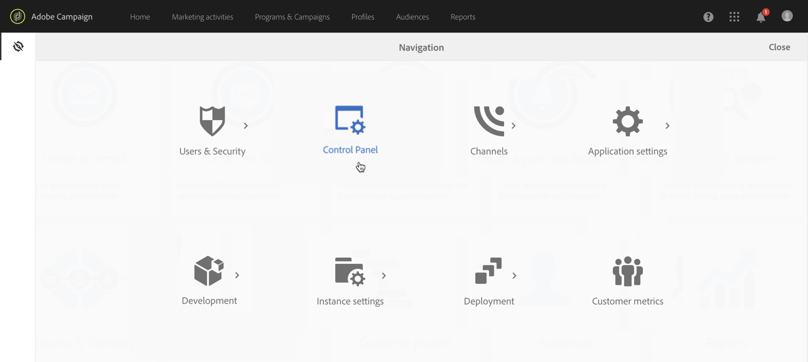

# 컨트롤 패널 액세스 {#accessing-control-panel}

Campaign 컨트롤 패널은 Experience Cloud에서 직접 사용하거나 제품 자체에서 사용할 수 있습니다.

에 액세스할 수 있습니다. **관리자 사용자** 만 해당. Administrators 그룹에 사용자를 할당하는 방법에 대한 자세한 내용은 [이 섹션](../../discover/using/managing-permissions.md).

## Experience Cloud 플랫폼에서 액세스 {#access-experience-cloud-platform}

Adobe Experience Cloud 플랫폼에서 Campaign 컨트롤 패널에 액세스하려면 아래 단계를 따르십시오.

1. 다음 위치로 이동 [홈페이지 Experience Cloud](https://experiencecloud.adobe.com/){target="_blank"}.

1. 에서 전용 링크를 클릭합니다. **빠른 액세스** 섹션.

   

Experience Cloud 플랫폼에서 Campaign 컨트롤 패널에 액세스할 수도 있습니다 **솔루션 선택기**:

1. 다음에서 [Adobe Experience Cloud 홈 페이지](https://experiencecloud.adobe.com/){target="_blank"}, 선택 **캠페인** 다음에서 **빠른 액세스** 섹션 또는 오른쪽 상단 메뉴

   

1. Campaign 인스턴스 목록이 표시됩니다. 다음을 클릭합니다. **Campaign 컨트롤 패널** 카드를 사용하여 실행할 수 있습니다.

   

## 제품에서 액세스 {#access-product}

>[!NOTE]
>
>제품 내에서 다음에 대한 액세스 권한을 사용할 수 있습니다. [Campaign Standard](https://experienceleague.adobe.com/docs/campaign-standard/using/campaign-standard-home.html?lang=ko){target="_blank"} 만 해당.

1. Campaign Standard 제품을 엽니다.

1. 다음 항목 선택 **[!UICONTROL Administration]** 메뉴 위치: **탐색** 창.

   

1. 다음을 클릭합니다. **[!UICONTROL Control Panel]** 아이콘.

   
