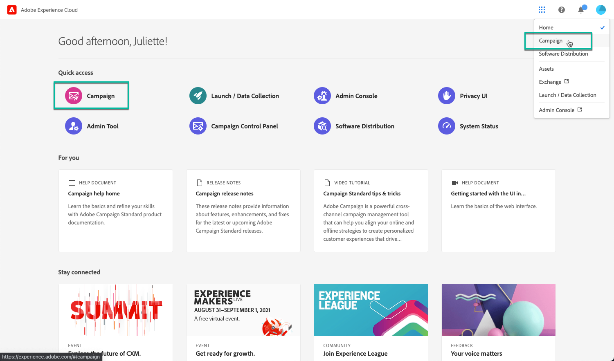

# 컨트롤 패널 액세스 {#accessing-control-panel}

컨트롤 패널은 Experience Cloud에서 직접 사용하거나 제품 자체에서 사용할 수 있습니다.

**관리자**&#x200B;만 액세스할 수 있습니다. 사용자를 관리자 그룹에 할당하는 방법에 대한 자세한 내용은 [이 섹션](../../discover/using/managing-permissions.md)을 참조하십시오.

>[!IMPORTANT]
>
>기본적으로 컨트롤 패널에는 &quot;관리자&quot; 제품 프로필에 속하는 관리자 사용자가 액세스할 수 있습니다. 조직 구성에 따라 제품 프로필의 이름을 다르게 지정할 수 있습니다(&quot;admin&quot;, &quot;admins&quot;, &quot;approval admin&quot; 등). **이름에 &quot;admin&quot;이라는 단어가 포함된 모든 제품 프로필은 자동으로 컨트롤 패널 액세스 권한을 부여합니다.**
>
>권한이 있는 사용자만 컨트롤 패널에 액세스하도록 하기 위해 Admin Console에서 제품 프로필 이름을 주의 깊게 검토해야 합니다.

## Experience Cloud 플랫폼에서 액세스 {#access-experience-cloud-platform}

Adobe Experience Cloud 플랫폼에서 컨트롤 패널에 액세스하려면 아래 단계를 따르십시오.

1. [Experience Cloud 홈페이지](https://experiencecloud.adobe.com/){target="_blank"}로 이동합니다.

1. **빠른 액세스** 섹션에서 전용 링크를 클릭합니다.

   

컨트롤 패널은 Experience Cloud Platform **솔루션 선택기**&#x200B;에서도 액세스할 수 있습니다.

1. [Adobe Experience Cloud 홈페이지](https://experiencecloud.adobe.com/){target="_blank"}의 **바로 가기** 섹션 또는 오른쪽 상단 메뉴에서 **Campaign**&#x200B;을 선택합니다.

   

1. Campaign 인스턴스 목록이 표시됩니다. **컨트롤 패널** 카드를 클릭하여 실행합니다.

   

## 제품에서 액세스 {#access-product}

>[!NOTE]
>
>제품 내 액세스는 [Campaign Standard](https://experienceleague.adobe.com/docs/campaign-standard/using/campaign-standard-home.html?lang=ko){target="_blank"}에서만 가능합니다.

1. Campaign Standard 제품을 엽니다.

1. **탐색** 창에서 **[!UICONTROL 관리]** 메뉴를 선택합니다.

   

1. **[!UICONTROL 컨트롤 패널]** 아이콘을 클릭합니다.

   
