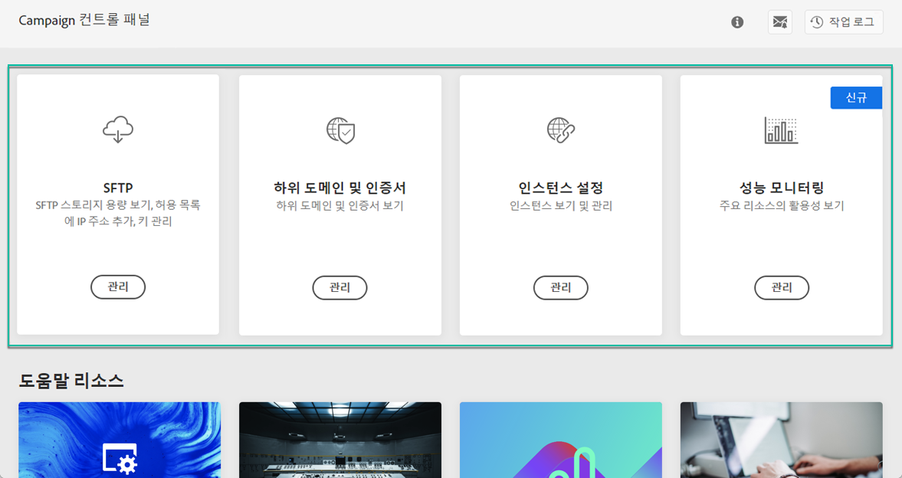
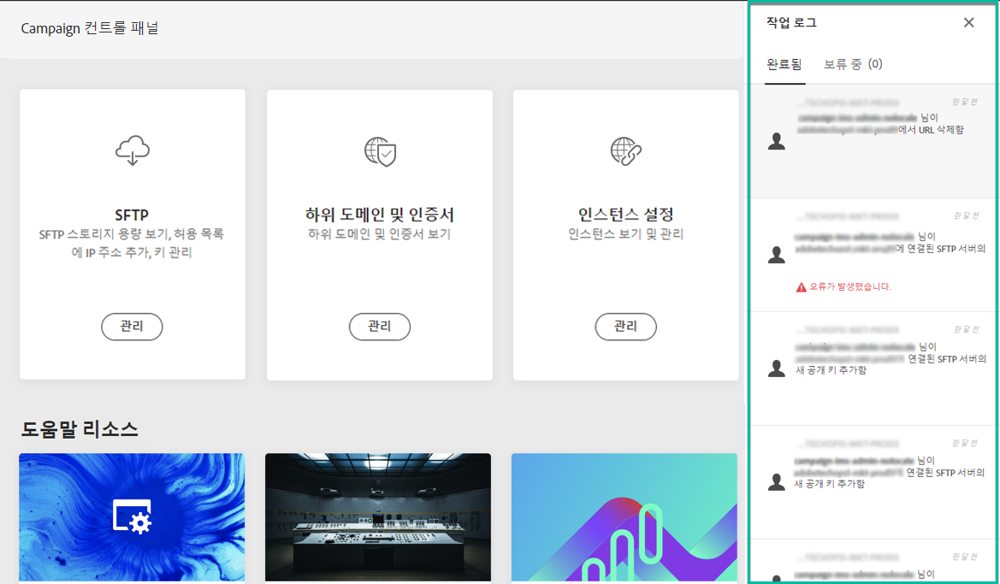
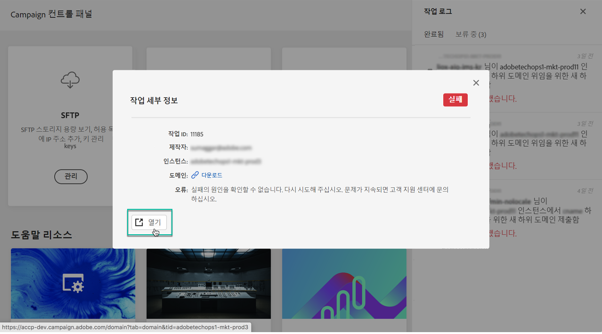
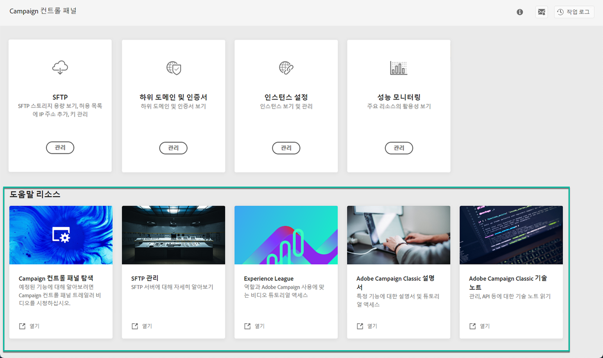

# 컨트롤 패널 인터페이스 살펴보기 {#discovering-interface}

컨트롤 패널 홈 페이지에서는 Campaign 인스턴스에서 수행 가능한 모든 작업에 액세스할 수 있습니다.

**성능 모니터링** 등 주제별로 정리한 카드로 표시됩니다.

<!--With upcoming Campaign releases, more topics and cards will be made available.-->

## 작업 로그 {#job-logs}

오른쪽 상단의 **[!UICONTROL 작업 로그]** 버튼을 사용하면 조직의 사용자가 수행한 모든 변경 사항을 감사할 수 있습니다.

자세한 내용을 보려면 목록의 요소를 클릭하십시오.

**[!UICONTROL 열기]** 버튼을 사용하면 변경된 제어판 탭에 직접 액세스할 수 있습니다.

## 도움말 리소스 {#help-resources}

**[!UICONTROL 도움말 리소스]** 섹션에서는 [컨트롤 패널] 및 Campaign 제품을 사용하는 데 도움이 되는 설명서를 제공합니다. 망설일 필요 없이 살펴보십시오.

## 지원 언어 {#languages}

[컨트롤 패널] 사용자 인터페이스는 브라우저의 구성에 맞는 언어를 표시하도록 설계되었습니다.

브라우저가 지원하지 않는 언어로 설정된 경우 [컨트롤 패널]은 지원 언어를 찾을 때까지 브라우저의 언어 목록 맨 위의 세 언어를 차례로 확인합니다. 처음 세 언어 중 [컨트롤 패널]에서 지원하는 언어가 없는 경우 기본 설정인 미국 영어를 사용합니다.

다음은 [컨트롤 패널]에서 현재 지원하는 언어 목록입니다.

* 영어(미국)
* 독일어
* 프랑스어
* 일본어
* 이탈리아어(이탈리아)
* 스페인어(스페인)
* 한국어
* 포르투갈어(브라질)
* 중국어(간체)
* 중국어(번체)
