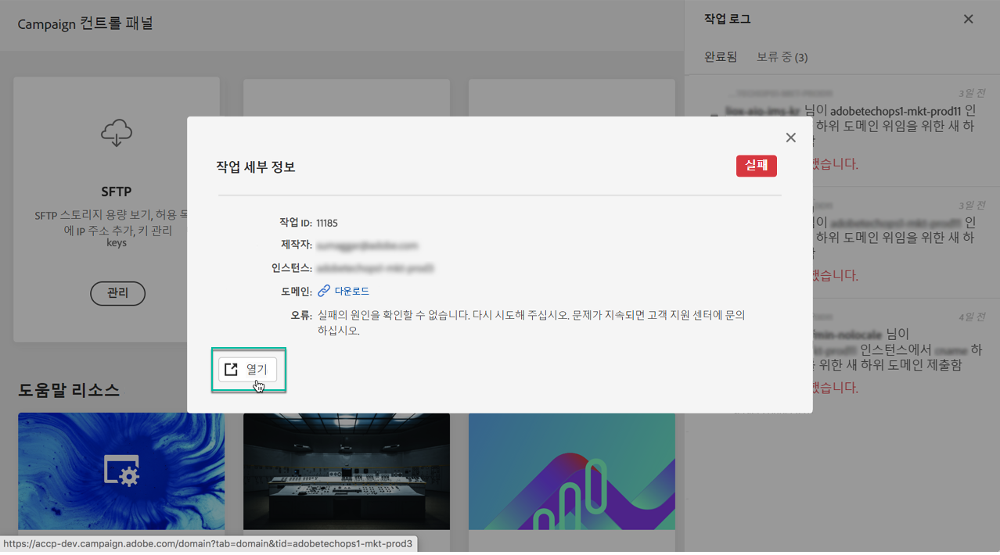

# 제어판 인터페이스 검색 {#discovering-interface}

제어판 홈 페이지에서는 캠페인 인스턴스에서 수행할 수 있는 모든 작업에 액세스할 수 있습니다.

이 카드들은 스토리지 및 데이터베이스 관리와 같은 주제로 구성된 카드로 **표시됩니다**.

향후 Campaign 릴리스를 통해 더 많은 토픽과 카드를 사용할 수 있습니다.

## 작업 로그 {#job-logs}

The **[!UICONTROL Job Logs]**button in the upper-right corner lets you audit all the changes that have been made by users of your organization.

자세한 내용을 보려면 목록의 요소를 클릭합니다.

The **[!UICONTROL Open]**button allows you to access directly the Control Panel tab where the change has been made.

## 도움말 리소스 {#help-resources}

이 **[!UICONTROL Help Resources]**섹션에서는 제어판 및 캠페인 제품을 사용하는 데 도움이 되는 유용한 설명서를 제공합니다. 망설이지 말고 탐색해 보세요.

