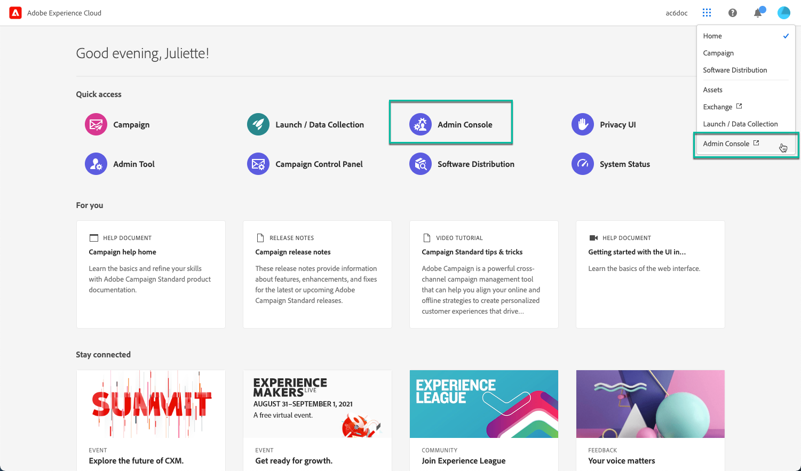

# 컨트롤 패널에 대한 권한 관리 {#managing-permissions-control-panel}

컨트롤 패널은 Campaign 인스턴스의 모든 관리 사용자가 사용할 수 있습니다. 사용자를 관리자 그룹에 할당하고 컨트롤 패널에 대한 액세스 권한을 부여하려면 아래 단계를 따르십시오.

 [&#x200B; 비디오에서 이 기능 살펴보기](../../discover/using/managing-permissions.md#video)

1. [Adobe Experience Cloud 홈 페이지](https://experiencecloud.adobe.com/){target="_blank"}(으)로 이동합니다.

1. **바로 가기** 섹션이나 오른쪽 상단 메뉴에서 사용 가능한 링크를 클릭하여 **Admin Console**&#x200B;을 실행합니다.

   

   >[!NOTE]
   >
   >**Admin Console** 링크가 표시되지 않으면 조직에 대한 관리자 권한이 없다는 의미입니다. 조직 관리자에게 문의하여 해당 단계를 수행합니다.

1. **Admin Console**&#x200B;의 **[!UICONTROL 제품 및 서비스]** 목록에서 원하는 Campaign 제품을 선택합니다.

   

   >[!NOTE]
   >
   >제품이 보이지 않는 경우 조직 관리자에게 연락하여 액세스 권한을 부여하세요.

1. Campaign 제품에 대한 인스턴스 목록이 표시됩니다. 관리 사용자를 추가할 인스턴스를 선택합니다.

   

   >[!NOTE]
   >
   >각 Campaign 인스턴스에 대해 서로 다른 관리 사용자를 추가할 수 있습니다. 관리 사용자는 자신이 속한 인스턴스의 컨트롤 패널에 액세스합니다.

1. 선택한 인스턴스에 대한 **[!UICONTROL 제품 프로필]** 목록이 표시됩니다. 관리 사용자 목록에 액세스하려면 **[!UICONTROL 관리자]** 제품 프로필을 클릭합니다.

   

   >[!IMPORTANT]
   >
   >기본적으로 Campaign 컨트롤 패널은 &quot;관리자&quot; 제품 프로필에 속하는 관리자 사용자가 액세스할 수 있습니다. 조직 구성에 따라 제품 프로필의 이름을 다르게 지정할 수 있습니다(&quot;admin&quot;, &quot;admins&quot;, &quot;approval admin&quot; 등). **이름에 &quot;admin&quot;이라는 단어가 포함된 모든 제품 프로필은 자동으로 Campaign 컨트롤 패널 액세스 권한을 부여합니다.**
   >
   >Admin Console에서 제품 프로필 이름 지정 규칙을 주의 깊게 검토하면 Campaign 인스턴스를 크게 변경할 수 있으므로 권한이 있는 사용자만 Campaign 컨트롤 패널에 액세스할 수 있습니다.

1. 관리 사용자 목록이 표시됩니다. 원하는 사용자를 추가하려면 **[!UICONTROL 사용자 추가]** 버튼을 클릭합니다.

   

>[!NOTE]
>
>액세스가 구성되면 사용자는 Adobe Experience Cloud에서 로그아웃한 후 다시 로그인해야 컨트롤 패널에 액세스할 수 있습니다.

## 튜토리얼 비디오 {#video}

>[!VIDEO](https://video.tv.adobe.com/v/27147?quality=12)
