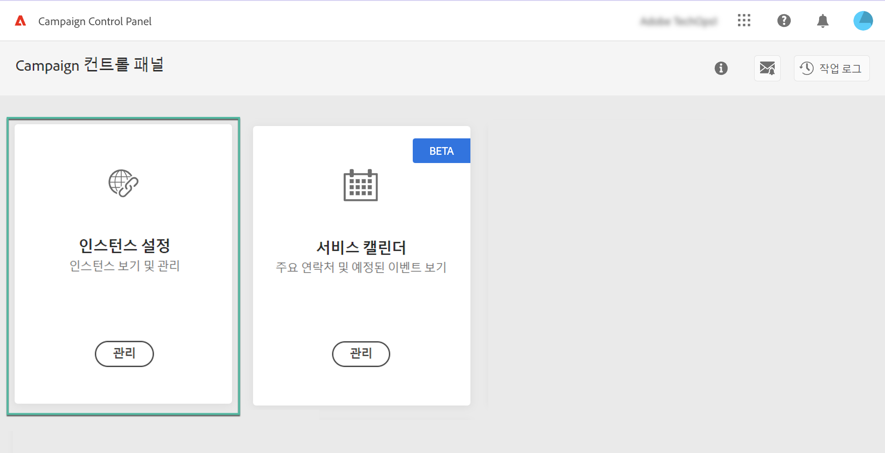
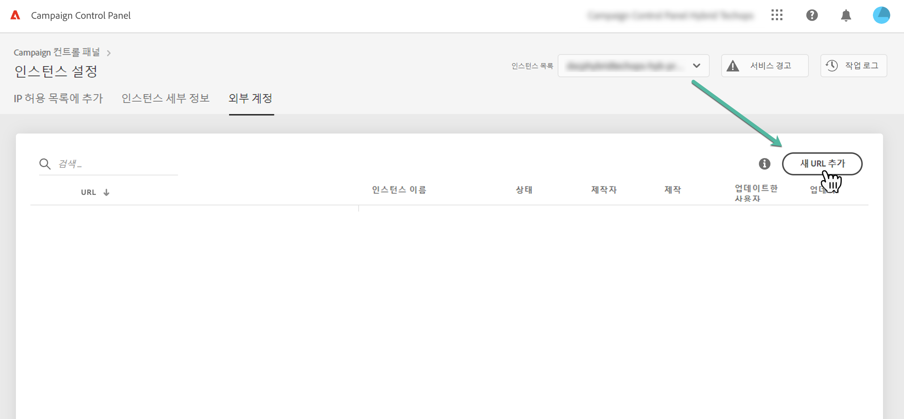
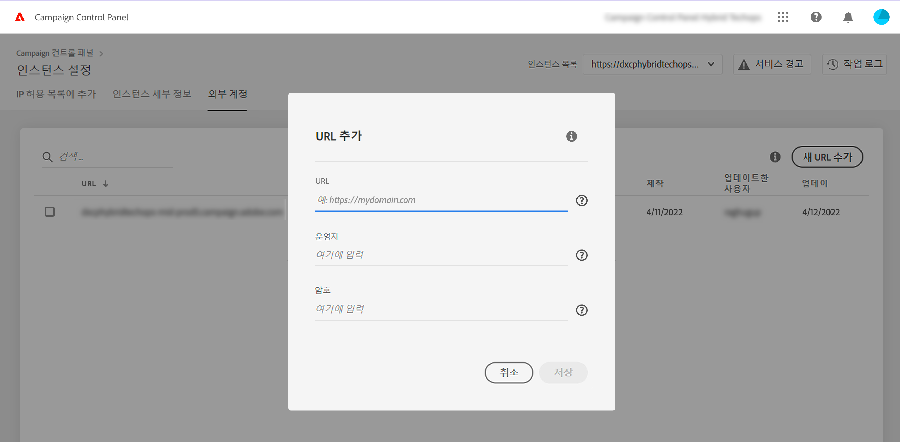
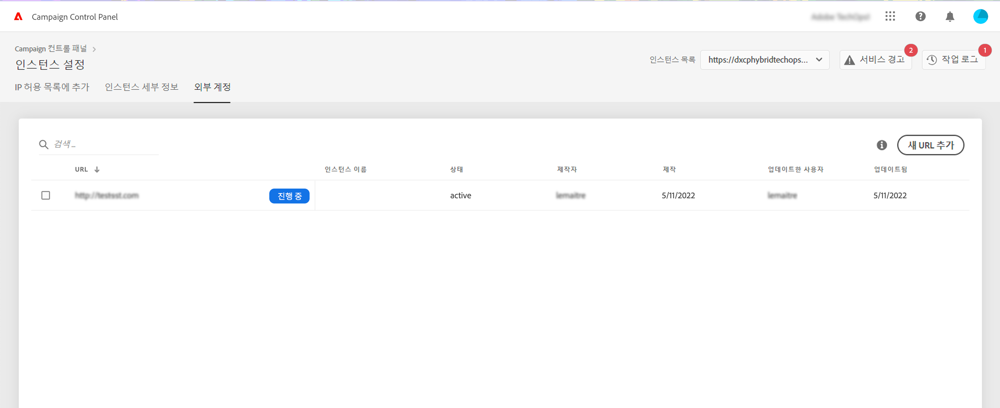
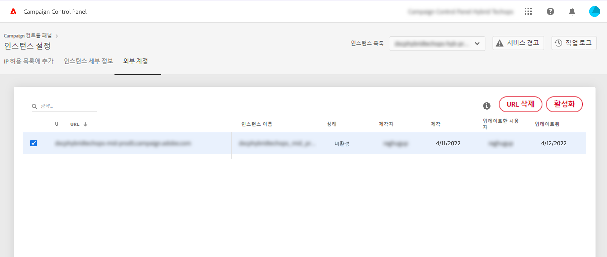
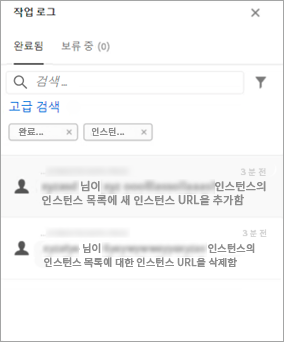

# MID/RT 인스턴스 추가(하이브리드 모델){#add-mid-rt-instances-hybrid-model}

>[!CONTEXTUALHELP]
>id="cp_externalaccounts"
>title="외부 계정"
>abstract="이 화면에서 하이브리드 호스팅 모델을 사용하는 고객은 컨트롤 패널 기능을 활용하기 위해 컨트롤 패널의 마케팅 인스턴스에 구성된 MID/RT 인스턴스 URL을 제공할 수 있습니다."

컨트롤 패널을 통해 하이브리드 호스팅 모델을 사용하는 고객은 특정 컨트롤 패널 기능을 활용할 수 있습니다. 이를 위해 다음을 해야 합니다.

* 컨트롤 패널의 마케팅 인스턴스에 구성된 [MID/RT 인스턴스 URL를 입력](#add)하고,
* 마케팅 인스턴스가 연결할 수 있도록 [허용 목록에 MID/RT 인스턴스 IP 주소를 추가](#ip)합니다.

호스팅 모델에 대한 자세한 내용은 [Campaign Classic 설명서](https://experienceleague.adobe.com/docs/campaign-classic/using/installing-campaign-classic/architecture-and-hosting-models/hosting-models-lp/hosting-models.html?lang=ko)를 참조하십시오.

## MID/RT 인스턴스 추가 {#add}

>[!CONTEXTUALHELP]
>id="cp_externalaccounts_url"
>title="URL"
>abstract="인스턴스의 URL입니다. 이 URL은 관리 > 플랫폼 > 외부 계정 메뉴의 Campaign 클라이언트 콘솔에 있습니다."

>[!CONTEXTUALHELP]
>id="cp_externalaccounts_operator"
>title="운영자"
>abstract="Adobe 관리자가 초기 프로비저닝 후 제공한 운영자의 ID입니다."

>[!CONTEXTUALHELP]
>id="cp_externalaccounts_password"
>title="암호"
>abstract="Adobe 관리자가 초기 프로비저닝 후 제공한 운영자의 암호입니다."

하이브리드 고객은 Experience Cloud를 통해 컨트롤 패널에 연결해야 합니다. 처음으로 컨트롤 패널에 액세스할 때 홈 페이지에는 카드가 두 개만 표시됩니다.

>[!NOTE]
>
>컨트롤 패널에 액세스하는 데 문제가 발생하는 경우 마케팅 인스턴스가 [조직 ID](https://experienceleague.adobe.com/docs/core-services/interface/administration/organizations.html?lang=ko)와 아직 매핑되지 않았을 수 있습니다. 이 설정을 완료하고 계속 진행하려면 고객 지원 센터에 문의하십시오. 연결에 성공하면 컨트롤 패널 홈 페이지가 표시됩니다.

컨트롤 패널 기능에 액세스하려면 **[!UICONTROL 인스턴스 설정]** 카드. 이렇게 하려면 아래 단계를 수행합니다.

1. 다음에서 **[!UICONTROL 인스턴스 설정]** 카드를 선택한 다음 **[!UICONTROL 외부 계정]** 탭.

1. 드롭다운 목록에서 원하는 마케팅 인스턴스를 선택하고 **[!UICONTROL 새 URL 추가]**.

   

1. 추가할 MID/RT 인스턴스에 대한 정보를 제공합니다.

   

   * **[!UICONTROL URL]**: 인스턴스의 URL입니다. Campaign 클라이언트 콘솔의 **[!UICONTROL 관리]** > **[!UICONTROL 플랫폼]** > **[!UICONTROL 외부 계정]** 메뉴 아래의 제품에서 사용할 수 있습니다.

     

   * **[!UICONTROL 연산자]** / **[!UICONTROL 암호]**: Adobe 관리자가 초기 프로비저닝 후 제공한 운영자의 자격 증명입니다.

     >[!NOTE]
     >
     >이러한 세부 사항을 사용할 수 없는 경우 고객 지원 센터에 문의하십시오.

1. 클릭 **[!UICONTROL 저장]** 확인할 수 있습니다.

MID/RT URL을 추가할 때 URL의 정확성을 확인하기 위해 비동기 프로세스가 트리거됩니다. 이 작업은 몇 분 정도 걸릴 수 있습니다. MID/RT 인스턴스 URL의 유효성을 검사할 때까지 작업이 보류 상태로 유지됩니다. 유효성 검사가 완료되면 컨트롤 패널 기본 기능에 액세스할 수 있습니다.

목록에서 MID/RT 인스턴스 URL을 선택하여 언제든지 제거하거나 비활성화할 수 있습니다.

에서 수행되는 모든 작업을 모니터링할 수 있습니다. **[!UICONTROL 외부 계정]** 에서 MID/RT 인스턴스 URL의 탭 **[!UICONTROL 작업 로그]**:

## 허용 목록에 IP 주소 추가 {#ip}

MID/RT 인스턴스 추가를 완료하면 마케팅 인스턴스가 연결할 수 있도록 허용 목록에 해당 IP 주소를 추가해야 합니다.

이 작업은 다음에서 수행할 수 있습니다. **[!UICONTROL IP 허용 목록]** 의 탭 **[!UICONTROL 인스턴스 설정]** 카드. [허용 목록에 IP 주소를 추가하는 방법 알아보기](ip-allow-listing-instance-access.md)

완료되면 MID/RT 인스턴스에서 컨트롤 패널 기능을 사용할 수 있습니다.

## 하이브리드 고객이 사용할 수 있는 기능 {#capabilities}

MID/RT 인스턴스가 컨트롤 패널에 추가되면 아래 나열된 기능을 활용할 수 있습니다.

* [주요 연락처 및 이벤트 모니터링](../../service-events/service-events.md)
* [인스턴스 세부 사항 보기](../../instances-settings/using/instance-details.md),
* [허용 목록에 IP 주소 추가](../../instances-settings/using/ip-allow-listing-instance-access.md),
* [새 하위 도메인 설정](../../subdomains-certificates/using/setting-up-new-subdomain.md),
* [하위 도메인의 SSL 인증서 갱신](../../subdomains-certificates/using/renewing-subdomain-certificate.md).
