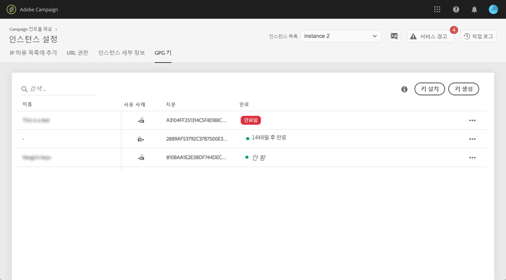
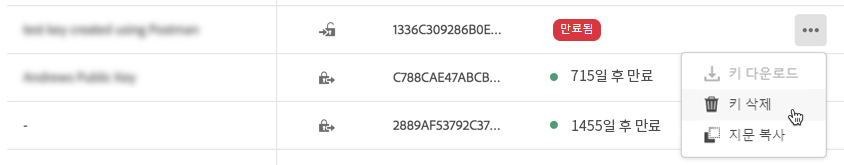
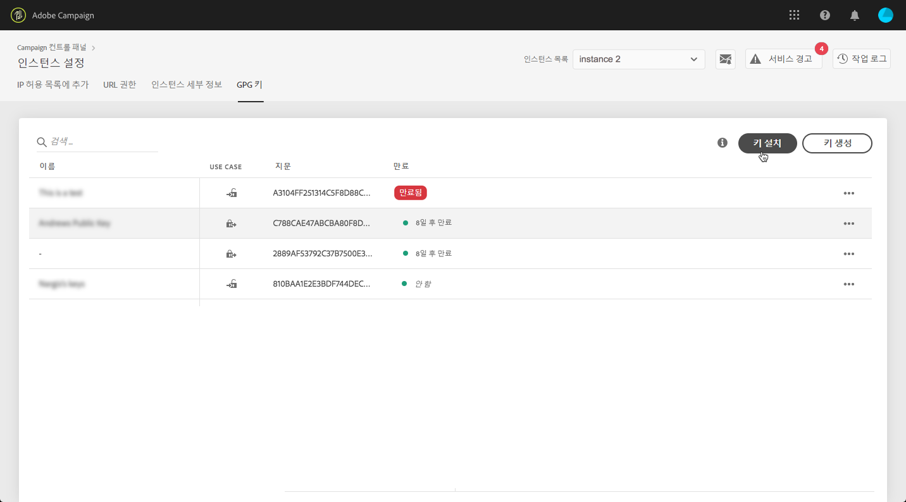
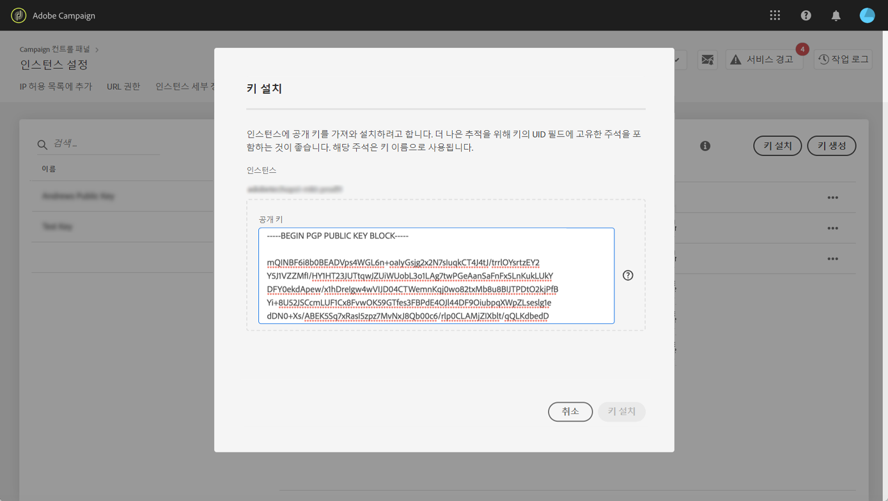
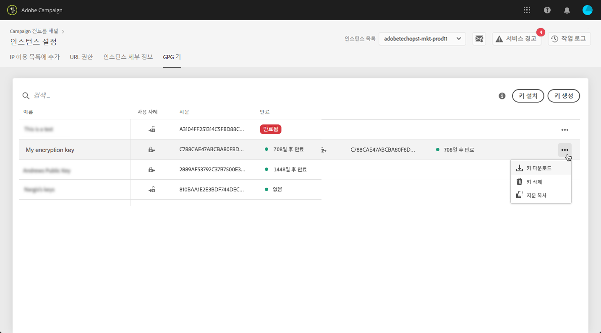
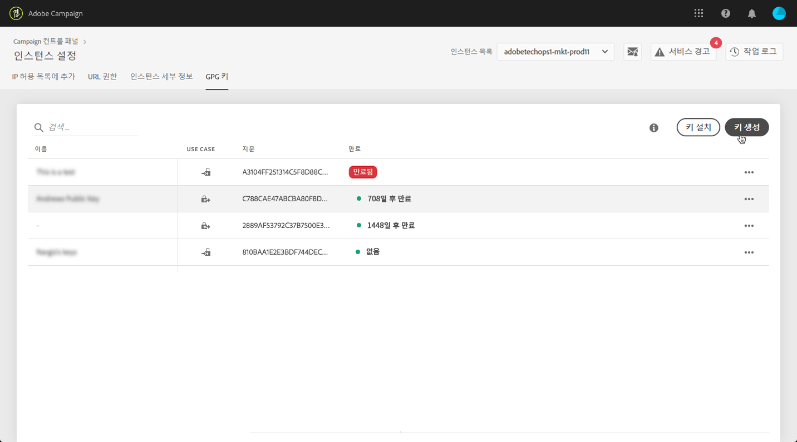
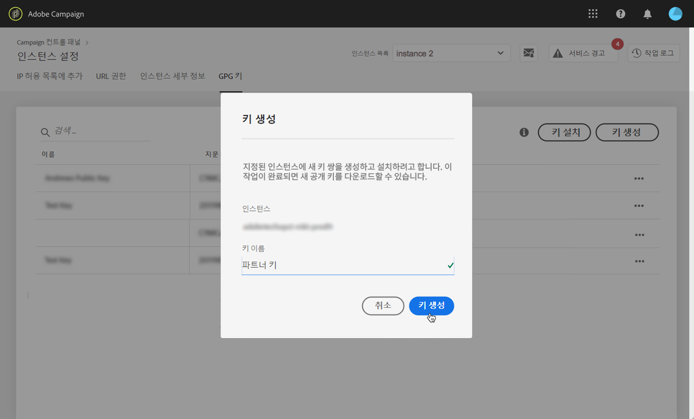
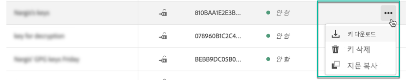

# GPG 키 관리 {#gpg-keys-management}

## GPG 암호화 정보 {#about-gpg-encryption}

GPG 암호화를 사용하면 [OpenPGP 사양을 따르는 공개/비공개 키 쌍 시스템을 통해 데이터를 보호할 수](https://www.openpgp.org/about/standard/) 있습니다.

구현되면 전송 전에 수신 데이터의 암호를 해독하고 나가는 데이터를 암호화하여 유효한 일치하는 키 쌍 없이는 아무도 이 데이터에 액세스하지 못하도록 할 수 있습니다.

Campaign을 사용하여 GPG 암호화를 구현하려면 제어판에서 직접 관리자가 마케팅 인스턴스에 GPG 키를 설치 및/또는 생성해야 합니다.

그러면 다음 작업을 수행할 수 있습니다.

* **전송된 데이터 암호화**: Adobe Campaign은 설치된 공개 키로 암호화한 후 데이터를 전송합니다.

* **들어오는 데이터의 암호 해독**: Adobe Campaign은 제어판에서 다운로드한 공개 키를 사용하여 외부 시스템에서 암호화된 데이터를 수신합니다. Adobe Campaign은 제어판에서 생성된 개인 키를 사용하여 데이터를 해독합니다.

## GPG 키 모니터링

인스턴스에 대해 설치 및 생성된 GPG 키에 액세스하려면 **[!UICONTROL Instance settings]** 카드를 연 다음 **[!UICONTROL GPG keys]** 탭을 선택합니다.

목록에는 각 키에 대한 세부 정보와 함께 인스턴스에 대해 설치 및 생성된 모든 암호화 및 암호 해독 GPG 키가 표시됩니다.

* **[!UICONTROL Name]**: 키를 설치하거나 생성할 때 정의된 이름입니다.
* **[!UICONTROL Use case]**: 이 열은 키의 사용 사례를 지정합니다.

   : 데이터 암호화를 위해 키가 설치되었습니다.

   : 데이터 암호 해독을 허용하는 키가 생성되었습니다.

* **[!UICONTROL Fingerprint]**: 키의 지문.
* **[!UICONTROL Expires]**: 키의 만료 날짜입니다. 제어판은 키 만료 날짜가 다가오면 시각적 표시를 제공합니다.

   * 30일 전에 긴급한(빨간색)이 표시됩니다.
   * 경고(노란색)는 60일 전에 표시됩니다.
   * 키가 만료되면 &quot;만료된&quot; 빨간색 배너가 표시됩니다.
   >[!NOTE]
   >
   >제어판에서 이메일 알림이 전송되지 않습니다.

더 이상 필요하지 않은 모든 키를 제거하는 것이 좋습니다. 이렇게 하려면 **..** 단추를 클릭한 다음 **[!UICONTROL Delete Key].**.

>[!IMPORTANT]
>
>키를 제거하기 전에 오류가 발생하지 않도록 Adobe Campaign 워크플로우에서 키를 사용하지 않도록 하십시오.

## 데이터 암호화 {#encrypting-data}

제어판을 사용하면 Adobe Campaign 인스턴스에서 나오는 데이터를 암호화할 수 있습니다.

이렇게 하려면 PGP 암호화 도구에서 GPG 키 쌍을 생성한 다음 공개 키를 제어판에 설치해야 합니다. 그런 다음 인스턴스에서 데이터를 보내기 전에 데이터를 암호화할 수 있습니다. 이렇게 하려면 다음 단계를 수행합니다.

1. OpenPGP 사양 다음에 나오는 GPG 암호화 도구를 사용하여 공개/ [비공개 키 쌍을 생성합니다](https://www.openpgp.org/about/standard/). 이렇게 하려면 GPG 유틸리티 또는 GNuPG 소프트웨어를 설치합니다.

   >[!NOTE]
   >
   >키를 생성하는 오픈 소스 무료 소프트웨어를 사용할 수 있습니다. 그러나 조직의 지침을 따르고 IT/보안 조직에서 추천하는 GPG 유틸리티를 사용해야 합니다.

1. 유틸리티가 설치되면 Mac Terminal 또는 Windows 명령에서 아래 명령을 실행합니다.

   `gpg --full-generate-key`

1. 메시지가 표시되면 키에 원하는 매개 변수를 지정합니다. 필수 매개 변수는 다음과 같습니다.

   * **키 유형**: RSA
   * **키 길이**: 1024 - 4096비트
   * **실제 이름** 및 **이메일 주소**: 키 쌍을 만든 사람을 추적할 수 있습니다. 조직 또는 부서에 연결된 이름 및 이메일 주소를 입력합니다.
   * **comment**: 주석 필드에 레이블을 추가하면 제어판 키 목록에서 쉽게 키를 식별할 수 있습니다.
   * **만료**: 만료 날짜가 없는 날짜 또는 &quot;0&quot;입니다.
   * **암호**
   

1. 스크립트가 확인되면 파일에 내보낼 수 있는 키를 생성하거나 제어판에 직접 붙여넣을 수 있습니다. 파일을 내보내려면 이 명령을 실행한 다음 생성한 키의 지문을 실행합니다.

   `gpg -a --export <fingerprint>`

1. 제어판에 공개 키를 설치하려면 탭에 액세스한 **[!UICONTROL GPG Keys]** 다음 원하는 인스턴스를 선택합니다.

1. 단추를 **[!UICONTROL Install Key]** 클릭합니다.

   

1. PGP 암호화 도구에서 생성된 공개 키를 붙여넣습니다. 공개 키 파일을 바로 드래그하여 놓을 수도 있습니다.

   >[!NOTE]
   >
   >공개 키는 OpenPGP 형식이어야 합니다.

   

1. 단추를 **!UICONTROL Install Key]** 클릭합니다.

공개 키가 설치되면 목록에 표시됩니다. ... **.** 버튼을 사용하여 다운로드하거나 지문을 복사할 수 있습니다.

그런 다음 Adobe Campaign 워크플로우에서 키를 사용할 수 있습니다. 데이터 추출 활동을 사용할 때 데이터를 암호화할 수 있습니다.

자세한 내용은 Adobe Campaign 설명서를 참조하십시오.

| Campaign Classic | Campaign Standard |
---------|----------
| [파일 압축 또는 암호화](https://docs.adobe.com/content/help/en/campaign-classic/using/automating-with-workflows/general-operation/how-to-use-workflow-data.html#zipping-or-encrypting-a-file) | [암호화된 데이터 관리](https://docs.adobe.com/content/help/en/campaign-standard/using/managing-processes-and-data/workflow-general-operation/importing-data.html#managing-encrypted-data) |
| [데이터 추출(파일) 활동](https://docs.adobe.com/content/help/en/campaign-classic/using/automating-with-workflows/action-activities/extraction--file-.html) | [파일 작업 추출](https://docs.adobe.com/content/help/en/campaign-standard/using/managing-processes-and-data/data-management-activities/extract-file.html) |

## 데이터 암호 해독 {#decrypting-data}

제어판을 사용하면 Adobe Campaign 인스턴스로 들어오는 외부 데이터의 암호를 해독할 수 있습니다.

이를 위해서는 제어판에서 바로 GPG 키 쌍을 생성해야 합니다.

* 공개 **키는** Campaign으로 전송할 데이터를 암호화하는 데 사용하는 외부 시스템과 공유됩니다.
* Campaign에서 **개인 키를** 사용하여 들어오는 암호화된 데이터를 해독합니다.

제어판에서 키 쌍을 생성하려면 다음 단계를 수행합니다.

1. 탭에 **[!UICONTROL GPG Keys]** 액세스한 다음 원하는 Adobe Campaign 인스턴스를 선택합니다.

1. 단추를 **[!UICONTROL Generate Key]** 클릭합니다.

   

1. 키 이름을 지정한 다음 을 클릭합니다 **!UICONTROL Generate Key]**. 이 이름은 캠페인 워크플로우에서 암호 해독에 사용할 키를 식별하는 데 도움이 됩니다

   

키 쌍이 생성되면 공개 키가 목록에 표시됩니다. 암호 해독 키 쌍은 만료 날짜가 없는 상태로 생성됩니다.

... **** 버튼을 사용하여 공개 키를 다운로드하거나 지문을 복사할 수 있습니다.

공개 키는 외부 시스템과 공유할 수 있습니다. Adobe Campaign은 데이터 로드 활동에 개인 키를 사용하여 공개 키로 암호화된 데이터의 암호를 해독할 수 있습니다.

자세한 내용은 Adobe Campaign 설명서를 참조하십시오.

| Campaign Classic | Campaign Standard |
---------|----------
| [처리 전 파일 지핑 또는 해독](https://docs.adobe.com/content/help/en/campaign-classic/using/automating-with-workflows/general-operation/importing-data.html#unzipping-or-decrypting-a-file-before-processing) | [암호화된 데이터 관리](https://docs.adobe.com/content/help/en/campaign-standard/using/managing-processes-and-data/workflow-general-operation/importing-data.html#managing-encrypted-data) |
| [데이터 로드(파일) 활동](https://docs.adobe.com/content/help/en/campaign-classic/using/automating-with-workflows/action-activities/data-loading--file-.html) | [파일 작업 로드](https://docs.adobe.com/content/help/en/campaign-standard/using/managing-processes-and-data/data-management-activities/load-file.html) |
