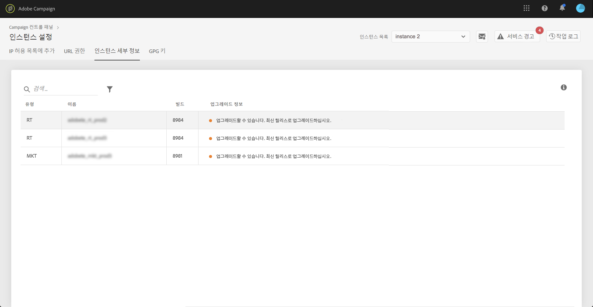

# 인스턴스 세부 사항 {#instance-details}

>[!CONTEXTUALHELP]
>id=&quot;cp_instanceettings_instancedetails&quot;
>title=&quot;인스턴스 세부 정보&quot;
>abstract=&quot;Adobe Campaign 인스턴스의 세부 사항을 봅니다.유형, 이름, 빌드 정보 및 가능한 업그레이드 권장 사항.&quot;
>additional-url=&quot;https://docs.adobe.com/content/help/en/campaign-classic/using/release-notes/latest-release.html&quot; text=&quot;Campaign Classic 릴리스 노트&quot;
>additional-url=&quot;https://docs.adobe.com/content/help/en/campaign-standard/using/release-notes/release-notes.html&quot; text=&quot;Campaign Standard 릴리스 노트&quot;

>[!CAUTION]
>
>이 기능은 Campaign Classic 인스턴스에만 사용할 수 있습니다.

## 인스턴스 세부 정보 {#about-instance-details}

Adobe Campaign Classic 인스턴스 아키텍처에는 마케팅 활동의 유연성을 활성화하는 여러 서버가 포함될 수 있습니다. 예를 들어, 인스턴스를 지원하는 마케팅, 실시간(또는 메시지 센터) 및 중간 소싱 서버를 사용할 수 있습니다.

인스턴스 세부 사항 기능을 사용하면 인스턴스의 플랫 아키텍처를 볼 수 있습니다. 서버 정보 외에도 인스턴스 빌드가 최신 상태인지 여부를 알 수 있을 뿐만 아니라 필요한 경우 업그레이드할 것을 권장합니다.

>[!NOTE]
>
>성능 저하를 방지하고 Adobe Campaign Classic에서 제공하는 최신 기능과 수정 사항을 활용할 수 있도록 하려면 매년 최소 1회 이상 인스턴스를 업그레이드할 것을 권장합니다.

**관련 항목:**

* [빌드 업그레이드 수행](https://docs.campaign.adobe.com/doc/AC/getting_started/EN/buildUpgrade.html)
* [Adobe Campaign 업데이트](https://docs.campaign.adobe.com/doc/AC/en/PRO_Updating_Adobe_Campaign_Introduction.html)

## 인스턴스에 대한 정보 검색 {#retrieving-information-about-instances}

인스턴스에 연결된 서버에 대한 정보를 보려면 다음 단계를 따르십시오.

1. 카드를 **[!UICONTROL Instances Settings]** 열어 탭에 액세스합니다 **[!UICONTROL Instance Details]** .

   >[!NOTE]
   >
   >인스턴스 설정 카드가 제어판의 홈 페이지에 표시되지 않으면 IMS ORG ID가 Adobe Campaign Classic 인스턴스와 연결되어 있지 않음을 의미합니다.

1. 왼쪽 창에서 원하는 Campaign Classic 인스턴스를 선택합니다.

   >[!NOTE]
   >
   >모든 Campaign 인스턴스가 왼쪽 창 목록에 표시됩니다. 인스턴스 세부 사항 기능은 Campaign Classic 인스턴스에만 해당되므로 Campaign Standard 인스턴스를 선택하면 &quot;적용되지 않는 인스턴스&quot; 메시지가 표시됩니다.

1. 인스턴스에 연결된 서버가 표시됩니다.

   

사용 가능한 정보는 다음과 같습니다.

* **[!UICONTROL Type]**:서버 유형입니다. 가능한 값은 MKT(마케팅), MID(중간 소싱) 및 RT(메시지 센터/실시간 메시징)입니다.
* **[!UICONTROL Name]**:서버 이름입니다.
* **[!UICONTROL Build:]** 서버에 설치된 빌드 버전.
* **[!UICONTROL Upgrade info]**:이 열에는 서버에 업데이트가 필요한 경우 표시됩니다.
   * 녹색:서버가 최신 상태이므로 업그레이드할 필요가 없습니다.
   * 노란색:업그레이드를 고려해야 합니다. 최신 기능 및 수정 사항이 없습니다.
   * 빨간색:최대한 빨리 업그레이드하십시오. 새 기능이 누락되었으며 서버 성능이 좋지 않을 수 있습니다.

서버 중 하나를 업그레이드해야 하는 경우 진행 방법에 대한 자세한 내용은 [이 설명서를](https://docs.campaign.adobe.com/doc/AC/getting_started/EN/buildUpgrade.html) 참조하십시오.

## 일반적인 질문 {#common-questions}

**인스턴스 아키텍처에 MID 서버가 표시되지 않습니다. 인스턴스가 제대로 작동하지 않는다는 의미입니까? 오늘 할 수 없는 일에 RT 인스턴스가 필요합니까?**

자체 인스턴스는 매우 다르게 보일 수 있으며 일부 유형의 서버가 없거나 여러 개의 동일한 서버를 가질 수 있습니다. 서버 유형이 없거나 다른 유형이 없다면 실시간 메시지를 보내거나 다른 종류의 활동을 수행할 수 없습니다. 추가 서버 용량을 요청할 수 있으며 추가 비용이 적용됩니다.

일부 서버가 &quot;인스턴스 세부 정보&quot; 페이지에 표시되지 않는 경우 고객 지원 센터에 문의하십시오. 메시지의 특정 인스턴스 URL을 메모해야 합니다.
