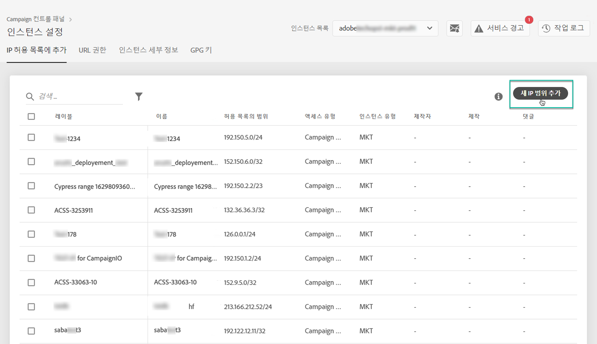
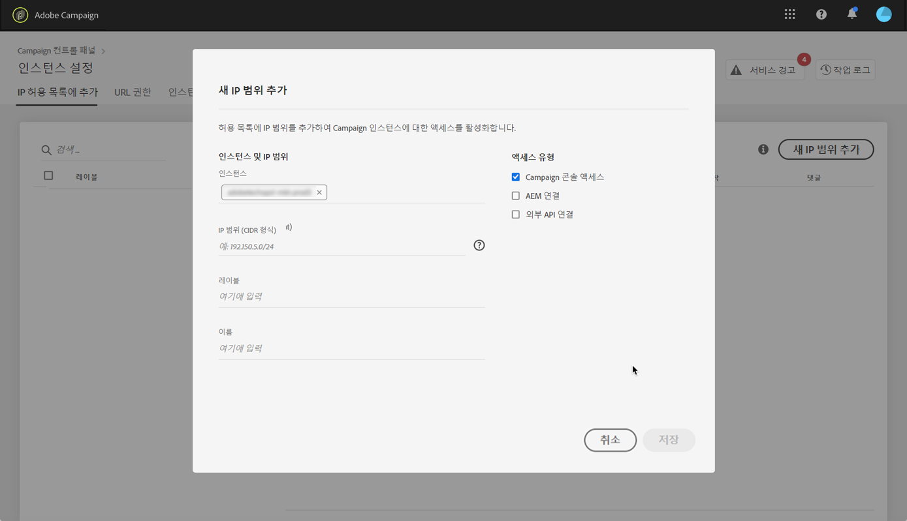
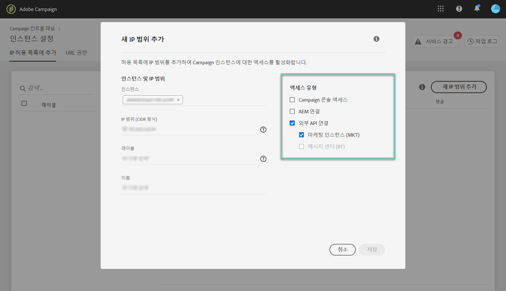

# IP 허용 목록 {#ip-allow-listing}

>[!CONTEXTUALHELP]
>id="cp_instancesettings_iprange"
>title="IP 허용 목록 정보"
>abstract="허용 목록에 IP 주소를 추가하여 인스턴스에 액세스합니다."
>additional-url="https://images-tv.adobe.com/mpcv3/045cac99-f948-478e-ae04-f8c161dcb9e2_1568132508.1920x1080at3000_h264.mp4" text="데모 비디오 시청"

>[!IMPORTANT]
>
>이 기능은 Campaign Classic 인스턴스에만 사용할 수 있습니다.

## IP 허용 목록 정보 {#about-ip-allow-listing}

기본적으로는 여러 IP 주소에서 Adobe Campaign Classic 인스턴스에 액세스할 수 없습니다.

IP 주소가 허용 목록에 추가되지 않은 경우 이 주소에서 인스턴스에 로그인할 수 없습니다. IP 주소가 인스턴스와 명시적으로 허용 목록에 추가되지 않은 경우에도 동일한 방법으로 API를 메시지 센터 또는 마케팅 인스턴스에 연결할 수 없습니다.

제어판을 사용하면 허용 목록에 IP 주소 범위를 추가하여 인스턴스에 새 연결을 설정할 수 있습니다. 이렇게 하려면 아래에서 설명하는 단계를 수행합니다.

허용 목록에 IP 주소가 있으면 사용자가 인스턴스에 액세스할 수 있도록 캠페인 연산자를 만들어 연결할 수 있습니다.

## 권장사항 {#best-practices}

제어판에서 허용 목록에 IP 주소를 추가할 때 아래 권장 사항과 제한 사항을 따라야 합니다.

* RT 서버나 AEM 보안 영역에 연결하는 데 사용하지 않으려는 **IP 주소는 모든 액세스 유형에 사용할 수 있도록 설정하지 마십시오**.
* **IP 주소에**&#x200B;대한 인스턴스에 대한 액세스를 일시적으로 활성화한 경우 인스턴스에 더 이상 연결할 필요가 없으면 허용 목록에서 IP 주소를 제거해야 합니다.
* **공용 장소의 IP 주소를 허용 목록** (공항, 호텔 등)에 추가하지 않는 것이 좋습니다. 항상 인스턴스의 보안을 유지하려면 회사 VPN 주소를 사용하십시오.

## 인스턴스 액세스를 위해 허용 목록에 IP 주소 추가 {#adding-ip-addresses-allow-list}

>[!CONTEXTUALHELP]
>id="cp_instancesettings_iprange_add"
>title="새 IP 범위 추가"
>abstract="인스턴스에 연결할 허용 목록에 추가할 IP 범위를 정의합니다."

허용 목록에 IP 주소를 추가하려면 다음 단계를 따르십시오.

1. Open the **[!UICONTROL Instances Settings card]** to access the IP allow listing tab, then click **[!UICONTROL Add new IP Range]**.

   >[!NOTE]
   >
   >인스턴스 설정 카드가 제어판의 홈 페이지에 표시되지 않으면 IMS를 의미합니다. 조직 ID는 Adobe Campaign 클래식 인스턴스와 연결되지 않습니다

   

1. 아래 설명된 대로 허용 목록에 추가할 IP 범위에 대한 정보를 입력합니다.

   

   * **[!UICONTROL Instance(s)]**: IP 주소가 연결할 수 있는 인스턴스입니다. 여러 인스턴스를 동시에 조작할 수 있습니다. 예를 들어 동일한 단계를 통해 프로덕션 및 스테이지 인스턴스 모두에서 IP 허용 목록을 수행할 수 있습니다.
   * **[!UICONTROL IP Range]**: 허용 목록에 추가할 IP 범위(CIDR 형식)입니다. IP 범위는 허용 목록의 기존 범위와 겹칠 수 없습니다. IP 범위가 겹치는 경우에는 겹치는 IP가 포함된 범위를 먼저 삭제하십시오.

   >[!NOTE]
   >
   >CIDR(Classless Inter-Domain Routing)은 컨트롤 패널 인터페이스를 사용하여 IP 범위를 추가할 때 지원되는 형식입니다. CIDR의 구문에는 IP 주소, &#39;/&#39; 문자, 십진수가 차례로 포함됩니다. [이 문서](https://whatismyipaddress.com/cidr)에서 CIDR의 형식과 구문을 자세히 확인할 수 있습니다.
   >
   >소유한 IP 범위를 CIDR 형식으로 변환하는 데 사용할 수 있는 무료 온라인 도구를 인터넷에서 검색할 수 있습니다.

   * **[!UICONTROL Label]**: 허용 목록에 표시할 레이블입니다.
   * **[!UICONTROL Name]**: 액세스 유형, 인스턴스(외부 API 연결의 경우) 및 IP 주소의 이름은 고유해야 합니다.

1. IP 주소에 부여할 액세스 권한 유형을 지정합니다.

   * **[!UICONTROL Campaign Console Access]**: IP 주소가 Campaign Classic 콘솔에 연결할 수 있습니다. 마케팅 인스턴스만 콘솔에 액세스하도록 설정할 수 있습니다. MID 및 RT 인스턴스는 콘솔에 액세스할 수 없으므로 콘솔에 액세스하도록 설정되지 않습니다.
   * **[!UICONTROL AEM connection]**: 지정한 AEM IP 주소가 마케팅 인스턴스에 연결할 수 있습니다.
   * **[!UICONTROL External API connection]**: 지정한 IP 주소를 사용하는 외부 API가 마케팅 및/또는 메시지 센터(RT) 인스턴스에 연결할 수 있습니다. RT 인스턴스는 콘솔에 연결하도록 설정되지 않습니다.

   

1. **[!UICONTROL Save]** 버튼을 클릭합니다. IP 범위가 허용 목록에 추가됩니다.

   

허용 목록에서 IP 범위를 삭제하려면 해당 범위를 선택한 다음 **[!UICONTROL Delete IP range]** 단추를 클릭합니다.

**관련 항목:**
* [IP 허용 목록(자습서 비디오)](https://docs.adobe.com/content/help/en/campaign-learn/campaign-classic-tutorials/administrating/control-panel-acc/ip-allow-listing.html)
* [연산자에 보안 영역 연결](https://docs.campaign.adobe.com/doc/AC/en/INS_Additional_configurations_Configuring_Campaign_server.html#Linking_a_security_zone_to_an_operator)
