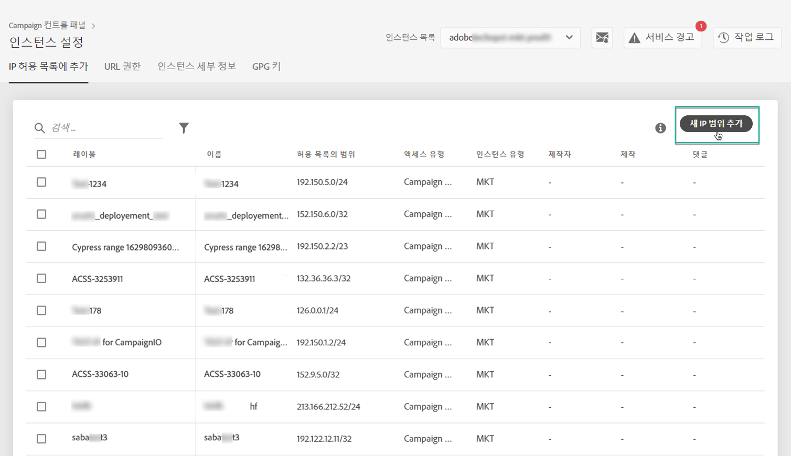

# IP 화이트리스트 {#ip-whitelisting}

>[!CAUTION]
>
>이 기능은 Campaign Classic 인스턴스에만 사용할 수 있습니다.

## IP 화이트리스트 정보 {#about-ip-whitelisting}

기본적으로 Adobe Campaign Classic 인스턴스는 다양한 IP 주소에서 액세스할 수 없습니다.

IP 주소가 허용 목록에 없으면 이 주소에서는 인스턴스에 로그인할 수 없습니다. IP 주소가 명시적으로 인스턴스로 화이트리스트에 추가되지 않은 경우, API를 메시지 센터 또는 마케팅 인스턴스에 연결할 수 없습니다.

제어판에서 허용 IP 주소 범위를 통해 인스턴스에 새 연결을 설정할 수 있습니다. 이렇게 하려면 아래 설명된 단계를 따르십시오.

IP 주소가 허용 목록에 추가되면 사용자가 인스턴스에 액세스할 수 있도록 캠페인 연산자를 만들어 연결할 수 있습니다.

## 모범 사례 {#best-practices}

제어판에서 허용 IP 주소를 사용할 때는 아래 권장 사항과 제한 사항을 따라야 합니다.

* **RT 서버 또는 AEM 보안 영역에 연결할** IP 주소를 사용하지 않을 경우 모든 액세스 유형에 IP 액세스를 활성화하지 마십시오.
* **IP 주소에**&#x200B;대한 인스턴스에 대한 액세스를 일시적으로 활성화한 경우 인스턴스에 더 이상 연결할 필요가 없으면 화이트리스트 IP 주소에서 IP 주소를 제거해야 합니다.
* **공개 장소** (공항, 호텔 등)의 허용 IP 주소는 권장하지 않습니다. 회사 VPN 주소를 사용하여 항상 인스턴스를 안전하게 유지하십시오.

## 인스턴스 액세스에 대한 허용 IP 주소 {#whistelisting-ip-addresses}

IP 주소를 허용 목록에 추가하려면 다음 단계를 따르십시오.

1. 를 **[!UICONTROL Instances Settings card]** 열어 IP 허용 목록 탭에 액세스한 다음 을 클릭합니다 **[!UICONTROL Add new IP Range]**.

   >[!NOTE]
   >
   >인스턴스 설정 카드가 제어판의 홈 페이지에 표시되지 않으면 IMS ORG ID가 Adobe Campaign Classic 인스턴스와 연결되어 있지 않음을 의미합니다.

   

1. 아래 설명된 대로 화이트리스트에 추가할 IP 범위에 대한 정보를 입력합니다.

   

   * **[!UICONTROL Instance(s)]**:IP 주소를 연결할 수 있는 인스턴스입니다. 여러 인스턴스를 동시에 조작할 수 있습니다. 예를 들어 IP 화이트 리스트는 동일한 단계를 통해 프로덕션 및 스테이지 인스턴스 모두에서 수행할 수 있습니다.
   * **[!UICONTROL IP Range]**:화이트리스트에 추가할 IP 범위(CIDR 형식)입니다. IP 범위는 기존의 화이트리스트 등록 범위와 겹칠 수 없습니다. 이 경우 먼저 겹치는 IP가 포함된 범위를 삭제합니다.
   >[!NOTE]
   >
   >CIDR(Classless Inter-Domain Routing)은 제어판 인터페이스에서 IP 범위를 추가할 때 지원되는 형식입니다. 구문은 IP 주소와 '/' 문자, 십진수로 구성됩니다. 형식 및 구문은 [이 아티클에서](https://whatismyipaddress.com/cidr)자세히 설명합니다.
   >
   >현재 보유하고 있는 IP 범위를 CIDR 포맷으로 변환할 수 있는 무료 온라인 툴을 인터넷에서 검색할 수 있습니다.

   * **!UICONTROL Label]**:화이트리스트 IP 주소 목록에 표시될 레이블입니다.
   * **[!UICONTROL Name]**:액세스 유형, 인스턴스(외부 API 연결의 경우) 및 IP 주소에 대해 고유해야 합니다.

1. IP 주소에 부여할 액세스 유형을 지정합니다.

   * **[!UICONTROL Campaign Console Access]**:IP 주소는 Campaign Classic 콘솔에 연결할 수 있습니다. 콘솔 액세스는 마케팅 인스턴스에만 활성화됩니다. MID 및 RT 인스턴스에 대한 액세스는 허용되지 않으므로 활성화되지 않습니다.
   * **[!UICONTROL AEM connection]**:지정된 AEM IP 주소는 마케팅 인스턴스에 연결할 수 있습니다.
   * **[!UICONTROL External API connection]**:지정된 IP 주소가 있는 외부 API는 마케팅 및/또는 메시지 센터(RT) 인스턴스에 연결할 수 있습니다. RT 인스턴스의 콘솔에 대한 연결은 활성화되지 않습니다.
   

1. 단추를 **[!UICONTROL Save]** 클릭합니다. IP 범위가 화이트리스트 IP 주소 목록에 추가됩니다.

   

화이트리스트 IP 범위를 삭제하려면 해당 범위를 선택한 다음 **[!UICONTROL Delete IP range]** 단추를 클릭합니다.

**관련 항목:**
* [IP 화이트 리스트(자습서 비디오)](https://docs.adobe.com/content/help/en/campaign-learn/campaign-classic-tutorials/administrating/control-panel-acc/ip-whitelisting.html)
* [연산자에 보안 영역 연결](https://docs.campaign.adobe.com/doc/AC/en/INS_Additional_configurations_Configuring_Campaign_server.html#Linking_a_security_zone_to_an_operator)
