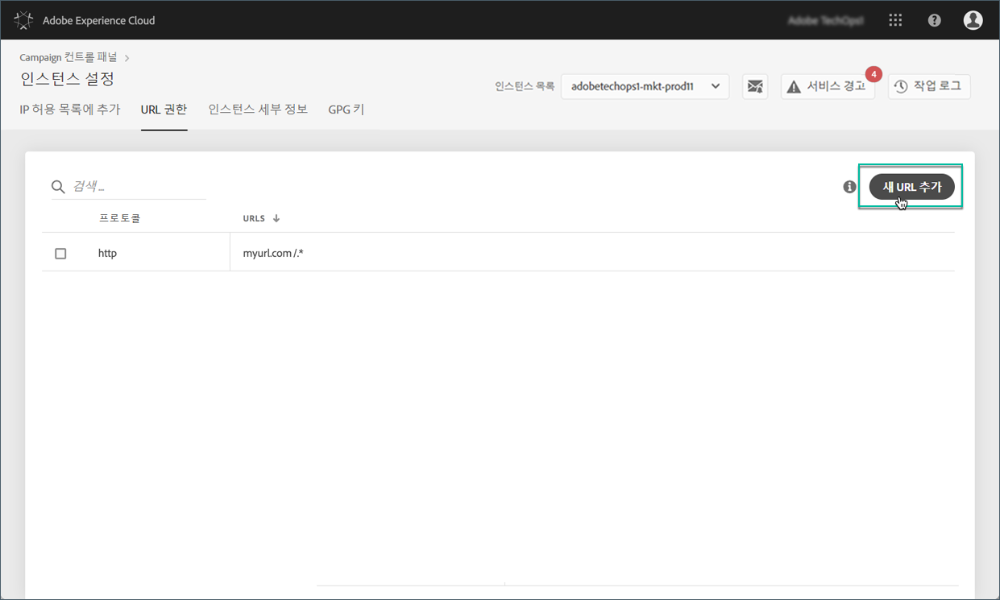
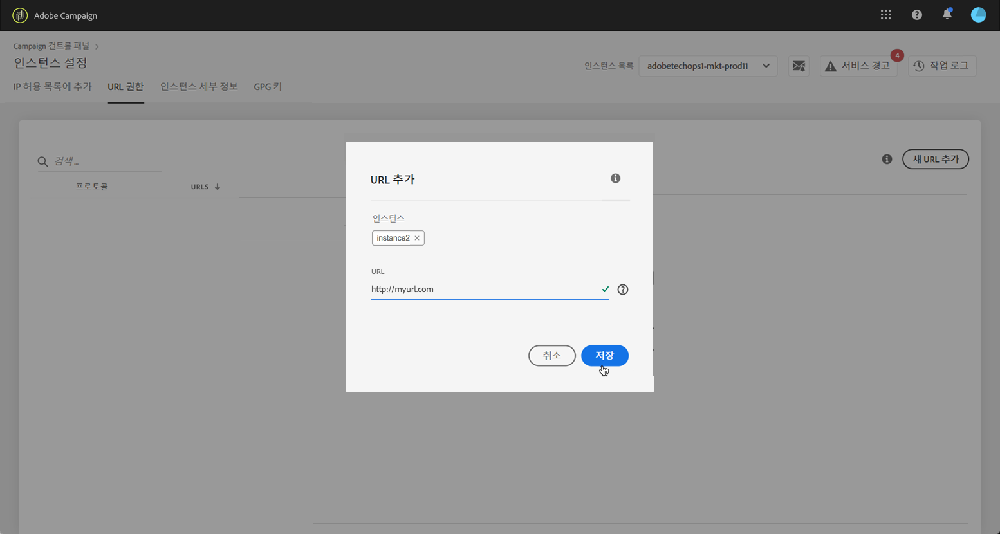
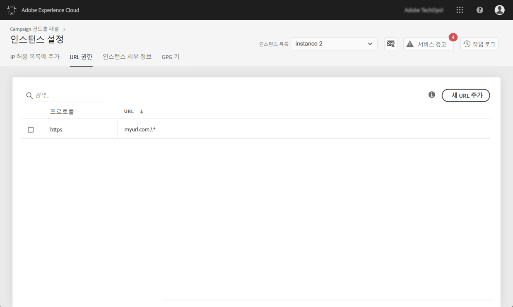

# URL 권한 {#url-permissions}

>[!CONTEXTUALHELP]
>id="cp_instancesettings_urlpermissions"
>title="URL 권한"
>abstract="Adobe Campaign 인스턴스가 연결할 수 있는 URL을 관리합니다."
>additional-url="https://images-tv.adobe.com/mpcv3/91206a19-d9af-4b6a-8197-0d2810a78941_1563488165.1920x1080at3000_h264.mp4" text="데모 비디오 시청"

>[!IMPORTANT]
>
>이 기능은 Campaign Classic 인스턴스 빌드 8850 이상에서만 사용할 수 있습니다. 이전 빌드를 사용하는 경우, 이 기능을 사용하려면 업그레이드해야 합니다.

## URL 권한 {#about-url-permissions}

Campaign Classic 인스턴스에서 워크플로우 등의 JavaScript 코드를 통해 호출할 수 있는 URL의 기본 목록은 제한되어 있습니다. 인스턴스는 이러한 URL이 있어야 정상 작동합니다.

기본적으로 인스턴스는 외부 URL에 연결할 수 없습니다. 컨트롤 패널에서는 인스턴스가 연결할 수 있도록 권한이 부여된 URL 목록에 일부 외부 URL을 추가할 수 있습니다. 이렇게 하면 파일 및/또는 데이터를 전송할 수 있도록 SFTP 서버나 웹 사이트 등의 외부 시스템에 Campaign 인스턴스를 연결할 수 있습니다.

추가한 URL은 인스턴스의 구성 파일(serverConf.xml)에서 참조됩니다.

 [비디오에서 이 기능 살펴보기](https://experienceleague.adobe.com/docs/campaign-classic-learn/control-panel/instance-settings/adding-url-permissions.html?lang=en#instance-settings)

**관련 항목:**

* [Campaign 서버 구성](https://docs.campaign.adobe.com/doc/AC/en/INS_Additional_configurations_Configuring_Campaign_server.html)
* [발신 연결 보호](https://docs.campaign.adobe.com/doc/AC/en/INS_Additional_configurations_Configuring_Campaign_server.html#Outgoing_connection_protection)

## 권장사항 {#best-practices}

* 연결하지 않을 웹 사이트/서버에는 Campaign 인스턴스를 연결하지 마십시오.
* 더 이상 사용하지 않는 URL은 삭제하십시오. 단, 회사의 다른 부서가 삭제한 URL에 계속 연결하는 경우에는 해당 URL을 다시 사용할 수 없게 됩니다.
* 컨트롤 패널에서는 **http**, **https** 및 **sftp** 프로토콜이 지원됩니다. 잘못된 URL이나 프로토콜을 입력하면 오류가 발생합니다.

## URL 권한 관리 {#managing-url-permissions}

>[!CONTEXTUALHELP]
>id="cp_instancesettings_url_add"
>title="새 URL 추가"
>abstract="Campaign 인스턴스에 연결할 수 있도록 URL을 추가합니다."

인스턴스가 연결할 수 있는 URL을 추가하려면 다음 단계를 수행합니다.

1. **[!UICONTROL Instances Settings]** 카드를 열고 **[!UICONTROL URL Permissions]** 탭에 액세스합니다.

   >[!NOTE]
   >
   >Campaign 컨트롤 패널 홈 페이지에 인스턴스 설정 카드가 표시되지 않으면 IMS를 의미합니다. 조직 ID는 Adobe Campaign Classic 인스턴스와 연결되지 않습니다
   >
   >인스턴스가 연결할 수 있는 모든 외부 URL이 <b>URL 권한</b> 탭에 나열됩니다. Campaign의 작동에 필요한 URL(예: 인프라의 각 요소 간 연결)은 이 목록에 포함되지 않습니다.

1. 왼쪽 창에서 원하는 인스턴스를 선택하고 **[!UICONTROL Add new URL]** 버튼을 클릭합니다.

   

   >[!NOTE]
   >
   >모든 Campaign 인스턴스가 왼쪽 창 목록에 표시됩니다.
   >
   >URL 권한 관리는 Campaign Classic 인스턴스 전용이므로 Campaign Standard 인스턴스를 선택하면 &quot;미해당 인스턴스&quot; 메시지가 표시됩니다.

1. 권한을 부여할 URL과 관련 프로토콜(http, https, sftp)을 입력합니다.

   >[!NOTE]
   >
   >여러 인스턴스에 URL 연결 권한을 부여할 수 있습니다. 이렇게 하려면 인스턴스의 첫 글자를 입력하여 인스턴스 필드에서 해당 인스턴스를 직접 추가합니다.

   

1. 목록에 URL을 추가하고 나면 해당 URL에 연결할 수 있습니다.

   >[!NOTE]
   >
   >입력한 URL의 유효성 검사가 완료되고 나면 입력한 페이지의 모든 하위 페이지도 포함되도록 URL 끝에 &quot;/.*&quot; 문자가 자동으로 추가됩니다.

   

언제든지 URL을 선택하고 **[!UICONTROL Delete URL]** 버튼을 클릭하면 URL을 삭제할 수 있습니다.

URL을 삭제하면 인스턴스가 해당 URL을 다시 호출할 수 없습니다.

## 일반적인 질문 {#common-questions}

**새 URL을 추가했는데 인스턴스에서 해당 URL에 계속 연결할 수 없는 이유는 무엇입니까?**

연결하려는 URL을 허용 목록에 추가하거나, 암호를 입력해야 하거나, 기타 형식의 인증을 진행해야 하는 경우도 있습니다. 컨트롤 패널에서는 추가 인증을 관리하지 않습니다.
