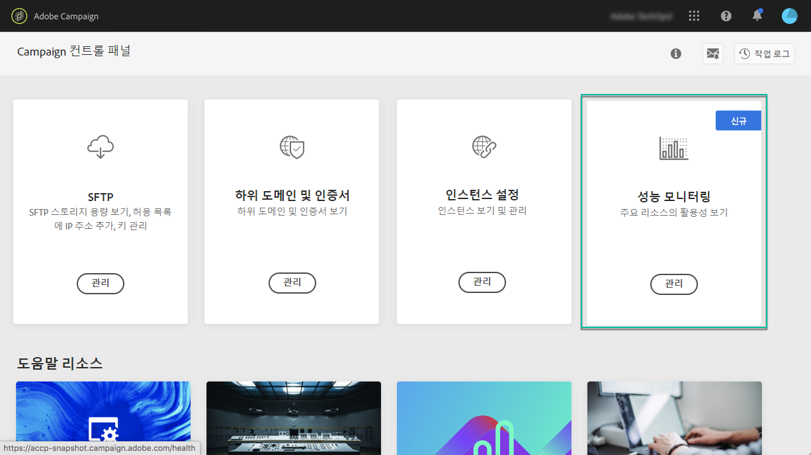

# 성능 모니터링 정보 {#about-performance-monitoring}

Campaign 컨트롤 패널은 인스턴스를 모니터링하고 최적의 성능을 보장하는 데 도움이 되는 몇 가지 기능을 제공합니다.

Campaign 컨트롤 패널 홈 페이지의 **[!UICONTROL Performance monitoring]** 카드에서는 데이터베이스 용량 등의 캠페인 인스턴스 사용을 모니터링할 수 있습니다. 이 작업에 대한 자세한 정보는 [이 섹션](../../performance-monitoring/using/database-monitoring.md)을 참조하십시오.

>[!NOTE]
>
>예정된 Campaign 컨트롤 패널 릴리스를 통해 이 카드에서 추가 모니터링 기능을 사용할 수 있게 됩니다.

또한 Campaign 컨트롤 패널을 사용하면 캠페인 인스턴스 중 하나에서 문제가 탐지될 때마다 이메일 알림을 받도록 등록할 수 있습니다. 이 작업에 대한 자세한 정보는 [이 섹션](../../performance-monitoring/using/email-alerting.md)을 참조하십시오.

