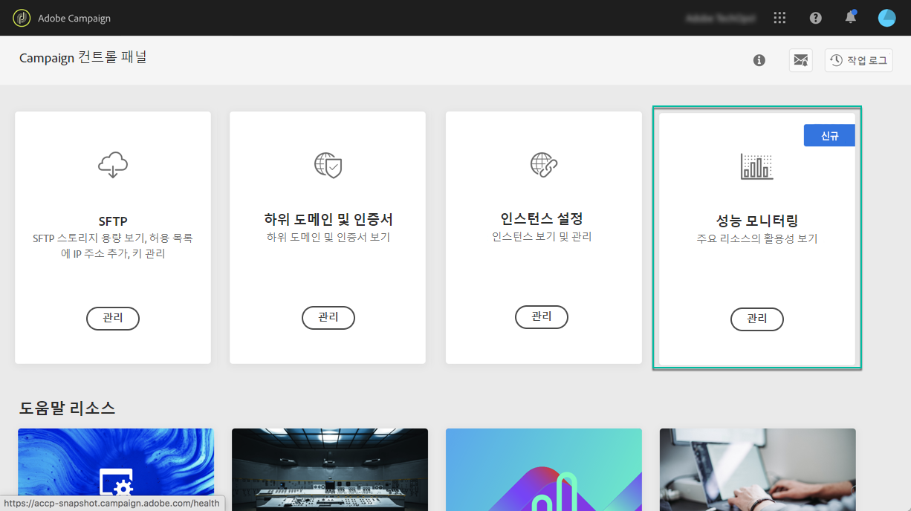

# 성능 모니터링 정보 {#about-performance-monitoring}

컨트롤 패널은 인스턴스를 모니터링하고 최적의 성능을 보장하는 데 도움이 되는 몇 가지 기능을 제공합니다.

컨트롤 패널 홈페이지의 **[!UICONTROL 성능 모니터링]** 카드를 사용하면 데이터베이스 용량 등 캠페인 인스턴스의 사용량을 모니터링할 수 있습니다. 이 작업에 대한 자세한 정보는 [이 섹션](../../performance-monitoring/using/database-monitoring.md)을 참조하십시오.

>[!NOTE]
>
>향후 컨트롤 패널 릴리스를 통해 이 카드에서 추가 모니터링 기능을 사용할 수 있습니다.

