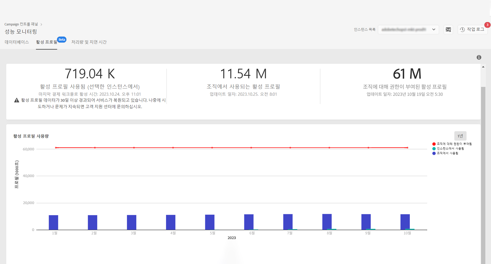

# 활성 프로필 모니터링 {#active-profiles-monitoring}

## 활성 프로필 정보 {#about-active-profiles}

>[!IMPORTANT]
>
>컨트롤 패널의 활성 파일 모니터링은 베타로 제공되며, 별도의 고지 없이 자주 업데이트 및 수정될 수 있습니다. Campaign Standard 10368 빌드에서 사용할 수 있습니다.

계약에 따라 각 캠페인 인스턴스에는 청구 용도로 계산되는 특정 양의 활성 프로필이 제공됩니다. 구입한 활성 프로필 수에 대한 자세한 내용은 최신 계약서를 참조하십시오.

&quot;프로필&quot;은 최종 고객, 잠재 고객 또는 리드를 나타내는 정보의 기록(예: 쿠키 ID, 고객 ID, 모바일 식별자 또는 특정 채널과 관련된 기타 정보가 포함된 외부 테이블 또는 nmsRecipient 테이블의 레코드)을 나타냅니다.

지난 12개월 동안 어느 채널을 통해 프로필을 타겟팅하거나 통신한 경우 프로필이 활성 상태로 간주됩니다.

>[!NOTE]
>
>Facebook 및 X(이전의 Twitter) 채널은 고려되지 않습니다.

활성 프로필에 대한 자세한 내용은 [Campaign Standard](https://experienceleague.adobe.com/docs/campaign-standard/using/profiles-and-audiences/managing-profiles/active-profiles.html?lang=ko) 및 [Campaign v7/v8](https://experienceleague.adobe.com/docs/campaign-classic/using/getting-started/profile-management/about-profiles.html?lang=ko#active-profiles) 설명서를 참조하십시오.

## 활성 프로필 사용량 모니터링 {#monitoring-active-profiles}

>[!CONTEXTUALHELP]
>id="cp_performancemonitoring_active_profile"
>title="활성 프로필 모니터링 정보"
>abstract="이 탭에서는 사용자의 Campaign 인스턴스 각각 및 조직의 최신 및 과거 활성 프로필 사용량 기록과 평가에 대하여 실시간으로 정보를 확인할 수 있습니다."

[컨트롤 패널]에서 활성 프로필 사용량을 모니터링하려면 **[!UICONTROL 성능 모니터링]** 카드 > **[!UICONTROL 활성 프로필]** 탭으로 이동하여 **[!UICONTROL 인스턴스 목록]**&#x200B;에서 원하는 인스턴스를 선택합니다.

활성 프로필 사용량에 대한 정보가 표시됩니다.

상단 섹션에는 다음 정보가 표시됩니다.

* 선택한 인스턴스에서 현재 사용하는 활성 프로필 수와, 인스턴스에서 최근 실행한 과금 워크플로우의 타임스탬프. 

* 조직 전반의 모든 인스턴스 내에서 사용한 총 활성 프로필 수.

  >[!NOTE]
  >
  >이 섹션은 조직과 연결된 인스턴스가 여러 개 있는 경우에만 표시됩니다.

* 조직에 할당된 총 활성 프로필 수.

하단 섹션에서는 지난 30일 동안의 활성 프로필 사용량을 시각적으로 표시합니다. 오른쪽 위 모서리에 있는 필터를 사용하여 이 시간대를 1년으로 변경할 수 있습니다. 그래프 위에 마우스 커서를 올리면 선택한 기간에 사용한 활성 프로필의 정확한 수를 확인할 수 있습니다.

활성 프로필 사용량과 관련된 정보는 인스턴스에서 정기적으로 실행되는 전용 [!DNL Campaign] “과금” 기술 워크플로우를 기반으로 제어판에서 업데이트됩니다.

| Campaign 버전 | 기술 워크플로우 | 실행 |
|  ---  |  ---  |  ---  |
| Campaign Standard | [과금](https://experienceleague.adobe.com/docs/campaign-standard/using/administrating/application-settings/technical-workflows.html?lang=ko) | 일별 |
| Campaign v7/v8 | [과금](https://experienceleague.adobe.com/docs/campaign-classic/using/automating-with-workflows/advanced-management/about-technical-workflows.html?lang=ko) | 월별 |

