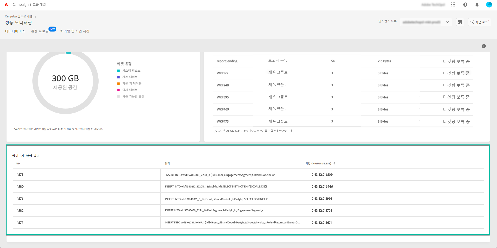

# 활성 쿼리 모니터링 {#long-running-queries}

**[!UICONTROL 데이터베이스]** 탭의 **[!UICONTROL 활성 쿼리]** 영역에는 선택한 인스턴스에서 가장 오랫동안 실행된 5개의 쿼리가 나열됩니다.

**[!UICONTROL 기간]** 열은 인스턴스에서 쿼리가 실행된 기간을 지정합니다. 기간은 `hh:mm:ss.ms` 형식으로 표시됩니다.

>[!IMPORTANT]
>
>쿼리 중 하나가 24시간 이상 활성 상태인 경우 고객 지원 센터에 문의하여 문제를 식별하고 해결하십시오. 쿼리의 고유 식별자인 **[!UICONTROL PID]** 열 값을 제공해야 합니다.
