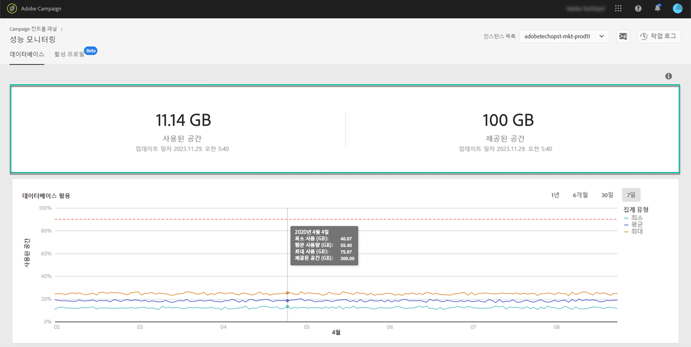
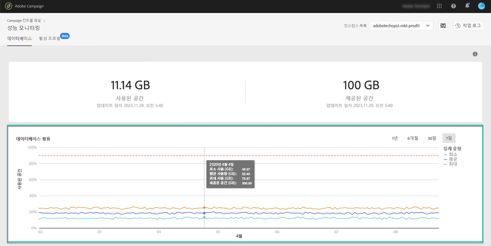

# 데이터베이스 모니터링 {#database-monitoring}

## 인스턴스 데이터베이스 정보 {#about-instances-databases}

계약에 따라 각 캠페인 인스턴스가 특정 양의 데이터베이스 공간으로 제공됩니다.

데이터베이스에는 Adobe Campaign에 저장된 모든 **자산**, **워크플로우** 및 **데이터** 가포함되어 있습니다.

시간이 지남에 따라, 특히 저장된 리소스를 인스턴스에서 삭제하지 않거나 일시 중지된 상태에 많은 워크플로우가 있는 경우 데이터베이스가 최대 용량에 도달할 수 있습니다.

인스턴스 데이터베이스를 넘치면 몇 가지 문제(로그인 불가능, 이메일 전송 불가능)가 발생할 수 있습니다. 따라서 인스턴스 데이터베이스를 모니터링하는 것은 최적의 성능을 보장하기 위해 필수적입니다.

>[!NOTE]
>
>제어판에 표시된 대로 제공되는 데이터베이스 공간의 크기는 계약에 지정된 데이터베이스 공간의 양을 반영하지 않을 수 있습니다. 대개의 경우 시스템의 성능을 보장하기 위해 일시적으로 더 큰 데이터베이스 공간이 제공됩니다.

## 데이터베이스 사용 모니터링 {#monitoring-instances-database}

제어판을 사용하면 각 캠페인 인스턴스에 대한 데이터베이스 사용을 모니터링할 수 있습니다. 이렇게 하려면 아래 단계를 수행합니다.

1. **[!UICONTROL Performance Monitoring]** 카드를 열고 **[!UICONTROL Databases]** 탭을 선택합니다.

1. 에서 원하는 인스턴스를 선택합니다 **[!UICONTROL Instance List]**.

   상단 영역은 인스턴스의 데이터베이스 용량 및 사용 공간에 대한 정보를 제공합니다.

   

   낮은 영역은 빨간색 점선 커브로 표현되는 90% 데이터베이스 사용률 임계값과 지난 7일 동안 최소, 평균 및 최대 데이터베이스 사용률을 그래픽으로 표시합니다.

   오른쪽 위 모서리에서 사용 가능한 필터를 사용하여 표시되는 기간을 변경할 수 있습니다.

   가독성을 높이기 위해 그래프에서 하나 또는 여러 개의 곡선을 강조 표시할 수도 있습니다. 이렇게 하려면 범례에서 **[!UICONTROL Aggregation Type]** 선택합니다.

   그래프 위로 마우스를 가져가면 선택한 기간에 대한 자세한 정보를 볼 수 있습니다.

   

>[!NOTE]
>
>또한 이 대시보드에서는 데이터베이스 중 하나가 용량에 도달하면 알림을 받을 수 있습니다. 이렇게 하려면 [이메일 알림 구독](../../performance-monitoring/using/email-alerting.md)

## 데이터베이스 오버로드 방지 {#preventing-database-overload}

Campaign Standard 및 Classic에서는 데이터베이스 디스크 공간 과소비를 방지하는 다양한 방법을 제공합니다.

아래 섹션에서는 데이터베이스 사용을 최적화하는 데 도움이 되는 캠페인 문서의 유용한 리소스를 제공합니다.

**워크플로우 모니터링**

* [워크플로우 우수 사례](https://docs.adobe.com/content/help/en/campaign-standard/using/managing-processes-and-data/workflow-general-operation/best-practices-workflows.html) (Campaign Standard)
* [워크플로우 실행](https://docs.adobe.com/help/en/campaign-classic/using/automating-with-workflows/monitoring-workflows/monitoring-workflow-execution.html) 모니터링(Campaign Classic)

**데이터베이스 유지 관리**

* 데이터베이스 정리 기술 워크플로우([Campaign Standard](https://docs.adobe.com/help/en/campaign-standard/using/administrating/application-settings/technical-workflows.html#list-of-technical-workflows) / [Campaign Classic](https://docs.adobe.com/help/en/campaign-classic/using/monitoring-campaign-classic/data-processing/database-cleanup-workflow.html))
* [데이터베이스 유지 관리 안내서](https://docs.adobe.com/content/help/en/campaign-classic/using/monitoring-campaign-classic/database-maintenance/recommendations.html) (Campaign Classic)
* [데이터베이스 성능 문제 해결](https://docs.adobe.com/content/help/en/campaign-classic/using/monitoring-campaign-classic/troubleshooting/database-performances.html) (Campaign Classic)
* [데이터베이스 관련 옵션](https://docs.adobe.com/help/en/campaign-classic/using/installing-campaign-classic/appendices/configuring-campaign-options.html#database) (Campaign Classic)
