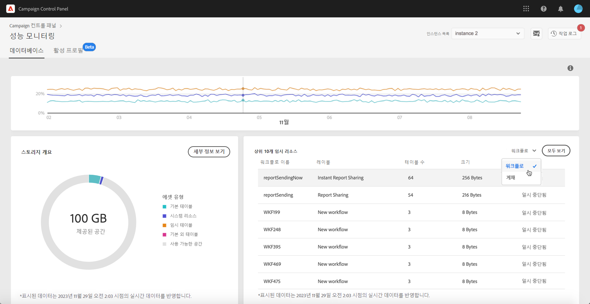

# 데이터베이스 모니터링 {#database-monitoring}

## 인스턴스 데이터베이스 정보 {#about-instances-databases}

계약에 따라 각 Campaign 인스턴스에는 특정 양의 데이터베이스 공간으로 프로비전됩니다.

데이터베이스에는 Adobe Campaign에 저장된 모든 **자산**, **워크플로우** 및 **데이터**&#x200B;가 포함되어 있습니다.

시간이 지남에 따라, 특히 저장된 리소스를 인스턴스에서 삭제하지 않거나 일시 중지된 상태에 많은 워크플로우가 있는 경우 데이터베이스가 최대 용량에 도달할 수 있습니다.

인스턴스 데이터베이스가 오버플로된 경우 문제(로그인, 이메일 보내기 불가 등)가 발생할 수 있습니다. 그러므로 최적의 성능을 보장하기 위해 인스턴스 데이터베이스를 모니터링하는 것이 필수입니다.

>[!NOTE]
>
>Campaign 컨트롤 패널에 표시된 데이터베이스 공간의 양이 계약의 내용과 다른 경우 고객 지원 센터에 문의하십시오.

## 데이터베이스 사용량 모니터링 {#monitoring-instances-database}

 이 비디오에서 [Campaign Classic](https://experienceleague.adobe.com/docs/campaign-classic-learn/control-panel/performance-monitoring/monitoring-databases.html?lang=ko#performance-monitoring) 또는 [Campaign Standard](https://experienceleague.adobe.com/docs/campaign-standard-learn/control-panel/performance-monitoring/monitoring-databases.html?lang=ko#performance-monitoring)를 사용하여 해당 기능 살펴보기

Campaign 컨트롤 패널을 사용하면 각 캠페인 인스턴스에 대한 데이터베이스 사용량을 모니터링할 수 있습니다. 이 작업을 수행 하려면 **[!UICONTROL Performance Monitoring]**&#x200B;카드를 연 다음 **[!UICONTROL Databases]**&#x200B;탭을 선택합니다.

**[!UICONTROL Instance List]**&#x200B;에서 원하는 인스턴스를 선택하여 인스턴스의 데이터베이스 용량 및 사용 공간에 대한 정보를 표시합니다.

>[!NOTE]
>
>이 대시보드의 데이터는 Campaign 인스턴스에서 실행되는 **[!UICONTROL Database cleanup technical workflow]**&#x200B;를 기준으로 업데이트됩니다([Campaign Standard](https://experienceleague.adobe.com/docs/campaign-standard/using/administrating/application-settings/technical-workflows.html?lang=ko#administrating) 및 [Campaign Classic](https://experienceleague.adobe.com/docs/campaign-classic/using/monitoring-campaign-classic/data-processing/database-cleanup-workflow.html?lang=ko) 설명서 참조).
>
>또한 기존의 방식으로 확인할 수 있습니다. 워크플로우가 **[!UICONTROL Used Space]** 및 **[!UICONTROL Provided Space]** 메트릭 아래에 실행된 지난 번 데이터베이스 중 하나가 c에 도달하면 알림을 받을 수 있습니다. 워크플로우가 3일 이상 실행된 적이 없는 경우, 워크플로우가 실행 중이 아닌 이유를 조사할 수 있도록 Adobe 고객 지원 센터에 문의하는 것이 좋습니다.

이 대시보드에서 아래 설명된 추가 메트릭을 사용하여 인스턴스의 데이터베이스 사용량을 분석할 수 있습니다.

### 데이터베이스 사용률 {#database-utilization}

**[!UICONTROL Database utilization]** 영역은 빨간색 점선 곡선으로 표현되는 90% 데이터베이스 사용 임계값과 지난 7일 동안의 최소, 평균 및 최대 데이터베이스 사용률을 그래픽으로 표시합니다.

기간을 변경하려면 그래프의 오른쪽 위 모서리에 있는 필터를 사용하십시오.

가독성을 높이기 위해 그래프에서 하나 또는 여러 개의 곡선을 강조 표시할 수도 있습니다. 이를 수행하려면 **[!UICONTROL Aggregation Type]** 범례에서 선택합니다.

특정 기간에 대한 자세한 내용을 보려면 그래프 위로 마우스를 가져가 현재 사용된 데이터베이스 사용량에 대한 정보를 표시합니다.

### 저장소 개요 {#storage-overview}

**[!UICONTROL Storage overview]** 영역은 다음과 같이 사용자가 사용 중인 공간을 그래픽으로 표시합니다.

* **[!UICONTROL System resources]**

   데이터베이스 공간에서 시스템 리소스로 용량이 많이 사용되는 경우 고객 지원 센터에 문의하십시오.

* 기본적으로 Campaign 인스턴스와 함께 제공되는 **[!UICONTROL Out-of-the-box tables]**,
* 워크플로우 및 게재별로 작성된 **[!UICONTROL Temporary tables]**,
* 사용자 지정 리소스를 만든 후 생성된 **[!UICONTROL Non-out of the box tables]**.

데이터베이스 공간을 사용하는 다른 자산에 대한 자세한 내용을 보려면 **[!UICONTROL View details]** 단추를 클릭합니다.

필터를 사용하여 특정 자산 유형에서만 검색 및 표시 테이블을 검색할 수 있습니다.

### 상위 10개의 임시 리소스 {#top-10}

**[!UICONTROL Top 10 temporary resources]** 영역에는 워크플로우 및 게재로 생성된 가장 큰 10개의 임시 리소스가 나열됩니다.

대규모 임시 리소스를 생성하는 워크플로우 및 게재 모니터링은 데이터베이스를 모니터링하는 중요한 단계입니다. 임시 리소스가 너무 많은 데이터베이스 공간을 사용하는 경우, 해당 워크플로우나 게재가 필요한지 확인하고, 해당 인스턴스로 이동하여 중지해야 합니다.

>[!IMPORTANT]
>
>일반적으로 **40개 이상의 열**&#x200B;이 기본 제공 리소스가 아닌 곳에 있는 상황을 피하는 것이 좋습니다.

>[!NOTE]
>
>워크플로우에 테이블 수가 많거나 데이터베이스 크기가 큰 경우, 워크플로우를 검토하여 너무 많은 데이터를 생성하는 이유를 조사하는 것이 좋습니다.
>
>이 페이지 끝에 데이터베이스 오버로드를 방지하는 데 도움이 되는 Campaign Standard 및 Classic 리소스가 있습니다.

**[!UICONTROL View all]** 단추를 사용하여 이러한 임시 리소스에 대한 자세한 정보에 액세스할 수 있습니다.

>[!NOTE]
>
>**[!UICONTROL Keep interim results]** 열의 값은 Campaign에서 옵션이 활성화되었는지(&quot;1&quot;), 비활성화되었는지(&quot;0&quot;)를 나타냅니다. **[!UICONTROL Keep interim results]** 옵션은 워크플로우 속성에서 액세스할 수 있습니다. 워크플로우의 다양한 활동 중에 전환 결과를 저장할 수 있습니다([Campaign Standard](https://docs.adobe.com/content/help/ko/campaign-standard/using/managing-processes-and-data/executing-a-workflow/managing-execution-options.html) 및 [Campaign Classic](https://experienceleague.adobe.com/docs/campaign-classic/using/automating-with-workflows/general-operation/workflow-best-practices.html?lang=ko#logs) 설명서 참조).
>
>워크플로우 중 하나에 대해 이 옵션을 활성화하면 데이터베이스 정리 워크플로우에서 중간 결과로 사용된 공간을 다시 확보할 수 없습니다. 따라서 옵션을 끌 수 있을지 확인하기 위해 워크플로우를 검토할 것을 권장합니다.

## 데이터베이스 오버로드 방지 {#preventing-database-overload}

Campaign Standard 및 Classic에서는 데이터베이스 디스크 공간 과소비를 방지하기 위한 다양한 방법을 제공합니다.

아래 섹션에서 데이터베이스 사용량을 최적화하는 데 도움이 되는 Campaign 설명서를 볼 수 있습니다.

**워크플로우 모니터링**

* [워크플로우 모범 사례](https://experienceleague.adobe.com/docs/campaign-standard/using/managing-processes-and-data/workflow-general-operation/best-practices-workflows.html?lang=ko) (Campaign Standard)
* [워크플로우 실행 모니터링](https://experienceleague.adobe.com/docs/campaign-classic/using/automating-with-workflows/monitoring-workflows/monitoring-workflow-execution.html?lang=ko) (Campaign Classic)

**데이터베이스 유지 관리**

* 데이터베이스 정리 기술 워크플로우([Campaign Standard](https://experienceleague.adobe.com/docs/campaign-standard/using/administrating/application-settings/technical-workflows.html?lang=ko#administrating) / [Campaign Classic](https://experienceleague.adobe.com/docs/campaign-classic/using/monitoring-campaign-classic/data-processing/database-cleanup-workflow.html?lang=ko))
* [데이터베이스 유지 관리 안내서](https://experienceleague.adobe.com/docs/campaign-classic/using/monitoring-campaign-classic/database-maintenance/recommendations.html?lang=ko) (Campaign Classic)
* [데이터베이스 성능 문제 해결](https://experienceleague.adobe.com/docs/campaign-classic/using/monitoring-campaign-classic/troubleshooting-toc/database-issues-toc/database-performances.html?lang=ko) (Campaign Classic)
* [데이터베이스 관련 옵션](https://docs.adobe.com/help/ko-KR/campaign-classic/using/installing-campaign-classic/appendices/configuring-campaign-options.html#database) (Campaign Classic)
* 데이터 보존([Campaign Standard](https://experienceleague.adobe.com/docs/campaign-standard/using/administrating/application-settings/data-retention.html?lang=ko#administrating) / [Campaign Classic](https://docs.adobe.com/help/ko-KR/campaign-classic/using/configuring-campaign-classic/data-model/data-model-best-practices.html#data-retention))

>[!NOTE]
>
>또한 데이터베이스 중 하나가 최대 용량에 도달하면 알림을 받을 수 있습니다. 이렇게 하려면 [이메일 경고](../../performance-monitoring/using/email-alerting.md)에 가입하십시오.
