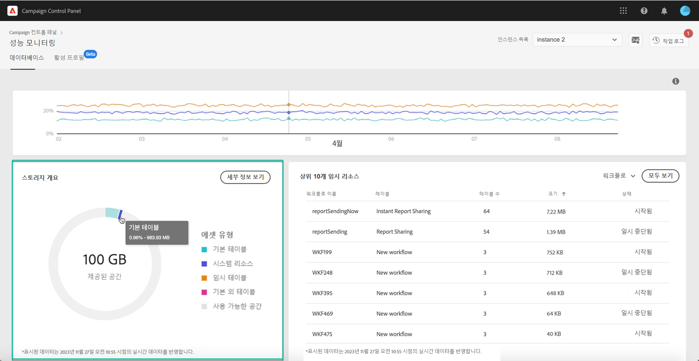

# 데이터베이스 모니터링 {#database-monitoring}

## 인스턴스 데이터베이스 정보 {#about-instances-databases}

계약에 따라 각 캠페인 인스턴스가 특정 양의 데이터베이스 공간으로 제공됩니다.

데이터베이스에는 Adobe Campaign에 저장된 모든 **자산**, **워크플로우** 및 **데이터** 가포함됩니다.

시간이 지남에 따라, 특히 저장된 리소스를 인스턴스에서 삭제하지 않거나 일시 중지된 상태에 많은 워크플로우가 있는 경우 데이터베이스가 최대 용량에 도달할 수 있습니다.

인스턴스 데이터베이스를 넘치면 몇 가지 문제(로그인 불가능, 이메일 전송 불가능)가 발생할 수 있습니다. 따라서 인스턴스 데이터베이스를 모니터링하는 것은 최적의 성능을 보장하기 위해 필수적입니다.

>[!NOTE]
>
>Campaign 컨트롤 패널에 표시된 대로 제공된 데이터베이스 공간의 크기가 계약에 지정된 금액을 반영하지 않는 경우 고객 지원 센터에 문의하십시오.

## 데이터베이스 사용 모니터링 {#monitoring-instances-database}

Campaign 컨트롤 패널을 사용하면 각 캠페인 인스턴스에 대한 데이터베이스 사용을 모니터링할 수 있습니다. 이렇게 하려면 **[!UICONTROL Performance Monitoring]** 카드를 연 다음 **[!UICONTROL Databases]** 탭을 선택합니다.

인스턴스의 데이터베이스 용량 및 사용 공간에 대한 정보를 표시하려면 인스턴스 **[!UICONTROL Instance List]** 에서 원하는 인스턴스를 선택합니다.

>[!NOTE]
>
>이 대시보드의 데이터는 캠페인 인스턴스에서 **[!UICONTROL Database cleanup technical workflow]** 실행되는 데이터를 기반으로 업데이트됩니다( [Campaign Standard](https://docs.adobe.com/help/en/campaign-standard/using/administrating/application-settings/technical-workflows.html#list-of-technical-workflows) 및 [Campaign Classic](https://docs.adobe.com/help/en/campaign-classic/using/monitoring-campaign-classic/data-processing/database-cleanup-workflow.html) 문서 참조).
>
>워크플로우가 **[!UICONTROL Used Space]** 및 지표 아래에 마지막으로 실행된 시간을 확인할 수 **[!UICONTROL Provided Space]** 있습니다. 워크플로우가 3일 이상 실행 중이지 않은 경우 워크플로우가 실행되지 않는 이유를 조사할 수 있도록 Adobe 고객 지원 센터에 문의하는 것이 좋습니다.

아래 설명된 추가 지표를 이 대시보드에서 사용하여 인스턴스의 데이터베이스 사용을 분석할 수 있습니다.

* [데이터베이스 사용률](../../performance-monitoring/using/database-monitoring.md#database-utilization)
* [저장소 개요](../../performance-monitoring/using/database-monitoring.md#storage-overview)
* [상위 10개의 임시 리소스](../../performance-monitoring/using/database-monitoring.md#top-10)

### 데이터베이스 사용률 {#database-utilization}

이 **[!UICONTROL Database utilization]** 영역은 빨간색 점선 커브로 표현되는 90% 데이터베이스 사용률 임계값과 지난 7일 동안 최소, 평균 및 최대 데이터베이스 사용률을 그래픽으로 표시합니다.

기간을 변경하려면 그래프의 오른쪽 위 모서리에 있는 필터를 사용하십시오.

가독성을 높이기 위해 그래프에서 하나 또는 여러 개의 곡선을 강조 표시할 수도 있습니다. 이렇게 하려면 범례에서 **[!UICONTROL Aggregation Type]** 선택합니다.

특정 기간에 대한 자세한 내용을 보려면 그래프 위로 마우스를 가져가면 현재 데이터베이스 사용에 대한 정보가 표시됩니다.

### 저장소 개요 {#storage-overview}

이 **[!UICONTROL Storage overview]** 영역은

* **[!UICONTROL System resources]**

   시스템 리소스에 데이터베이스 공간의 많은 부분이 사용되는 경우 고객 지원 센터에 문의하는 것이 좋습니다.

* **[!UICONTROL Out-of-the-box tables]** 기본적으로 캠페인 인스턴스와 함께 제공됩니다.
* **[!UICONTROL Temporary tables]** 워크플로우 및 게재별로 작성됨
* **[!UICONTROL Non-out of the box tables]** 사용자 지정 리소스를 만든 후 생성됩니다.

데이터베이스 공간을 사용하고 있는 다른 자산에 대한 자세한 내용을 보려면 **[!UICONTROL View details]** 단추를 클릭하십시오.

필터를 사용하여 특정 자산 유형에서만 검색 및 표시 테이블을 세분화합니다.

### 상위 10개의 임시 리소스 {#top-10}

이 **[!UICONTROL Top 10 temporary resources]** 영역에는 워크플로우 및 게재로 생성된 가장 큰 10개의 임시 리소스가 나열됩니다.

대규모 임시 리소스를 만드는 워크플로 및 배달 모니터링은 데이터베이스를 모니터링하기 위한 핵심 단계입니다. 임시 리소스가 너무 많은 데이터베이스 공간을 사용하고 있는 경우 이 작업 과정이나 배달을 필요로 하고, 나중에 해당 인스턴스로 이동하여 중지해야 합니다.

>[!IMPORTANT]
>
>일반적인 권장 사항은 기본 리소스 이외의 **열에** 40개 열이 발생하지 않도록 하는 것입니다.

>[!NOTE]
>
>워크플로우에 많은 수의 테이블 카운트나 데이터베이스 크기가 있는 경우, 너무 많은 데이터를 생성하는 이유를 조사하기 위해 워크플로우를 검토하는 것이 좋습니다.
>
>이 페이지 끝에는 데이터베이스 오버로드를 방지하는 데 도움이 되는 Campaign Standard 및 클래식 리소스도 사용할 수 있습니다.

이 **[!UICONTROL View all]** 단추를 사용하면 이러한 임시 리소스에 대한 자세한 정보에 액세스할 수 있습니다.

>[!NOTE]
>
>열의 값은 **[!UICONTROL Keep interim results]** 캠페인에서 옵션이 활성화되었는지(&quot;1&quot;), 비활성화되었는지(&quot;0&quot;)를 나타냅니다. 이 **[!UICONTROL Keep interim results]** 옵션은 워크플로우 속성에서 액세스할 수 있습니다. 워크플로우의 다양한 활동 간에 전환 결과를 저장할 수 있습니다( [Campaign Standard](https://docs.adobe.com/content/help/en/campaign-standard/using/managing-processes-and-data/executing-a-workflow/managing-execution-options.html) 및 [Campaign Classic](https://docs.adobe.com/content/help/en/campaign-classic/using/automating-with-workflows/general-operation/workflow-best-practices.html#logs) 설명서 참조).
>
>워크플로 중 하나에 대해 이 옵션을 활성화하면 데이터베이스 정리 워크플로에서 중간 결과로 사용된 공간을 다시 확보할 수 없습니다. 따라서 옵션을 끌 수 있는지 여부를 확인하기 위해 워크플로우를 검토하는 것이 좋습니다.

## 데이터베이스 오버로드 방지 {#preventing-database-overload}

Campaign Standard 및 Classic에서는 데이터베이스 디스크 공간 과소비를 방지하기 위한 다양한 방법을 제공합니다.

아래 섹션에서는 데이터베이스 사용을 최적화하는 데 도움이 되는 캠페인 문서의 유용한 리소스를 제공합니다.

**워크플로우 모니터링**

* [워크플로우 모범 사례](https://docs.adobe.com/content/help/en/campaign-standard/using/managing-processes-and-data/workflow-general-operation/best-practices-workflows.html) (Campaign Standard)
* [워크플로우 실행](https://docs.adobe.com/help/en/campaign-classic/using/automating-with-workflows/monitoring-workflows/monitoring-workflow-execution.html) 모니터링(Campaign Classic)

**데이터베이스 유지 관리**

* 데이터베이스 정리 기술 워크플로우([Campaign Standard](https://docs.adobe.com/help/en/campaign-standard/using/administrating/application-settings/technical-workflows.html#list-of-technical-workflows) / [Campaign Classic](https://docs.adobe.com/help/en/campaign-classic/using/monitoring-campaign-classic/data-processing/database-cleanup-workflow.html))
* [데이터베이스 유지 관리 안내서](https://docs.adobe.com/content/help/en/campaign-classic/using/monitoring-campaign-classic/database-maintenance/recommendations.html) (Campaign Classic)
* [데이터베이스 성능 문제 해결](https://docs.adobe.com/content/help/en/campaign-classic/using/monitoring-campaign-classic/troubleshooting/database-performances.html) (Campaign Classic)
* [데이터베이스 관련 옵션](https://docs.adobe.com/help/en/campaign-classic/using/installing-campaign-classic/appendices/configuring-campaign-options.html#database) (Campaign Classic)
* 데이터 유지([Campaign Standard](https://docs.adobe.com/help/en/campaign-standard/using/administrating/application-settings/data-retention.html) / [Campaign Classic](https://docs.adobe.com/help/en/campaign-classic/using/configuring-campaign-classic/data-model/data-model-best-practices.html#data-retention))

>[!NOTE]
>
>또한 데이터베이스 중 하나가 용량에 도달하면 알림을 받을 수 있습니다. 이렇게 하려면 [이메일 알림](../../performance-monitoring/using/email-alerting.md)구독
