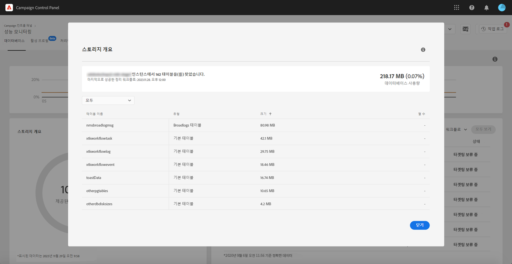

# 저장소 개요 {#storage-overview}

>[!CONTEXTUALHELP]
>id="cp_dbdetails_storagedetails"
>title="저장소 개요 정보"
>abstract="이 탭에서는 데이터베이스 공간을 사용하는 다양한 Campaign 리소스에 대하여 자세한 정보를 확인할 수 있습니다."

**[!UICONTROL Storage overview]** 영역은 다음과 같이 사용자가 사용 중인 공간을 그래픽으로 표시합니다.

* **[!UICONTROL System resources]**

   데이터베이스 공간에서 시스템 리소스로 용량이 많이 사용되는 경우 고객 지원 센터에 문의하십시오.

* 기본적으로 Campaign 인스턴스와 함께 제공되는 **[!UICONTROL Out-of-the-box tables]**,
* 워크플로우 및 게재별로 작성된 **[!UICONTROL Temporary tables]**,
* 사용자 지정 리소스를 만든 후 생성된 **[!UICONTROL Non-out of the box tables]**.

데이터베이스 공간을 사용하는 다른 자산에 대한 자세한 내용을 보려면 **[!UICONTROL View details]** 단추를 클릭합니다.

필터를 사용하여 특정 자산 유형에서만 검색 및 표시 테이블을 검색할 수 있습니다.

