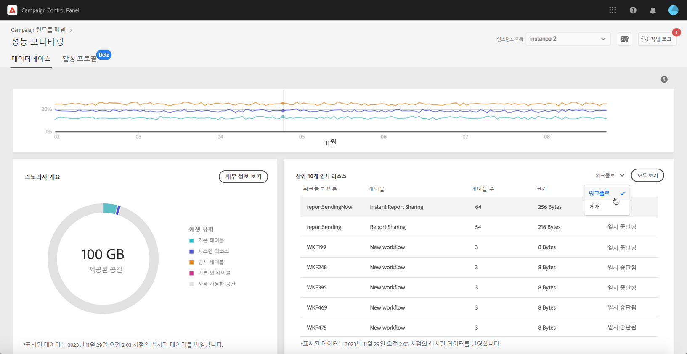

# 상위 10개의 임시 리소스 {#top-10}

**[!UICONTROL Top 10 temporary resources]** 영역에는 워크플로우 및 게재로 생성된 가장 큰 10개의 임시 리소스가 나열됩니다.

대규모 임시 리소스를 생성하는 워크플로우 및 게재 모니터링은 데이터베이스를 모니터링하는 중요한 단계입니다. 임시 리소스가 너무 많은 데이터베이스 공간을 사용하는 경우, 해당 워크플로우나 게재가 필요한지 확인하고, 해당 인스턴스로 이동하여 중지해야 합니다.

>[!IMPORTANT]
>
>일반적으로 **40개 이상의 열**&#x200B;이 기본 제공 리소스가 아닌 곳에 있는 상황을 피하는 것이 좋습니다.

>[!NOTE]
>
>워크플로우에 테이블 수가 많거나 데이터베이스 크기가 큰 경우, 워크플로우를 검토하여 너무 많은 데이터를 생성하는 이유를 조사하는 것이 좋습니다.
>
>이 페이지 끝에 데이터베이스 오버로드를 방지하는 데 도움이 되는 Campaign Standard 및 Classic 리소스가 있습니다.

**[!UICONTROL View all]** 단추를 사용하여 이러한 임시 리소스에 대한 자세한 정보에 액세스할 수 있습니다.

**[!UICONTROL Keep interim results]** 열의 값은 Campaign에서 옵션이 활성화되었는지(&quot;1&quot;), 비활성화되었는지(&quot;0&quot;)를 나타냅니다. 이 옵션을 사용하면 워크플로우의 다양한 활동 중에 전환 결과를 저장할 수 있습니다([Campaign Standard](https://experienceleague.adobe.com/docs/campaign-standard/using/managing-processes-and-data/executing-a-workflow/managing-execution-options.html?lang=ko) 및 [Campaign Classic](https://experienceleague.adobe.com/docs/campaign-classic/using/automating-with-workflows/introduction/workflow-best-practices.html?lang=ko#logs) 설명서 참조).

>[!IMPORTANT]
>
>프로덕션 워크플로우에서는 이 옵션을 체크해서는 안 됩니다. 결과를 분석하는 데 사용되며 테스트 목적으로만 설계되었기 때문에 개발 또는 스테이징 환경에서만 사용해야 합니다.
>
>Campaign 컨트롤 패널의 값이 워크플로우 중 하나에 대해 옵션이 활성화되었음을 나타내는 경우 Campaign에서 비활성화하는 것이 좋습니다.
