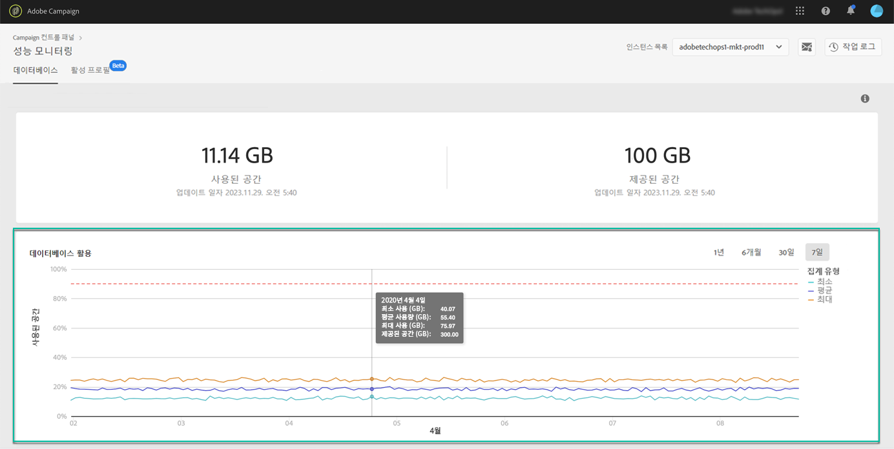

# 데이터베이스 사용률 {#database-utilization}

**[!UICONTROL 데이터베이스 사용률]** 영역은 지난 7일 동안의 최소, 평균, 최대 데이터베이스 사용률을 그래픽으로 표시하며, 90%의 데이터베이스 사용률 임계값을 빨간색 점선 곡선으로 표시합니다.

기간을 변경하려면 그래프의 오른쪽 위 모서리에 있는 필터를 사용하십시오.

가독성을 높이기 위해 그래프에서 하나 또는 여러 개의 곡선을 강조 표시할 수도 있습니다. 이렇게 하려면 **[!UICONTROL 집계 유형]** 범례를 선택하면 됩니다.

특정 기간에 대한 자세한 내용을 보려면 그래프 위로 마우스를 가져가 현재 사용된 데이터베이스 사용량에 대한 정보를 표시합니다.

