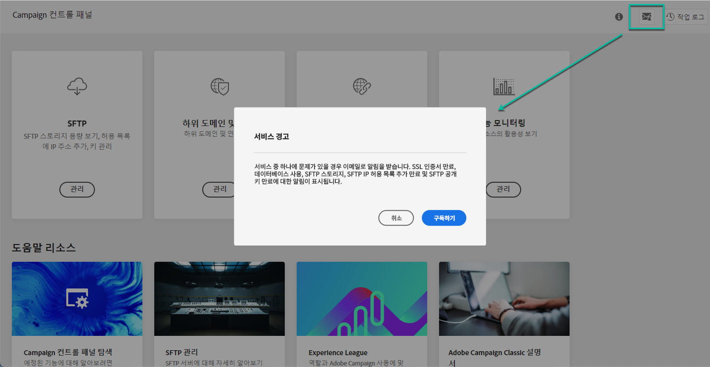

# 이메일 경고 {#email-alerting}

작업에 더 많은 유연성을 제공하기 위해 컨트롤 패널에는 실시간 이메일 경고 기능이 제공됩니다.

## 경고 목록 {#list}

경고 목록은 다음과 같습니다.

* **SFTP 스토리지 사용량**: SFTP 서버 중 하나가 용량 80% 이상에 도달했습니다. [SFTP 스토리지 관리](../../sftp/using/sftp-storage-management.md)를 참조하십시오.

* **데이터베이스 사용량**: 인스턴스 데이터베이스 중 하나가 용량 80% 이상에 도달했습니다. [데이터베이스 모니터링](../../performance-monitoring/using/database-monitoring.md)을 참조하십시오.

* **SFTP IP 허용 목록 만료**: 정의한 IP 범위 중 하나가 만료되었거나 10일 이내에 만료될 예정입니다. [IP 범위 허용 목록](../../sftp/using/ip-range-allow-listing.md)을 참조하십시오.

* **SFTP 공개 키 만료**: 정의한 공개 키 중 하나가 만료되었거나 10일 이내에 만료될 예정입니다. [키 관리](../../sftp/using/key-management.md)를 참조하십시오.

* **SSL 인증서 만료**: 하위 도메인의 SSL 인증서 중 하나가 만료되었거나 30일 이내에 만료될 예정입니다. [하위 도메인의 SSL 인증서 모니터링](../../subdomains-certificates/using/monitoring-ssl-certificates.md)을 참조하십시오.

<!--* **Long running Queries**: A query has been running for more than 24 hours on one of your instances. See [Monitoring active queries](database-active-queries.md).-->

>[!NOTE]
>
>또한 컨트롤 패널을 사용하면 인스턴스(릴리스 및 서비스 검토)에서 이벤트가 발생하기 전에 이메일로 알림을 받을 수 있도록 **미리 알림을 설정**&#x200B;할 수 있습니다.
>
>이렇게 하려면 이메일 경고를 구독하고 예정된 이벤트에 대한 미리 알림을 설정해야 합니다. [예정된 이벤트에 대한 미리 알림을 설정하는 방법 알아보기](../../service-events/service-events.md#reminders)

## 경고 구독 {#subscribe}

이러한 경고를 구독하려면 다음 단계를 수행하십시오.

1. 컨트롤 패널의 어느 위치에서나 사용할 수 있는 **[!UICONTROL 경고 알림]** 버튼을 클릭한 다음 **[!UICONTROL 구독]**&#x200B;을 클릭합니다.

   

1. 구독을 확인하기 위해 이메일이 전송됩니다.

   

1. 구독 후 컨트롤 패널은 시스템 문제에 대해 알리고 수행할 작업을 권장합니다. 자신이 관리자인 **모든 인스턴스**&#x200B;에 등록한 모든 사람에게 이메일 경고가 전송됩니다.

   
