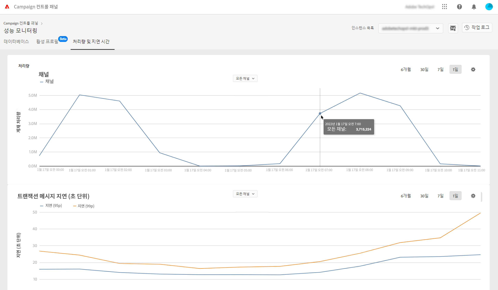
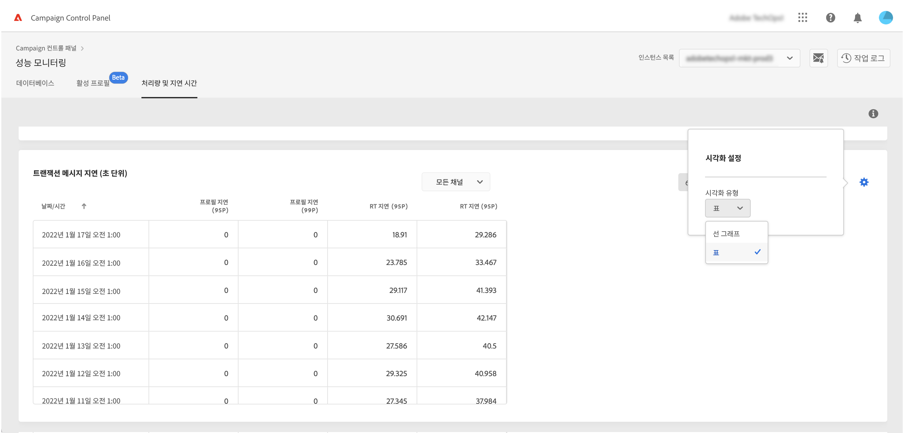
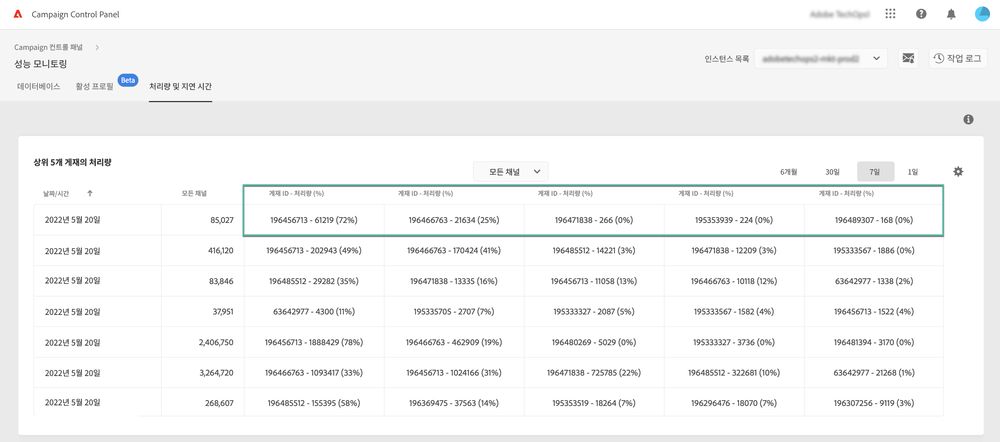
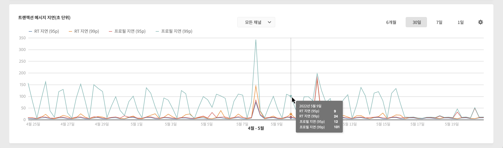
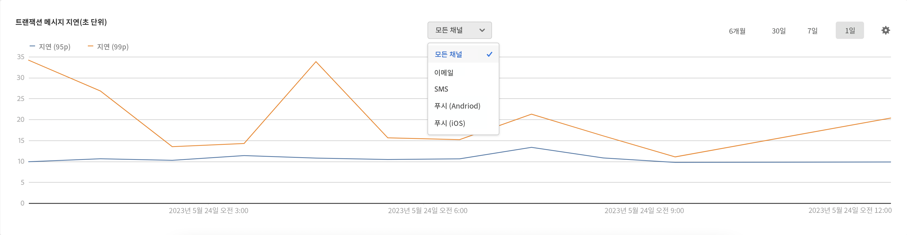

# 처리량 및 지연 모니터링 {#throughputs-latency-monitoring}

>[!CONTEXTUALHELP]
>id="cp_performancemonitoring_throughputslatencies"
>title="처리량 및 지연 모니터링 정보 "
>abstract="이 탭에서는 인스턴스의 한 기간 동안 게재 처리량과 지연 시간이 어떤 트렌드인지 모니터링할 수 있습니다. 처리량에 영향을 주는 게재에 대해 자세히 확인하려면 표 형식으로 보기로 전환하세요."

Campaign 컨트롤 패널을 사용하면 각 인스턴스의 게재 처리량과 지연을 모니터링할 수 있습니다.

>[!IMPORTANT]
>
>이 기능은 (MID 인스턴스가 없는) [독립형 배포 버전](https://experienceleague.adobe.com/docs/campaign-classic/using/installing-campaign-classic/deployment-types-/standalone-deployment.html?lang=ko)을 포함한 모든 Campaign Standard 고객, v8 고객, Campaign v7 고객(빌드 번호 9032 이상)이 사용할 수 있습니다.

게재 처리량 및 지연 시간이 일정 기간 동안 어떤 트렌드를 보이는지 모니터링하려면 인스턴스의 사용을 이해하고 제대로 작동하는지 확인해야 합니다.

이 정보는 각 Campaign 인스턴스에 대해 [컨트롤 패널]의 **[!UICONTROL Throughputs & Latency]** 탭에 있는 **[!UICONTROL Performance Monitoring]** 카드에서 사용할 수 있습니다(컨트롤 패널에서 숫자를 표시하는 데 최대 1시간이 소요될 수 있습니다).

>[!NOTE]
>
>이 영역에 나와 있는 모든 수치는 근사 정보용으로만 제공됩니다.

기본적으로 현재 날짜의 데이터가 표시됩니다. **[!UICONTROL 6 months]**, **[!UICONTROL 30 days]**, **[!UICONTROL 7 days]** 버튼을 사용하여 표시된 기간을 변경할 수 있습니다. 보기에 따라 데이터가 다음과 같이 표시됩니다.
* 1일 및 7일 보기의 경우 시 단위,
* 30일 보기의 경우 6시간 단위,
* 6개월 보기의 경우 일 단위로 표시됩니다.

정보를 그래프가 아닌 정렬 가능한 열을 사용하여 표 형식으로 시각화할 수도 있습니다. 이렇게 하려면 **[!UICONTROL Visualization settings]** 버튼을 클릭한 후 **[!UICONTROL Table]**&#x200B;을(를) 선택합니다.

## 처리량 모니터링 {#throughput}

다음 **[!UICONTROL Throughput]** 영역에서는 권한이 부여된 모든 통신 채널에 대해 선택한 Campaign 인스턴스에서 시간당 전송된 메시지 수에 대한 정보를 제공합니다.

>[!NOTE]
>
>Campaign v7/v8의 경우 표시되는 처리량의 수는 MID(중간 소싱) 인스턴스에서 달성한 처리량입니다. 독립형 MKT(마케팅) 배포(MID 인스턴스 없음)의 경우 MKT 인스턴스의 처리량이 대신 표시됩니다.

또한 컨트롤 패널에서는 선택한 기간 동안 처리량에 가장 많은 영향을 미친 게재 5개의 ID를 식별할 수 있습니다. 이 정보는 표 형식 보기에서만 확인할 수 있습니다.

## 지연 시간 모니터링 {#latency}

다음 **[!UICONTROL Latency]** 영역에서는 실시간 트랜잭션 통신을 전송할 때 선택한 인스턴스에서 발생하는 지연에 대한 정보를 제공합니다.

>[!NOTE]
>
>**프로필 지연** 관련 정보도 [!DNL Campaign Standard] 인스턴스에서만 확인할 수 있습니다.

지연은 95 및 99 백분위수에서 캡처되고 시각화되므로, 요청의 95% 및 99%가 지정된 지연보다 빨라야 합니다.

기본적으로 모든 채널에 대해 지연 시간이 표시됩니다. 드롭다운 목록을 사용하여 특정 채널의 지연 시간을 시각화할 수 있습니다.

>[!NOTE]
>
>채널 필터링은 Campaign Classic v7/v8 인스턴스에서만 사용할 수 있습니다.
