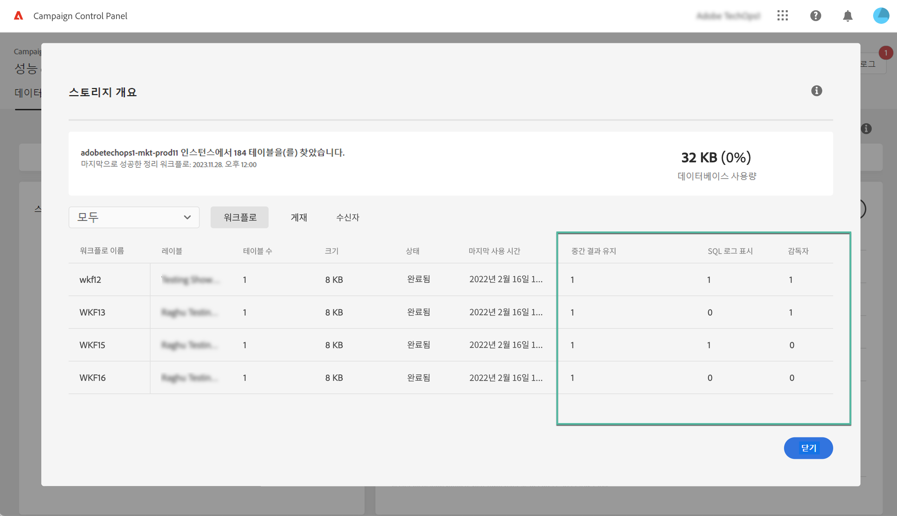
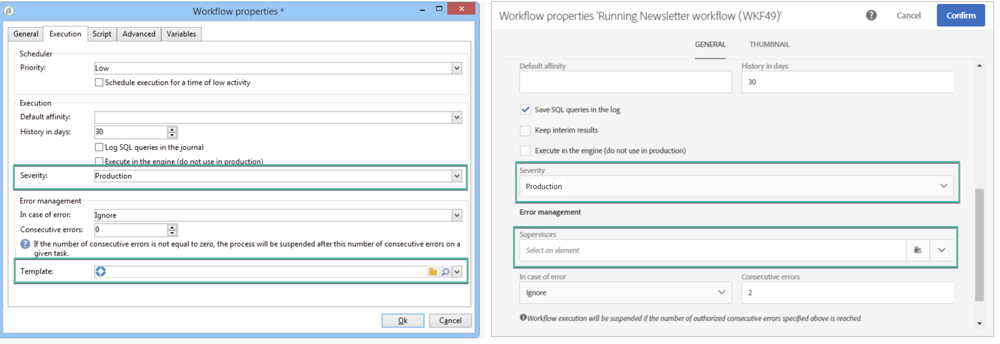

# 워크플로우 모니터링 {#monitor-workflows}

<!-- Clean paused and completed workflows

When [!DNL Adobe Campaign] workflows are paused or completed, they leave temporary tables on your instances database that consume space and can lead to performance issues.

Control Panel allows you to identify those workflows and clean the temporary resources generated on your instances.

>[!NOTE]
>
>Technically, this operation executes the **[!UICONTROL Database cleanup technical workflow]** that runs on your Campaign instance everyday (see [Campaign Standard](https://experienceleague.adobe.com/docs/campaign-standard/using/administrating/application-settings/technical-workflows.html#list-of-technical-workflows) and [Campaign Classic](https://experienceleague.adobe.com/docs/campaign-classic/using/monitoring-campaign-classic/data-processing/database-cleanup-workflow.html) documentation). 

To clean paused and completed workflows, follow these steps:

1. Navigate to the **[!UICONTROL Performance monitoring]** card.

1. In the **[!UICONTROL Databases]** tab, select the instance where you want to perform the operation.

1. Access the **[!UICONTROL Storage overview]** details, then filter the list on **[!UICONTROL Temporary tables]**. Learn more on **[!UICONTROL Storage overview]** in [this page](database-storage-overview.md).

    

1. All temporary tables generated on your instances by workflows and deliveries display. Click the **[!UICONTROL Clean now]** button to delete the resources generated by paused and completed workflows.

    

1. Once the operation is confirmed, you can track the estimated remaining time in the **[!UICONTROL Storage overview]** list.

    

Monitor workflow parameters -->

Adobe Campaign에서 일부 워크플로우 매개 변수는 인스턴스에 문제가 발생하지 않도록 특별히 주의를 기울여야 할 수 있습니다. 컨트롤 패널 **[!UICONTROL 스토리지 개요]** 세부 사항을 통해 이러한 옵션이 귀하의 워크플로우에 활성화되어 있는지 확인할 수 있습니다.

## **[!UICONTROL 중간 결과를 유지합니다]** {#keep-results}

활성화되면(값 &quot;1&quot;) 이 옵션은 워크플로우의 다양한 활동 간 전환 결과를 저장합니다. 자세한 내용은 [Campaign Standard](https://experienceleague.adobe.com/docs/campaign-standard/using/managing-processes-and-data/executing-a-workflow/managing-execution-options.html?lang=ko) 및 [Campaign Classic](https://experienceleague.adobe.com/docs/campaign-classic/using/automating-with-workflows/introduction/workflow-best-practices.html?lang=ko#logs) 설명서를 참조하세요.

>[!IMPORTANT]
>
>프로덕션 워크플로우에서는 이 옵션을 체크해서는 안 됩니다. 분석 및 테스트 용도로 사용되므로 개발 또는 스테이징 환경에서만 사용해야 합니다. Campaign에서는 비활성화하는 것이 좋습니다.

## **[!UICONTROL SQL 로그 표시]** {#sql}

이 옵션이 활성화되면 워크플로우 실행 중에 데이터베이스로 전송된 SQL 쿼리가 Adobe Campaign에 표시됩니다. 자세한 정보는 [Campaign Standard](https://experienceleague.adobe.com/docs/campaign-standard/using/managing-processes-and-data/executing-a-workflow/managing-execution-options.html?lang=ko) 및 [Campaign Classic](https://experienceleague.adobe.com/docs/campaign-classic/using/automating-with-workflows/advanced-management/workflow-properties.html?lang=ko#execution) 설명서를 참조하세요.

값 &quot;1&quot;은 워크플로우가 **심각도** 필드를 &quot;프로덕션&quot;으로 설정하고 SQL 쿼리 로그 옵션이 활성화되었음을 나타냅니다.

>[!IMPORTANT]
>
>이 옵션을 활성화하면 성능에 영향을 주고 서버의 로그 파일을 채울 수 있습니다. 분석 및 진단 목적으로만 사용해야 합니다.

## **[!UICONTROL 감독자]** {#supervisors}

이 필드에서는 워크플로우에 연산자를 할당할 수 있습니다. 워크플로우가 실패하면 관련 연산자에게 경고가 표시됩니다. 자세한 정보는 [Campaign Standard](https://experienceleague.adobe.com/docs/campaign-standard/using/managing-processes-and-data/executing-a-workflow/monitoring-workflow-execution.html?lang=ko#error-management) 및 [Campaign Classic](https://experienceleague.adobe.com/docs/campaign-classic/using/automating-with-workflows/advanced-management/workflow-properties.html?lang=ko#error-management) 설명서를 참조하세요.

값 &quot;1&quot;은 워크플로우가 **심각도** 필드가 &quot;프로덕션&quot;으로 설정되어 있고 상위자 그룹이 워크플로우에 할당되지 않았음을 나타냅니다.

