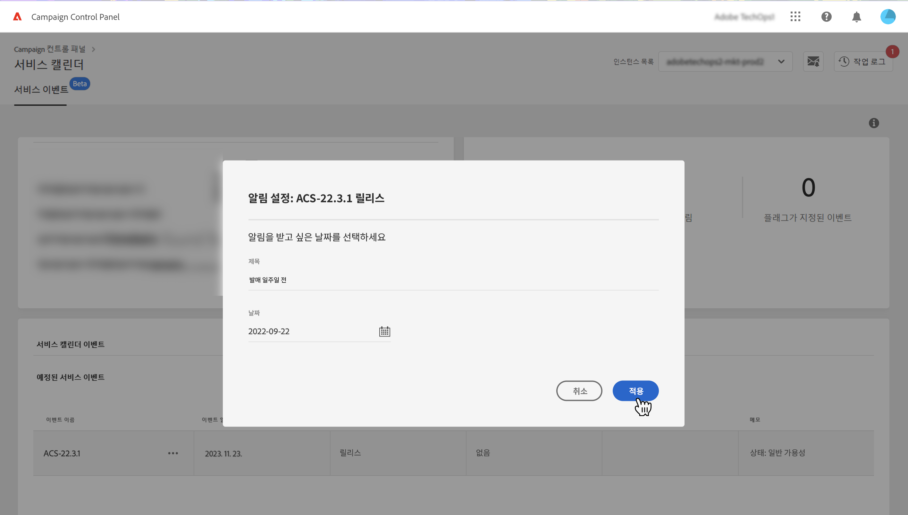
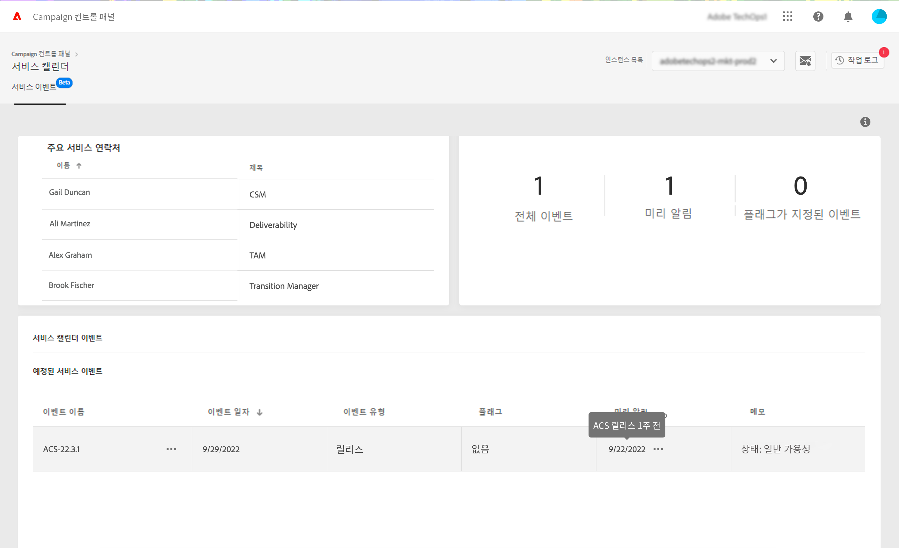

# 주요 연락처 및 이벤트 식별 {#keycontacts-events}

>[!CONTEXTUALHELP]
>id="cp_servicecalendar_serviceevents"
>title="서비스 캘린더"
>abstract="주요 연락처 섹션에는 Adobe에서 인스턴스에 대한 요청이나 문제에 대해 연락할 수 있는 사람이 나열됩니다. 서비스 이벤트 달력 섹션에서 선택한 인스턴스에 대한 이전/예정된 릴리스 및 경고를 식별하고 지정된 이벤트에 대한 미리 알림을 설정할 수 있습니다."

>[!IMPORTANT]
>
>서비스 캘린더는 베타로 제공되며, 별도의 고지 없이 자주 업데이트 및 수정될 수 있습니다.

Campaign 인스턴스를 효과적으로 모니터링하려면 인스턴스에 영향을 줄 수 있는 중요한 이벤트를 추적하는 것이 중요합니다. Campaign 컨트롤 패널을 통해 새로운 릴리스, 업그레이드, 패치, 핫픽스 등과 같은 이벤트를 식별할 수 있습니다. 및 은 요청이나 문제에 대한 주요 Adobe 연락처 목록을 제공합니다.

이 정보는 **[!UICONTROL Service Calendar]** Campaign 컨트롤 패널 홈페이지의 카드.

## 주요 연락처 {#key-contacts}

**[!UICONTROL Key contacts]** 섹션에는 인스턴스 관련 요청이나 문제에 대해 연락할 수 있는 Adobe 직원 목록이 있습니다.

>[!NOTE]
>
>이 섹션에는 Managed Service 계정에 대한 정보만 표시됩니다.

주요 연락처에는 다음 역할이 포함됩니다.

* **[!UICONTROL TAM]**: 기술 계정 관리자,
* **[!UICONTROL CSM]**: 고객 성공 관리자,
* **[!UICONTROL Deliverability]**: 게재 작업 담당자,
* **[!UICONTROL Transition Manager]**: Managed Service 전환 관리자(Managed Service 계정만 해당),
* **[!UICONTROL On-boarding Specialist]**: Campaign Classic 온보딩을 지원하기 위해 계정에 배정된 전문가(Managed Services 계정만 해당).

## 중요한 이벤트 추적 {#events}

다음 **[!UICONTROL Service Event Calendar]** 섹션에는 이전 및 예정된 릴리스와 Campaign 컨트롤 패널 이메일 경고에 가입한 사용자에게 경고가 모두 표시됩니다. 또한 Campaign 컨트롤 패널을 사용하면 선택한 인스턴스에 대해 미리 알림을 설정하고 관련 이벤트에 대한 플래그를 설정하여 보다 효율적으로 구성할 수 있습니다.

이벤트는 달력 또는 목록에 표시됩니다. 를 사용하여 두 보기 간을 전환할 수 있습니다. **[!UICONTROL Calendar]** 및 **[!UICONTROL List]** 섹션의 오른쪽 위 모서리에 있는 단추.

<table><tr style="border: 0;">
<td>
</td><td>달력 보기에서 오른쪽 위 모서리의 탐색 단추를 사용하여 이벤트를 탐색할 수 있습니다. 를 사용하십시오 <b>이중 화살표</b> 선택한 월 이후/이전에 있는 첫 번째 이벤트로 이동하고 <b>단일 화살표</b> 한 달에서 다른 달로 이동합니다. 을(를) 클릭합니다. <b>원 단추</b> 오늘의 견지로 돌아가려고.</td>
</tr></table>

다음과 같은 세 가지 유형의 이벤트가 표시됩니다.

* **미리 알림** 이벤트가 발생하기 전에 알림을 받으려면 사용자가 설정합니다. 달력 보기에서 녹색으로 표시됩니다. [미리 알림을 설정하는 방법 알아보기](#reminders)
* **경고** Campaign 컨트롤 패널이 사용자에게 저장 과부하 또는 SSL 인증서 만료와 같은 인스턴스에 대한 문제를 알리기 위해 이메일을 통해 전송됩니다. 달력 보기에 주황색으로 표시됩니다. 이벤트 설명은 이메일 경고 가입에 따라 로그인된 사용자에게 경고를 전송할지 여부를 지정합니다. [Campaign 컨트롤 패널 이메일 경고 기능에 대해 자세히 알아보십시오](../performance-monitoring/using/email-alerting.md)

* **릴리스** 달력 보기에서 회색과 파란색으로 각각 표시된 과거 및 예정된 인스턴스 배포를 모두 표시합니다. 이벤트 세부 사항은 각 배포와 연결된 릴리스 유형을 지정합니다.

   * **[!UICONTROL General availability]**: 사용 가능한 안정적인 최신 빌드.
   * **[!UICONTROL Limited availability]**: 주문형 배포만 가능.
   * **[!UICONTROL Release candidate]**: 엔지니어링 유효성 검사. 프로덕션 교정을 기다리는 중입니다.
   * **[!UICONTROL Pre release]**: 특정한 고객 요구에 대한 사전 가용성.
   * **[!UICONTROL No longer available]**: 빌드에 중요한 문제가 없지만 버그가 추가로 수정된 새 빌드를 사용할 수 있습니다. 업그레이드가 필요합니다.
   * **[!UICONTROL Deprecated]**: 알려진 회귀가 포함된 빌드. 빌드는 더 이상 지원되지 않습니다. 업그레이드는 필수입니다.

예정된 하나 또는 여러 이벤트에 플래그를 할당하여 추적할 수 있습니다. 이렇게 하려면 이벤트 이름 옆에 있는 줄임표 단추를 클릭합니다.

## 미리 알림 설정 {#reminders}

서비스 캘린더를 사용하면 이벤트가 발생하기 전에 이메일로 알림을 받기 위해 미리 알림을 설정할 수 있습니다.

>[!NOTE]
>
>예정된 이벤트에 대한 알림을 받으려면 Campaign 컨트롤 패널에서 이메일 경고를 구독했는지 확인하십시오. [자세히 알아보기](../performance-monitoring/using/email-alerting.md)

이벤트에 대한 경고를 설정하려면 다음 단계를 수행합니다.

1. 상기할 이벤트를 마우스로 가리키거나 목록 보기에서 타원 단추를 클릭하고 를 선택합니다 **[!UICONTROL Set Reminder]**.

1. 미리 알림에 제목을 지정하고 이벤트가 발생하기 전에 알림을 받을 날짜를 선택합니다.

   

   >[!NOTE]
   >
   >Campaign 컨트롤 패널 경고를 구독하지 않은 경우 메시지가 표시되며, 등록하여 이메일 알림을 받을 수 있습니다.

1. 이제 선택한 이벤트에 대해 미리 알림이 설정됩니다. 언제든지 마우스로 제목을 표시할 수 있습니다.

   

   >[!NOTE]
   >
   >동일한 이벤트에 대해 최대 2개의 미리 알림을 설정할 수 있습니다.

1. 미리 알림에 지정된 날짜에 예정된 이벤트에 대해 알리는 이메일이 전송되며 미리 알림은 자동으로 서비스 달력 메뉴의 **[!UICONTROL Reminders]** 카운트에서 제거됩니다.
