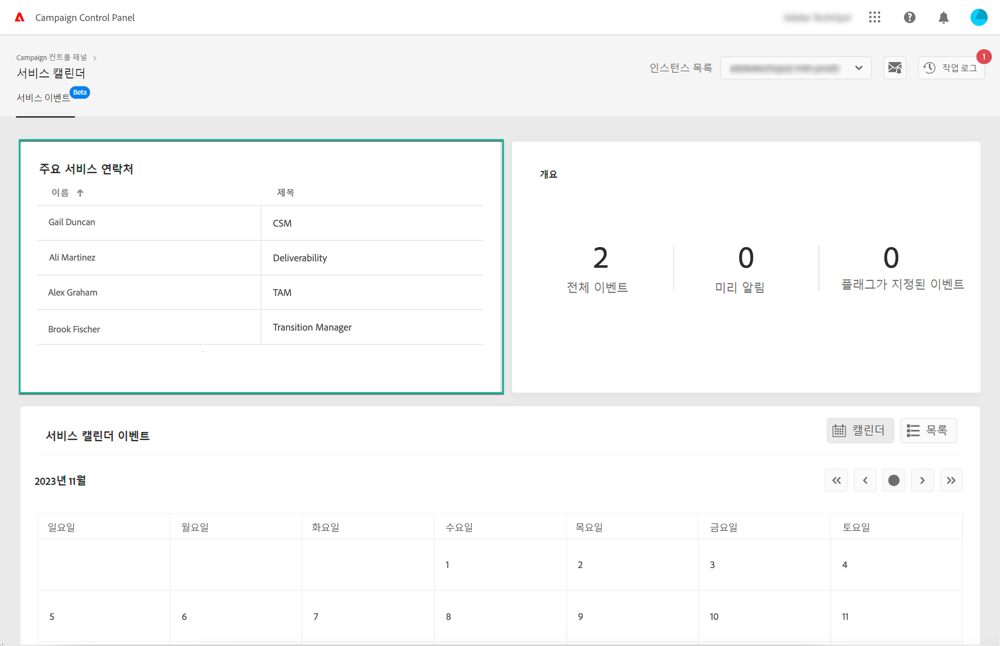
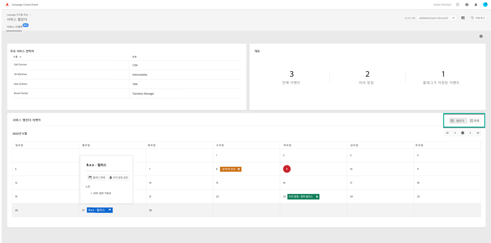
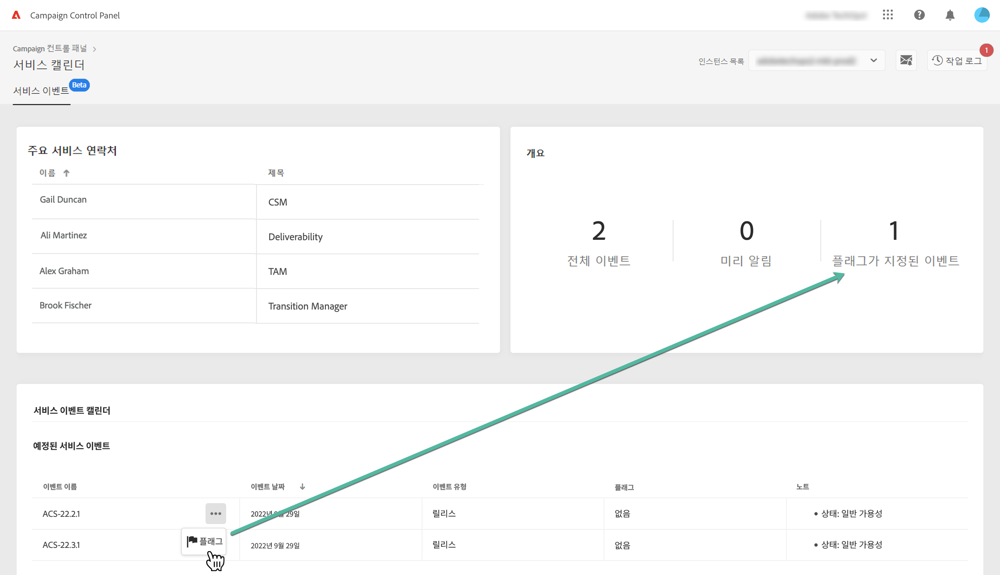

# 주요 연락처 및 이벤트 모니터링 {#keycontacts-events}

>[!CONTEXTUALHELP]
>id="cp_servicecalendar_serviceevents"
>title="서비스 달력"
>abstract="주요 연락처 섹션에는 Adobe에서 인스턴스에 대한 요청이나 문제에 대해 연락할 수 있는 사람이 나열됩니다. 서비스 이벤트 달력 섹션에서 선택한 인스턴스에 대해 과거 및 예정된 릴리스 및 서비스 검토를 모두 식별할 수 있습니다."

>[!IMPORTANT]
>
>서비스 달력은 베타로 제공되며, 별도의 고지 없이 자주 업데이트 및 수정될 수 있습니다.

Campaign 인스턴스를 모니터링하려면 인스턴스에서 계획된 이벤트를 식별해야 합니다.

Campaign 컨트롤 패널을 사용하면 인스턴스에서 발생하는 릴리스 및 서비스 검토를 모니터링하고 요청 또는 문제에 대해 Adobe 시 주요 연락처 목록에 액세스할 수 있습니다.

이러한 정보는 **[!UICONTROL Service Calendar]** Campaign 컨트롤 패널 홈페이지의 카드.

## 주요 연락처 {#key-contacts}

다음 **[!UICONTROL Key contacts]** 섹션에는 Adobe에서 인스턴스 관련 요청이나 문제에 대해 연락할 수 있는 사람 목록이 있습니다.

>[!NOTE]
>
>이 섹션에는 관리 서비스 계정에 대한 정보만 표시됩니다.

주요 연락처에는 다음 역할이 포함됩니다.

* **[!UICONTROL TAM]**: 기술 계정 관리자,
* **[!UICONTROL CSM]**: 고객 성공 관리자,
* **[!UICONTROL Deliverability]**: 게재 가능성 작업을 위한 연락 지점,
* **[!UICONTROL Transition Manager]**: Managed Services 전환 관리자(Managed Services 계정만 해당),
* **[!UICONTROL On-boarding Specialist]**: Campaign Classic에 도움을 주기 위해 계정에 지정된 전문가(Managed Services 계정만 해당).

## 이벤트 {#events}

다음 **[!UICONTROL Service Event Calendar]** 섹션에는 선택한 인스턴스에 대해 과거 및 예정된 릴리스 및 서비스 검토가 모두 표시됩니다.

다음 **[!UICONTROL Note]** 열은 각 릴리스의 상태에 대한 정보를 제공합니다.

* **[!UICONTROL General availability]**: 사용 가능한 최신 안정적인 빌드.
* **[!UICONTROL Limited availability]**: 주문형 배포만 가능.
* **[!UICONTROL Release candidate]**: 엔지니어링 유효성을 검사했습니다. 제품 교정을 기다리는 중입니다.
* **[!UICONTROL Pre release]**: 특정 고객 요구에 대한 이전 가용성
* **[!UICONTROL No longer available]**: 빌드에 중요한 문제가 없지만 추가 버그 수정으로 새 문제를 사용할 수 있습니다. 업그레이드가 필요합니다.
* **[!UICONTROL Deprecated]**: 알려진 회귀 포함 빌드
빌드는 더 이상 지원되지 않습니다. 업그레이드는 필수입니다.

예정된 하나 또는 여러 이벤트에 플래그를 할당하여 추적할 수 있습니다. 이렇게 하려면 이벤트 이름 옆에 있는 타원 버튼을 클릭합니다.

