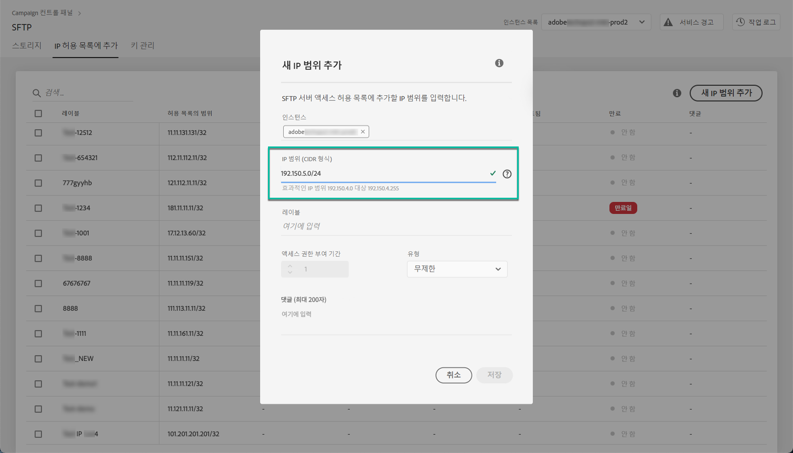
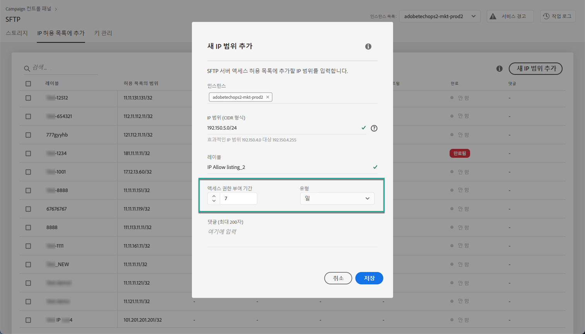
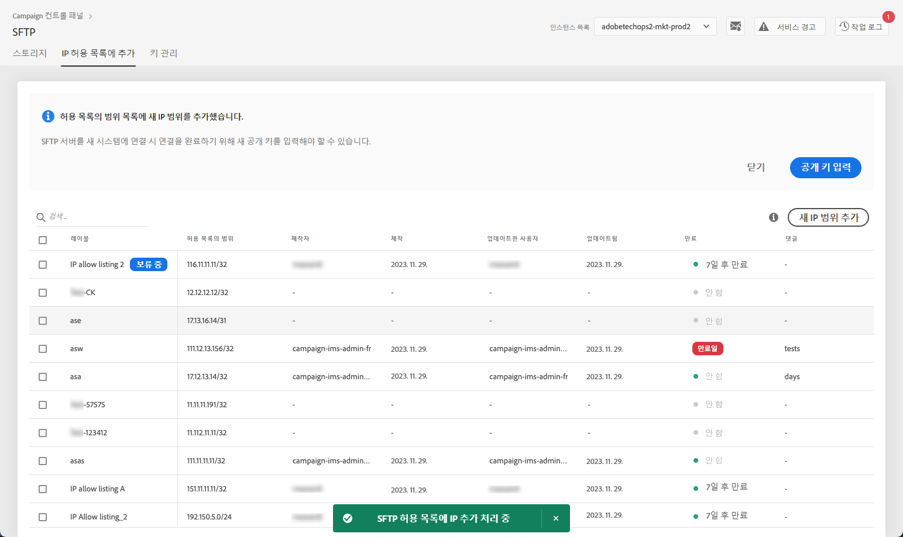
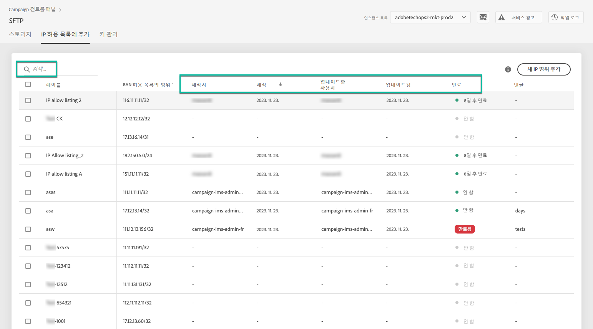
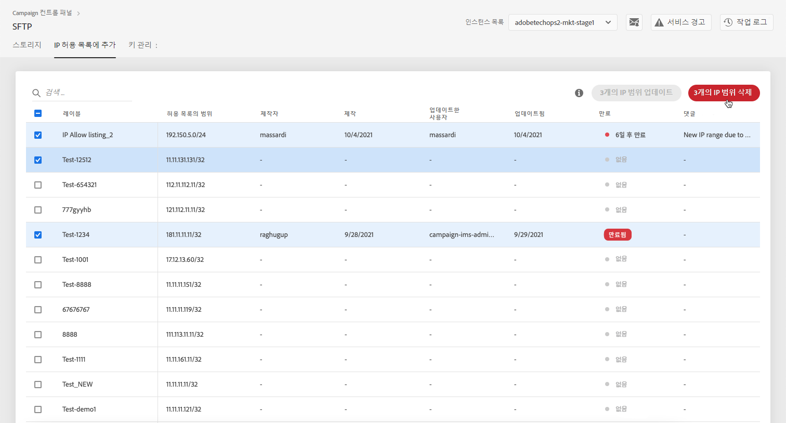
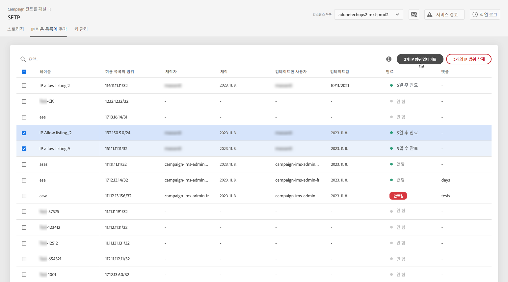
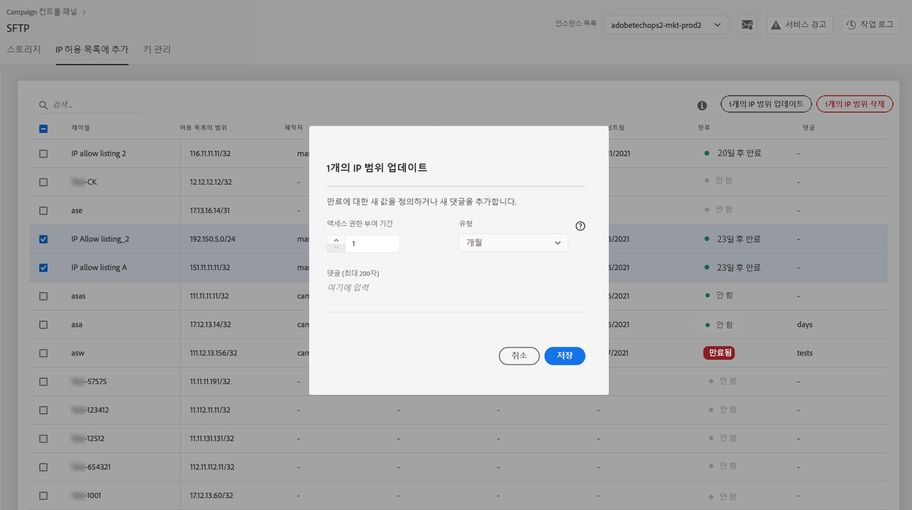

# IP 범위 허용 목록 {#ip-range-allow-listing}

>[!CONTEXTUALHELP]
>id="cp_ip_whitelist"
>title="IP 허용 목록 정보"
>abstract="이 탭에서 허용 목록에 IP 범위를 추가하여 SFTP 서버에 연결을 설정할 수 있습니다. 여기에는 액세스 권한이 있는 SFTP 서버만 표시됩니다. 다른 SFTP 서버 액세스 권한을 요청하려면 관리자에게 문의하십시오."
>additional-url="https://images-tv.adobe.com/mpcv3/8a977e03-d76c-44d3-853c-95d0b799c870_1560205338.1920x1080at3000_h264.mp4#t=98" text="데모 비디오 시청"

SFTP 서버는 보호되어 있으므로 파일을 확인하거나 새 파일을 작성하기 위해 SFTP 서버에 액세스하려면 서버에 액세스하는 클라이언트나 시스템의 공개 IP 주소를 허용 목록에 추가해야 합니다.

 이 비디오에서 [Campaign Classic](https://experienceleague.adobe.com/docs/campaign-classic-learn/control-panel/sftp-management/adding-ip-range-to-allow-list.html#sftp-management) 또는 [Campaign Standard](https://experienceleague.adobe.com/docs/campaign-standard-learn/control-panel/sftp-management/adding-ip-range-to-allow-list.html#sftp-management)를 사용하여 해당 기능 살펴보기

## CIDR 형식 {#about-cidr-format}

CIDR(Classless Inter-Domain Routing)은 컨트롤 패널 인터페이스를 사용하여 IP 범위를 추가할 때 지원되는 형식입니다.

CIDR의 구문에는 IP 주소, &#39;/&#39; 문자, 십진수가 차례로 포함됩니다. The format and its syntax are fully detailed in [this article](https://whatismyipaddress.com/cidr){target=&quot;_blank&quot;}.

소유한 IP 범위를 CIDR 형식으로 변환하는 데 도움이 되는 무료 온라인 도구를 인터넷에서 검색할 수 있습니다.

## 모범 사례 {#best-practices}

컨트롤 패널에서 IP 주소를 허용 목록에 추가할 때는 아래 권장 사항과 제한을 따라야 합니다.

* 단일 IP 주소가 아닌 **허용 목록에 IP 범위를 추가합니다**. IP 주소 하나를 허용 목록에 추가하려면 범위에 IP가 하나만 포함되어 있음을 나타내는 &#39;/32&#39;를 추가합니다.
* 예를 들어 265개를 초과하는 IP 주소 포함과 같은&#x200B;**허용 목록에 매우 넓은 범위를 추가하지 마십시오.** /0~/23 사이의 CIDR 형식 범위는 컨트롤 패널에서 거부됩니다.
* **공개 IP 주소**&#x200B;만 허용 목록에 추가할 수 있습니다.
* Make sure to **regularly delete IP addresses** that you do not need anymore from the allow list.

## 허용 목록에 IP 주소 추가 {#adding-ip-addresses-allow-list}

>[!CONTEXTUALHELP]
>id="cp_sftp_iprange_add"
>title="IP 범위 구성"
>abstract="SFTP 서버에 연결하기 위해 허용 목록에 추가할 IP 범위를 정의합니다."

허용 목록에 IP 범위를 추가하려면 다음 단계를 수행합니다.

1. **[!UICONTROL SFTP]** 카드를 열고 **[!UICONTROL IP Allow Listing]** 탭을 선택합니다.
1. 허용 목록의 IP 주소 목록이 각 인스턴스에 대해 표시됩니다. 왼쪽 목록에서 원하는 인스턴스를 선택하고 **[!UICONTROL Add new IP range]** 버튼을 클릭합니다.

   

1. Define the IP range that you want to add to the allow list. This field only accepts IP ranges in CIDR format, such as *192.150.5.0/24*.

   

   >[!IMPORTANT]
   >
   >IP 범위가 허용 목록의 기존 범위와 겹칠 수 없습니다. IP 범위가 겹치는 경우에는 겹치는 IP가 포함된 범위를 먼저 삭제하십시오.

1. 여러 인스턴스에 대해 허용 목록에 범위를 추가할 수 있습니다. 이렇게 하려면 아래쪽 화살표 키를 누르거나 원하는 인스턴스의 첫 번째 문자를 입력한 다음 제안 목록에서 인스턴스를 선택합니다.

   

1. 목록에서 이 IP 범위에 대해 표시할 레이블을 정의합니다.

   

   >[!NOTE]
   >
   >**[!UICONTROL Label]** 필드에는 다음 특수 문자가 허용됩니다.
   > `. _ - : / ( ) # , @ [ ] + = & ; { } ! $`

1. To better manage your IP allow list, you can set a duration for the availability of each IP range. 이렇게 하려면 **[!UICONTROL Type]** 드롭다운 목록에서 단위를 선택하고 해당 필드에 기간을 정의합니다. IP 범위 만료에 대한 자세한 내용은 [이 섹션](#expiry)을 참조하십시오.

   

   >[!NOTE]
   >
   >By default, the **[!UICONTROL Type]** field is set to **[!UICONTROL Unlimited]**, which means that the IP range never expires.

1. In the **[!UICONTROL Comment]** field, you can indicate a reason for allowing this IP range (why, for whom, etc.).

1. **[!UICONTROL Save]** 버튼을 클릭합니다. 요청이 완전히 처리될 때까지 허용 목록에 추가된 IP 범위가 **[!UICONTROL Pending]**&#x200B;로 표시되며 몇 초 이내에 완료됩니다.

   

>[!IMPORTANT]
>
>SFTP 서버를 새 시스템에 연결하여 새 IP 범위를 허용 목록에 추가하려는 경우 연결을 완료하려면 새 공개 키를 입력해야 할 수 있습니다. 자세한 내용은 [이 섹션](key-management.md)을 참조하십시오.

## IP 범위 관리 {#managing-ip-ranges}

만드는 IP 범위가 **[!UICONTROL IP Allow Listing]** 탭에 표시됩니다.

You can sort the items based on the creation date or edition date, on the user who created or edited it, and on the IP range expiry.

You can also search an IP range by starting to type a label, a range, a name or a comment.

To edit one or more IP ranges, see [this section](#editing-ip-ranges).

허용 목록에서 하나 이상의 IP 범위를 삭제하려면 해당 범위를 선택한 다음 **[!UICONTROL Delete IP range]** 버튼을 클릭합니다.

### 만료 {#expiry}

**[!UICONTROL Expires]** 열에는 IP 범위가 만료될 때까지 남은 일 수가 표시됩니다.

[이메일 경고](../../performance-monitoring/using/email-alerting.md)를 구독한 경우, IP 범위가 만료되기 10일 5일 전에 전자 메일로 알림을 받게 됩니다. 그리고 만료 기한입니다. Upon receiving the alert, you can [edit the IP range](#editing-ip-ranges) to extend its validity period if needed.

만료된 IP 범위는 7일 후 자동으로 삭제됩니다. **[!UICONTROL Expires]** 열에 **[!UICONTROL Expired]**&#x200B;으로 표시됩니다. Within this 7 day-period:

* 만료된 IP 범위를 더 이상 사용하여 SFTP 서버에 액세스할 수 없습니다.

* 만료된 범위와 겹치는 다른 IP 범위를 만들 수 없습니다. 새 IP 범위를 만들려면 먼저 만료된 IP 범위를 삭제해야 합니다.

* You can [edit](#editing-ip-ranges) an expired IP range and update its duration to make it available again.

* 허용 목록에서 삭제할 수 있습니다.

## IP 범위 편집 {#editing-ip-ranges}

>[!CONTEXTUALHELP]
>id="cp_sftp_iprange_update"
>title="IP 범위 업데이트"
>abstract="SFTP 서버에 연결할 수 있는 선택한 IP 범위를 업데이트합니다."

IP 범위를 편집하려면 아래 단계를 따르십시오.

>[!NOTE]
>
>2021년 10월 Campaign 컨트롤 패널 릴리스 이후 만들어진 IP 범위만 편집할 수 있습니다.

<!--Edition is not available for IP ranges that have been created before the Control Panel October 2021 release.-->

1. Select one or more IP ranges from the **[!UICONTROL IP Allow Listing]** list.

1. **[!UICONTROL Update IP range]** 버튼을 클릭합니다.

   

1. IP 범위 만료만 편집하거나 새 설명을 추가할 수 있습니다.

   >[!NOTE]
   >
   >CIDR 형식을 수정하거나 해당 레이블을 지정하거나 관련 인스턴스를 편집하려면 먼저 IP 범위를 삭제하고 필요에 따라 새 인스턴스를 만들어야 합니다.

   

1. 변경 내용을 저장합니다.

## 변경 사항 모니터링 {#monitoring-changes}

The **[!UICONTROL Job Logs]** in the Control Panel home page let you track and monitor all changes that have been made to IP addresses on the allow list.

컨트롤 패널 인터페이스에 대한 자세한 내용은 [이 섹션](../../discover/using/discovering-the-interface.md)을 참조하십시오.

