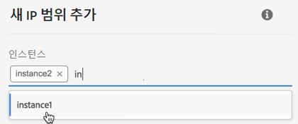
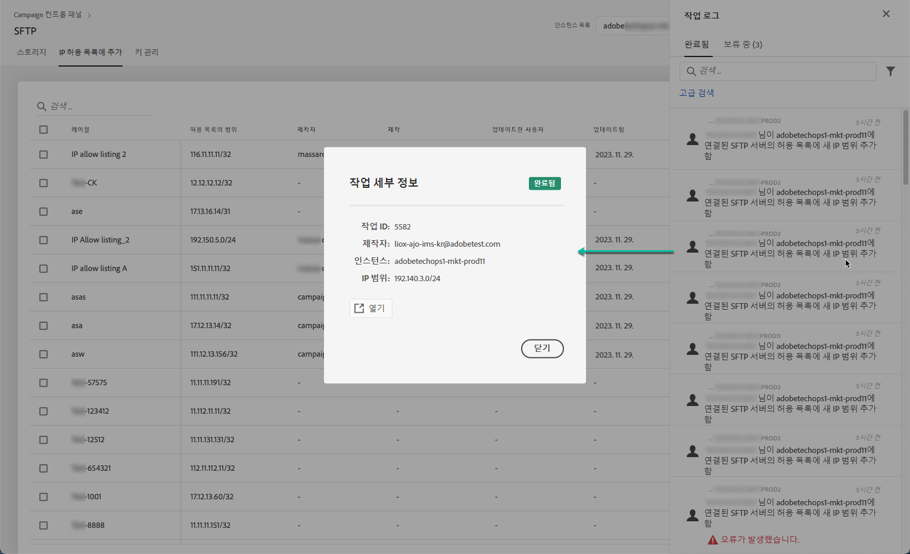

# IP 범위 허용 목록 {#ip-range-allow-listing}

>[!CONTEXTUALHELP]
>id="cp_ip_whitelist"
>title="IP 허용 목록 정보"
>abstract="이 탭에서 허용 목록에 IP 범위를 추가하여 SFTP 서버에 연결을 설정할 수 있습니다. 여기에는 액세스 권한이 있는 SFTP 서버만 표시됩니다. 다른 SFTP 서버 액세스 권한을 요청하려면 관리자에게 문의하십시오."
>additional-url="https://images-tv.adobe.com/mpcv3/8a977e03-d76c-44d3-853c-95d0b799c870_1560205338.1920x1080at3000_h264.mp4#t=98" text="데모 비디오 시청"

SFTP 서버는 보호되어 있으므로 해당 서버에 액세스하여 파일을 보거나 새 파일을 작성하려면 해당 서버에 액세스하는 시스템이나 클라이언트의 공개 IP 주소를 허용 목록에 추가해야 합니다.

 이 비디오에서 [Campaign v7/v8](https://experienceleague.adobe.com/docs/campaign-classic-learn/control-panel/sftp-management/adding-ip-range-to-allow-list.html?lang=ko#sftp-management) 또는 [Campaign Standard](https://experienceleague.adobe.com/docs/campaign-standard-learn/control-panel/sftp-management/adding-ip-range-to-allow-list.html?lang=ko#sftp-management)를 사용하여 해당 기능 살펴보기

## CIDR 형식 정보 {#about-cidr-format}

CIDR(Classless Inter-Domain Routing)은 컨트롤 패널 인터페이스를 사용하여 IP 범위를 추가할 때 지원되는 형식입니다.

CIDR의 구문에는 IP 주소, &#39;/&#39; 문자, 십진수가 차례로 포함됩니다. [이 문서](https://whatismyipaddress.com/cidr)에서 CIDR의 형식과 구문을 자세히 확인할 수 있습니다{target="_blank"}.

소유한 IP 범위를 CIDR 형식으로 변환하는 데 사용할 수 있는 무료 온라인 도구를 인터넷에서 검색할 수 있습니다.

## 모범 사례 {#best-practices}

컨트롤 패널에서 IP 주소를 허용 목록에 추가할 때는 아래 권장 사항과 제한을 따라야 합니다.

* 단일 IP 주소가 아닌 **허용 목록에 IP 범위를 추가합니다**. IP 주소 하나를 허용 목록에 추가하려면 범위에 IP가 하나만 포함되어 있음을 나타내는 &#39;/32&#39;를 추가합니다.
* 예를 들어 265개를 초과하는 IP 주소 포함과 같은&#x200B;**허용 목록에 매우 넓은 범위를 추가하지 마십시오.** /0~/23 사이의 CIDR 형식 범위는 컨트롤 패널에서 거부됩니다.
* **공개 IP 주소**&#x200B;만 허용 목록에 추가할 수 있습니다.
* 허용 목록에서 더 이상 필요하지 않은 **IP 주소를 정기적으로 삭제**&#x200B;해야 합니다.

## 허용 목록에 IP 주소 추가 {#adding-ip-addresses-allow-list}

>[!CONTEXTUALHELP]
>id="cp_sftp_iprange_add"
>title="IP 범위 구성"
>abstract="SFTP 서버에 연결하기 위해 허용 목록에 추가할 IP 범위를 정의합니다."

허용 목록에 IP 범위를 추가하려면 다음 단계를 수행합니다.

1. **[!UICONTROL SFTP]** 카드를 연 다음 **[!UICONTROL IP 허용 목록]** 탭을 선택합니다.
1. 허용 목록의 IP 주소 목록이 각 인스턴스에 대해 표시됩니다. 왼쪽 목록에서 원하는 인스턴스를 선택한 후 **[!UICONTROL 새 IP 범위 추가]** 버튼을 클릭합니다.

   

1. 허용 목록에 추가할 IP 범위를 정의합니다. 이 필드는 *192.150.5.0/24*&#x200B;와 같은 CIDR 형식의 IP 범위만 허용합니다.

   

   >[!IMPORTANT]
   >
   >IP 범위가 허용 목록의 기존 범위와 겹칠 수 없습니다. IP 범위가 겹치는 경우에는 겹치는 IP가 포함된 범위를 먼저 삭제하십시오.

1. 여러 인스턴스에 대해 허용 목록에 범위를 추가할 수 있습니다. 이렇게 하려면 아래쪽 화살표 키를 누르거나 원하는 인스턴스의 첫 번째 문자를 입력한 다음 제안 목록에서 인스턴스를 선택합니다.

   

1. 목록에서 이 IP 범위에 대해 표시할 레이블을 정의합니다.

   

   >[!NOTE]
   >
   >**[!UICONTROL 레이블]** 필드에 입력할 수 있는 특수 문자는 다음과 같습니다.
   > `. _ - : / ( ) # , @ [ ] + = & ; { } ! $`

1. IP 허용 목록을 더 잘 관리하기 위해 각 IP 범위의 가용성 기간을 설정할 수 있습니다. 이렇게 하려면 **[!UICONTROL 유형]** 드롭다운 목록에서 단위를 선택하고 해당 필드에 기간을 정의합니다. IP 범위 만료에 대한 자세한 내용은 [이 섹션](#expiry)을 참조하십시오.

   

   >[!NOTE]
   >
   >기본적으로 **[!UICONTROL 유형]** 필드는 **[!UICONTROL 무제한]**&#x200B;으로 설정됩니다. 이는 IP 범위가 만료되지 않음을 의미합니다.

1. **[!UICONTROL 주석]** 필드에 이 IP 범위를 허용하는 이유(이유, 대상 등)를 표시할 수 있습니다.

1. **[!UICONTROL 저장]** 버튼을 클릭합니다. 허용 목록에 추가된 IP 범위는 요청이 완전히 처리될 때까지 **[!UICONTROL 보류 중]**&#x200B;으로 표시되며, 이는 몇 초만 소요됩니다.

   

>[!IMPORTANT]
>
>SFTP 서버를 새 시스템에 연결하여 허용 목록에 새 IP 범위를 추가하려는 경우 새 공개 키를 입력하여 연결을 완료해야 할 수도 있습니다. 자세한 내용은 [이 섹션](key-management.md)을 참조하십시오.

## IP 범위 관리 {#managing-ip-ranges}

생성한 IP 범위는 **[!UICONTROL IP 허용 목록]** 탭에 표시됩니다.

만든 날짜 또는 편집 날짜, 항목을 만들거나 편집한 사용자 및 IP 범위 만료일을 기준으로 항목을 정렬할 수 있습니다.

레이블, 범위, 이름 또는 주석을 입력하여 IP 범위를 검색할 수도 있습니다.

하나 이상의 IP 범위를 편집하려면 [이 섹션](#editing-ip-ranges)을 참조하십시오.

허용 목록에서 하나 이상의 IP 범위를 삭제하려면 해당 범위를 선택한 다음 **[!UICONTROL IP 범위 삭제]** 버튼을 클릭합니다.

### 만료 {#expiry}

**[!UICONTROL 만료]** 열에는 IP 범위가 만료될 때까지 남은 일수가 표시됩니다.

[이메일 알림](../../performance-monitoring/using/email-alerting.md)을 구독한 경우 IP 범위가 만료되기 10일 전, 5일 전 및 만료 예정일에 이메일로 알림을 받게 됩니다. 알림을 받으면 [IP 범위를 편집](#editing-ip-ranges)하여 필요한 경우 유효 기간을 연장할 수 있습니다.

만료된 IP 범위는 7일 후 자동으로 삭제됩니다. **[!UICONTROL 만료]** 열에 **[!UICONTROL 만료]**&#x200B;로 표시됩니다. 7일 기간 내:

* 만료된 IP 범위는 더 이상 SFTP 서버에 액세스하는 데 사용할 수 없습니다.

* 만료된 범위와 겹치는 다른 IP 범위를 만들 수 없습니다. 새 IP 범위를 만들려면 먼저 만료된 IP 범위를 삭제해야 합니다.

* 만료된 IP 범위를 [편집](#editing-ip-ranges)하고 해당 기간을 업데이트하여 다시 사용할 수 있도록 할 수 있습니다.

* 허용 목록에서 삭제할 수 있습니다.

## IP 범위 편집 {#editing-ip-ranges}

>[!CONTEXTUALHELP]
>id="cp_sftp_iprange_update"
>title="IP 범위 업데이트"
>abstract="SFTP 서버에 연결할 수 있는 선택된 IP 범위를 업데이트합니다."

IP 범위를 편집하려면 아래 단계를 따르십시오.

>[!NOTE]
>
>Campaign 컨트롤 패널 2021년 10월 릴리스 이후 생성된 IP 범위만 편집할 수 있습니다.

<!--Edition is not available for IP ranges that have been created before the Control Panel October 2021 release.-->

1. **[!UICONTROL IP 허용 목록]** 목록에서 하나 이상의 IP 범위를 선택합니다.

1. **[!UICONTROL IP 범위 업데이트]** 버튼을 클릭합니다.

   

1. IP 범위 만료를 편집하거나 새 주석을 추가할 수만 있습니다.

   >[!NOTE]
   >
   >CIDR 형식, 해당 레이블을 수정하거나 관련 인스턴스를 편집하려면 먼저 IP 범위를 삭제하고 필요에 따라 새 범위를 만들어야 합니다.

   

1. 변경 내용을 저장합니다.

## 변경 사항 모니터링 {#monitoring-changes}

컨트롤 패널 홈 페이지의 **[!UICONTROL 작업 로그]**&#x200B;를 사용하면 허용 목록의 IP 주소에 대한 모든 변경 사항을 추적하고 모니터링할 수 있습니다.

컨트롤 패널 인터페이스에 대한 자세한 내용은 [이 섹션](../../discover/using/discovering-the-interface.md)을 참조하십시오.

