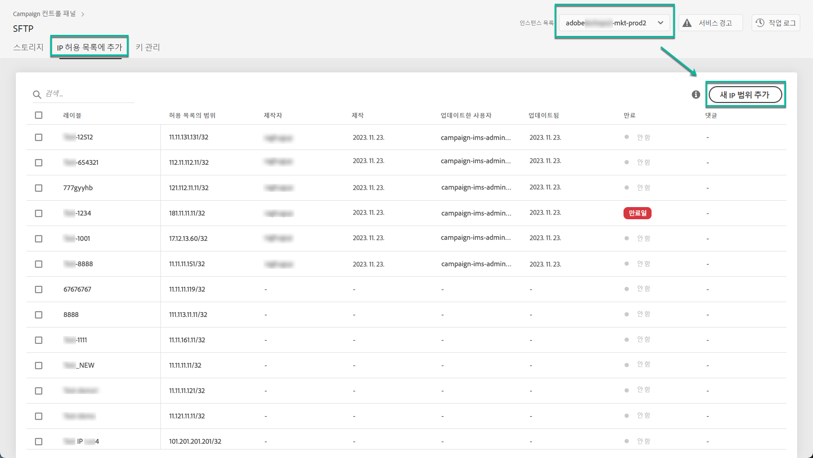
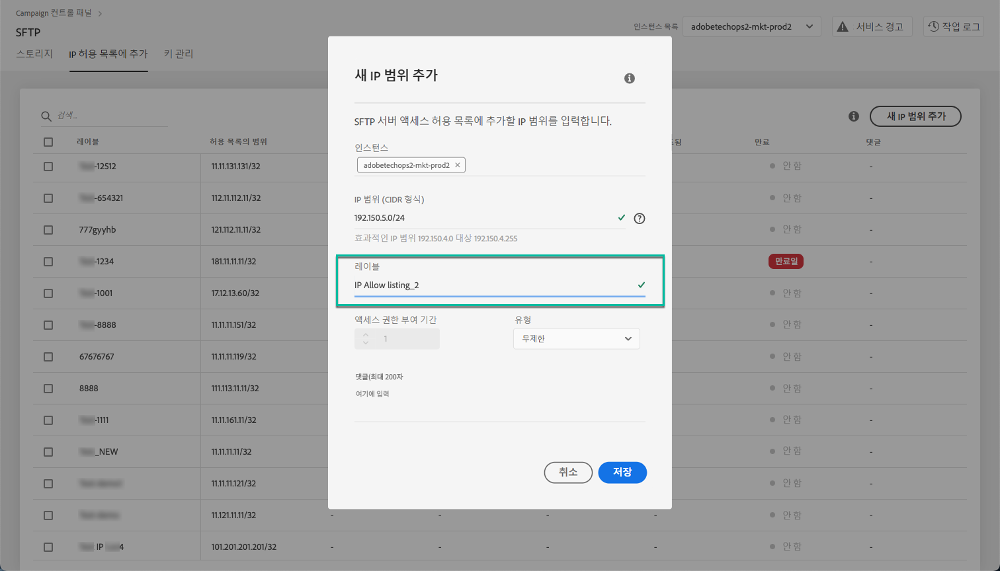
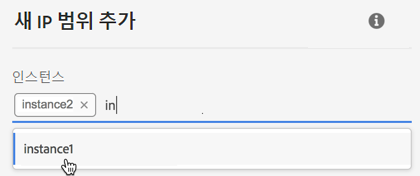
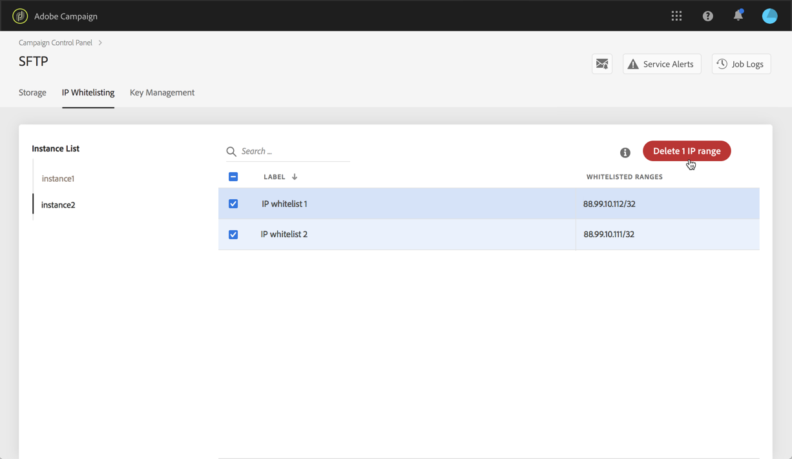
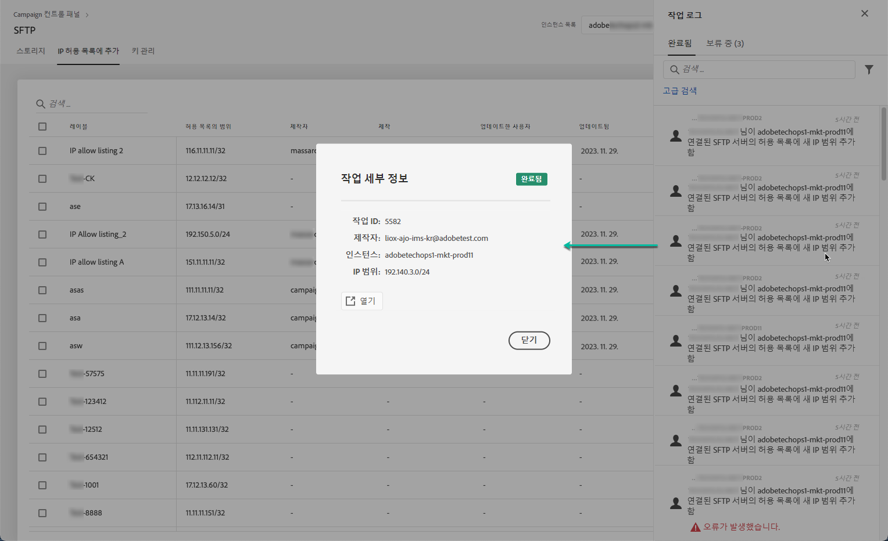

# IP 범위 허용 목록 {#ip-range-whitelisting}

SFTP 서버는 보호됩니다. 파일을 보거나 새 파일을 작성하려면 서버에 액세스하는 시스템 또는 클라이언트의 공개 IP 주소를 허용 목록에 추가해야 합니다.

## CIDR 포맷 {#about-cidr-format}

CIDR(Classless Inter-Domain Routing)은 제어판 인터페이스에서 IP 범위를 추가할 때 지원되는 형식입니다.

구문은 IP 주소와 &#39;/&#39; 문자, 십진수로 구성됩니다. 형식 및 구문은 [이 아티클에서](https://whatismyipaddress.com/cidr)자세히 설명합니다.

현재 보유하고 있는 IP 범위를 CIDR 포맷으로 변환할 수 있는 무료 온라인 툴을 인터넷에서 검색할 수 있습니다.

## 모범 사례 {#best-practices}

제어판에서 허용 IP 주소를 사용할 때는 아래 권장 사항과 제한 사항을 따라야 합니다.

* **단일 IP 주소가 아닌 허용 목록 IP 범위** . 단일 IP 주소를 허용 목록에 포함하려면 범위에 단일 IP만 포함됨을 나타내는 &#39;/32&#39;를 추가합니다.
* **> 265개의 IP 주소를 포함하여 매우 넓은 범위를**&#x200B;허용 목록에 추가하지 마십시오. 제어판은 /0에서 /23 사이의 CIDR 형식 범위를 거부합니다.
* 공개 **IP 주소만** 허용 목록에 포함될 수 있습니다.
* 더 이상 필요하지 않은 화이트리스트 등록 IP 주소를 **정기적으로** 삭제해야 합니다.

## 허용 IP 주소 {#whitelisting-ip-addresses}

IP 범위를 화이트리스트하려면 다음 단계를 수행합니다.

1. 카드를 **[!UICONTROL SFTP]**열고**[!UICONTROL IP Whistelisting]** 탭을 선택합니다.
1. 각 인스턴스에 대해 화이트리스트 등록 IP 주소 목록이 표시됩니다. 왼쪽 목록에서 원하는 인스턴스를 선택한 다음 **[!UICONTROL Add new IP range]**단추를 클릭합니다.

   

1. CIDR 형식으로 허용 목록에 추가할 IP 범위를 정의한 다음 목록에 표시할 레이블을 정의합니다.

   >[!NOTE]
   >
   >레이블 필드에서 다음 특수 문자를 사용할 수 있습니다.
   > `. _ - : / ( ) # , @ [ ] + = & ; { } ! $`

   

   >[!CAUTION]
   >
   >IP 범위는 기존 허용 목록 범위와 겹칠 수 없습니다. 이 경우 먼저 겹치는 IP가 포함된 범위를 삭제합니다.
   >
   >여러 인스턴스에 대해 범위를 허용 목록에 추가할 수 있습니다. 이렇게 하려면 아래쪽 화살표 키를 누르거나 원하는 인스턴스의 첫 번째 문자를 입력한 다음 제안 목록에서 선택합니다.

   

1. 단추를 **[!UICONTROL Save]**클릭합니다. IP 화이트 리스트 추가는 요청이 완전히 처리될 때까지 보류 중으로 표시됩니다. 단 몇 초밖에 걸리지 않습니다.

화이트리스트 IP 범위를 삭제하려면 해당 범위를 선택한 다음 **[!UICONTROL Delete IP range]**단추를 클릭합니다.

>[!NOTE]
>
>현재 허용 목록 범위를 편집할 수 없습니다. IP 범위를 수정하려면 IP 범위를 삭제한 다음 필요에 따라 하나를 만듭니다.

## 변경 사항 모니터링 {#monitoring-changes}

제어판 홈 **[!UICONTROL Job Logs]**페이지에서 화이트리스트 IP 주소에 대한 모든 변경 사항을 모니터링할 수 있습니다.

제어판 인터페이스에 대한 자세한 내용은 [이 섹션을](../../discover/using/discovering-the-interface.md)참조하십시오.

