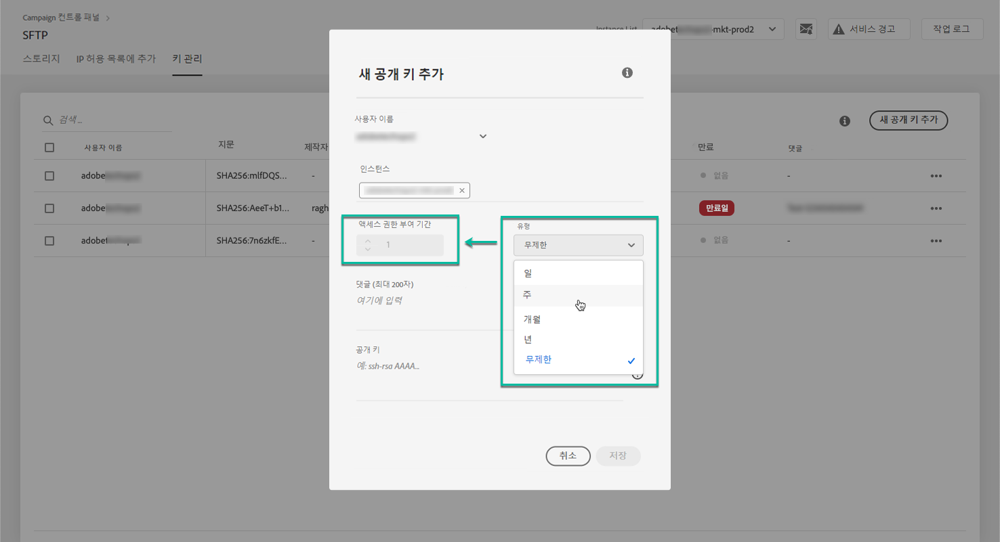
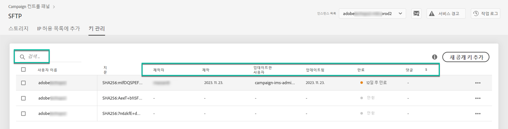
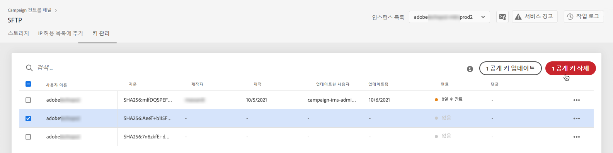
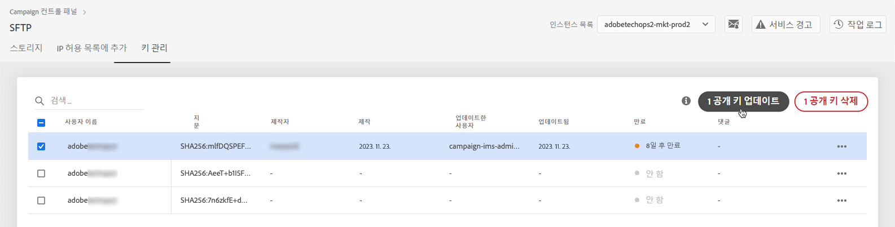

# 키 관리 {#key-management}

>[!CONTEXTUALHELP]
>id="cp_key_management"
>title="공개 키 관리"
>abstract="In this tab, create, manage, and edit your public keys."
>additional-url="https://images-tv.adobe.com/mpcv3/8a977e03-d76c-44d3-853c-95d0b799c870_1560205338.1920x1080at3000_h264.mp4#t=166" text="데모 비디오 시청"

Adobe는 모든 고객에게 **공개 및 개인 키 쌍**&#x200B;을 사용하여 SFTP 서버에 연결할 것을 권장합니다.

아래에서는 공개 SSH 키를 생성한 다음 SFTP 서버 액세스를 위해 추가하는 단계와, 인증 관련 권장 사항에 대해 설명합니다.

서버 액세스를 설정한 후에는 해당 서버에 연결할 수 있도록 **서버 액세스 권한이 필요한 IP 주소를 허용 목록에 추가**&#x200B;해야 합니다. 이 작업에 대한 자세한 정보는 [이 섹션](../../instances-settings/using/ip-allow-listing-instance-access.md)을 참조하십시오.

 이 비디오에서 [Campaign Classic](https://experienceleague.adobe.com/docs/campaign-classic-learn/control-panel/sftp-management/generate-ssh-key.html#sftp-management) 또는 [Campaign Standard](https://experienceleague.adobe.com/docs/campaign-standard-learn/control-panel/sftp-management/generate-ssh-key.html#sftp-management)를 사용하여 해당 기능 살펴보기

## 모범 사례 {#best-practices}

**공개 SSH 키**

항상 동일한 인증을 사용하여 서버에 연결하고 키에 지원되는 형식을 사용해야 합니다.

**사용자 이름 및 암호와 API 통합**

드물지만 암호 기반 인증을 사용할 수 있는 SFTP 서버도 있습니다. Adobe recommends that you use key-based authentication, as this method is more efficient and secure. You can request to switch to key-based authentication by contacting Customer Care.

>[!IMPORTANT]
>
>암호가 만료되면 시스템에 키가 설치되어 있어도 SFTP 계정에 로그인할 수 없습니다.

## SSH 키 설치 {#installing-ssh-key}

>[!CONTEXTUALHELP]
>id="cp_sftp_publickey_add"
>title="공개 키 추가"
>abstract="인스턴스에 대한 공개 SSH 키를 생성한 다음 Campaign 컨트롤 패널에 추가하여 SFTP 서버에 액세스합니다."

>[!IMPORTANT]
>
>SSH 키와 관련하여 항상 조직 지침을 따라야 합니다. 아래 단계는 SSH 키 생성을 수행하는 방법의 한 가지 예일 뿐이며, 팀이나 내부 네트워크 그룹에 관련 요구 사항을 전달할 때 유용한 참조 정보로 활용할 수 있습니다.

1. **[!UICONTROL Key Management]** 탭으로 이동하여 **[!UICONTROL Add new public key]** 버튼을 클릭합니다.

   

1. 대화 상자가 열리면 공개 키를 만들 사용자 이름과 키를 활성화할 서버를 선택합니다.

   

   >[!NOTE]
   >
   >Control Panel will check if a given username is active on a given instance and enable you to activate the key on one or several instances.
   >
   >각 사용자에 대해 공개 SSH 키를 하나 이상 추가할 수 있습니다.

1. To better manage your public keys, you can set a duration for the availability of each key. 이렇게 하려면 **[!UICONTROL Type]** 드롭다운 목록에서 단위를 선택하고 해당 필드에 기간을 정의합니다. For more on public key expiry, see [this section](#expiry).

   

   >[!NOTE]
   >
   >By default, the **[!UICONTROL Type]** field is set to **[!UICONTROL Unlimited]**, which means that the public key never expires.

1. In the **[!UICONTROL Comment]** field, you can indicate a reason for adding this public key (why, for whom, etc.).

1. **[!UICONTROL Public Key]** 필드를 채우려면 공개 SSH 키를 생성해야 합니다. 운영 체제에 따라 아래 절차를 따르십시오.

   **Linux 및 Mac:**

   Terminal을 사용하여 공개 키와 개인 키 쌍을 생성합니다.
   1. 다음 명령을 입력합니다. `ssh-keygen -m pem -t rsa -b 2048 -C "your_email@example.com"`.
   1. 메시지가 표시되면 키의 이름을 입력합니다. .ssh 디렉토리는 없는 경우 자동으로 생성됩니다.
   1. 메시지가 표시되면 암호를 입력하고 다시 입력합니다. 암호는 비워 두어도 됩니다.
   1. 키 쌍 &quot;name&quot; 및 &quot;name.pub&quot;가 생성됩니다. &quot;name.pub&quot; 파일을 검색한 다음 엽니다. 이 파일에는 지정한 이메일 주소로 끝나는 영숫자 문자열이 있어야 합니다.

   **Windows:**

   동일한 &quot;name.pub&quot; 형식의 개인/공용 키 쌍을 생성하는 데 사용할 수 있는 서드파티 도구를 설치해야 할 수 있습니다.

1. .pub 파일을 열고 &quot;ssh...&quot;로 시작하는 전체 문자열을 복사하여 컨트롤 패널에 붙여넣습니다.

   

   >[!NOTE]
   >
   >**[!UICONTROL Public Key]** 필드는 OpenSSH 형식만 허용합니다. 공개 SSH 키 크기는 **2048비트**&#x200B;여야 합니다.

1. **[!UICONTROL Save]** 버튼을 클릭하여 키를 만듭니다. Campaign 컨트롤 패널이 공개 키 및 연결된 지문(SHA256 형식으로 암호화됨)을 저장합니다.

>[!IMPORTANT]
>
>If the key you created is used to establish a connection with a system that has never been connected to the selected SFTP server before, you will need to add a public IP of that system to the allow list before you are able to use this system with the SFTP server. [이 섹션](ip-range-allow-listing.md)을 참조하십시오.

지문을 사용하면 컴퓨터에 저장된 개인 키와 Campaign 컨트롤 패널에 저장된 해당 공개 키를 일치시킬 수 있습니다.

&quot;**...**&quot; 버튼을 사용하면 기존 키를 삭제하거나 연결된 지문을 클립보드에 복사할 수 있습니다.

## 공개 키 관리 {#managing-public-keys}

만드는 공개 키가 **[!UICONTROL Key Management]** 탭에 표시됩니다.

만든 날짜 또는 편집 날짜, 항목을 만들거나 편집한 사용자 및 IP 범위 만료에 따라 항목을 정렬할 수 있습니다.

이름 또는 설명을 입력하여 공개 키를 검색할 수도 있습니다.

하나 이상의 IP 범위를 편집하려면 [이 섹션](#editing-public-keys)을 참조하십시오.

To delete on or more public keys from the list, select them, then click the **[!UICONTROL Delete public key]** button.

### Expiry {#expiry}

**[!UICONTROL Expires]** 열은 공개 키가 만료될 때까지 남은 일수를 표시합니다.

[이메일 경고](../../performance-monitoring/using/email-alerting.md)를 구독한 경우, 공개 키가 만료되기 10일 5일 전에 전자 메일로 알림을 받게 되며, 만료될 날짜입니다. Upon receiving the alert, you can [edit the public key](#editing-public-keys) to extend its validity period if needed.

만료된 공개 키는 7일 후 자동으로 삭제됩니다. **[!UICONTROL Expires]** 열에 **[!UICONTROL Expired]**&#x200B;으로 표시됩니다. 이 7일 이내:

* 만료된 공개 키를 더 이상 사용하여 SFTP 서버에 연결할 수 없습니다.

* [만료된 공개 키를 편집하고 기간을 업데이트하여 다시 사용할 수 있습니다.](#editing-public-keys)

* 목록에서 삭제할 수 있습니다.

## 공개 키 편집 {#editing-public-keys}

>[!CONTEXTUALHELP]
>id="cp_sftp_publickey_update"
>title="공개 키 편집"
>abstract="선택한 공개 키를 업데이트하여 SFTP 서버에 액세스합니다."

To edit public keys, follow the steps below.

>[!NOTE]
>
>You can only edit public keys that have been created since the Control Panel October 2021 release.

1. Select one or more items from the **[!UICONTROL Key Management]** list.
1. **[!UICONTROL Update public key]** 버튼을 클릭합니다.

   

1. 공개 키 만료를 편집하거나 새 설명을 추가할 수 있습니다.

   >[!NOTE]
   >
   >To modify the username, instance and public key in OpenSSH format, delete the public key and create a new one corresponding to your needs.

1. 변경 내용을 저장합니다.
