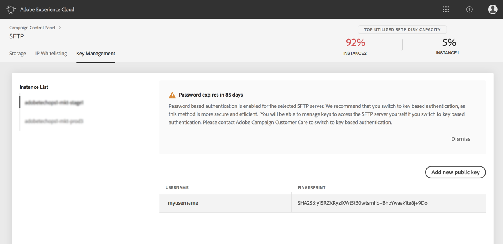

# 주요 관리 {#key-management}

Adobe는 모든 고객에게 **공개 및 개인 키 쌍**&#x200B;을 사용하여 SFTP 서버에 연결할 것을 권장합니다.

공개 SSH 키를 생성하여 SFTP 서버에 액세스하기 위해 추가하는 단계는 물론 인증에 대한 권장 사항이 아래에 설명되어 있습니다.

서버에 대한 액세스가 설정되면 서버에 **액세스할 수 있도록 서버에 액세스해야 하는 IP 주소를** 허용 목록에 추가해야 합니다. For more on this, refer to [this section](../../instances-settings/using/ip-whitelisting-instance-access.md).

>[!NOTE]
>
>현재 SSH 공개 키를 삭제할 수 없습니다.

## 모범 사례 {#best-practices}

**공개 SSH 키 정보**

항상 동일한 인증을 사용하여 서버에 연결하고 키에 지원되는 형식을 사용해야 합니다.

**사용자 이름 및 암호와 API 통합**

일부 SFTP 서버에서 암호 기반 인증이 사용되는 경우는 매우 드문 경우입니다. 이 방법은 효율적이고 안전하므로 키 기반 인증을 사용하는 것이 좋습니다. 고객 지원 센터에 연락하여 키 기반 인증으로 전환할 것을 요청할 수 있습니다.

>[!CAUTION]
>
>시스템에 키가 설치되어 있어도 암호가 만료되면 SFTP 계정에 로그인할 수 없습니다.

## SSH 키 설치 {#installing-ssh-key}

>[!CAUTION]
>
>아래 단계는 SSH 키 생성의 예시입니다. SSH 키와 관련하여 조직 지침을 따르십시오. 아래 예제는 이러한 작업을 수행하는 방법에 대한 한 가지 예이며, 팀 또는 내부 네트워크 그룹에 대한 통신 요구 사항을 참조하기 위한 유용한 포인트 역할을 합니다.

1. 탭으로 이동한 **[!UICONTROL Key Management]** 다음 **[!UICONTROL Add public key]** 단추를 클릭합니다.

   

1. 대화 상자가 열리면 공개 키를 만들 사용자 이름과 키를 활성화할 서버를 선택합니다.

   >[!NOTE]
   >
   >이 인터페이스는 해당 인스턴스에서 해당 사용자 이름이 활성 상태인지 확인하고 하나 또는 여러 인스턴스에서 키를 활성화할 수 있는 옵션을 제공합니다.
   >
   >각 사용자에 대해 하나 이상의 공개 SSH 키를 추가할 수 있습니다.

   

1. 공개 SSH 키를 복사하여 붙여 넣습니다. 공개 키를 생성하려면 운영 체제에 해당하는 아래 단계를 따르십시오.

   >[!NOTE]
   >
   >공개 SSH 키 크기는 2048 **비트여야**&#x200B;합니다.

   **Linux 및 Mac:**

   터미널을 사용하여 공개 및 개인 키 쌍을 생성합니다.
   1. 다음 명령을 입력합니다. `ssh-keygen -t rsa -C <your_email@example.com>`Adobe
   1. 메시지가 표시되면 키에 이름을 입력합니다. .ssh 디렉토리가 없는 경우 시스템에서 자동으로 생성합니다.
   1. 메시지가 표시되면 암호를 입력하고 다시 입력합니다. 또한 비워 둘 수 있습니다.
   1. 시스템에서 키 쌍 "name" 및 "name.pub"을 만듭니다. "name.pub" 파일을 검색한 다음 엽니다. 지정한 이메일 주소로 끝나는 영숫자 문자열이 있어야 합니다.
   **Windows:**

   같은 형식의 "name.pub"으로 개인/공개 키 쌍을 생성하는 데 도움이 되는 타사 도구를 설치해야 할 수 있습니다.

1. .pub 파일을 연 다음 "ssh..."로 시작하는 전체 문자열을 복사하여 붙여 넣습니다. 컨트롤 패널로 이동합니다.

   

1. 단추를 클릭하여 키를 만듭니다. **[!UICONTROL Save]** 제어판은 공개 키와 관련 지문을 SHA256 형식으로 암호화합니다.

지문을 사용하여 제어판에 저장된 해당 공개 키를 사용하여 컴퓨터에 저장된 개인 키와 일치시킬 수 있습니다.

"**...**" 단추를 사용하면 기존 키를 삭제하거나 연결된 지문을 클립보드에 복사할 수 있습니다.

