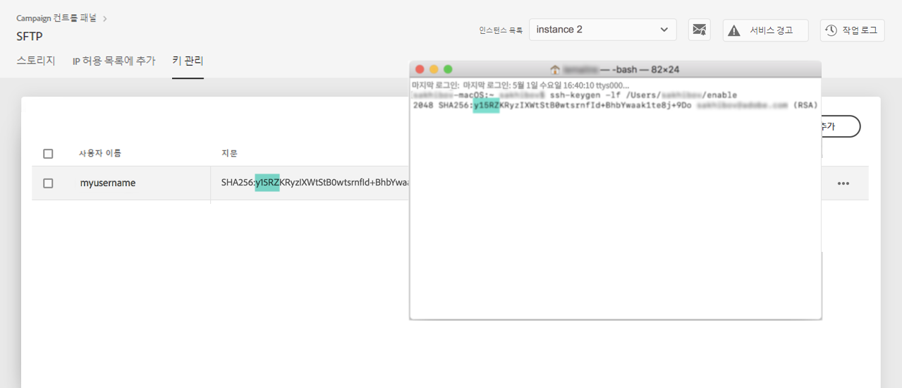

# 키 관리 {#key-management}

>[!CONTEXTUALHELP]
>id="cp_key_management"
>title="키 관리"
>abstract="이 탭에서 공개 키를 관리할 수 있습니다."
>additional-url="https://images-tv.adobe.com/mpcv3/8a977e03-d76c-44d3-853c-95d0b799c870_1560205338.1920x1080at3000_h264.mp4#t=166" text="데모 비디오 시청"

Adobe는 모든 고객에게 **공개 및 개인 키 쌍**&#x200B;을 사용하여 SFTP 서버에 연결할 것을 권장합니다.

아래에서는 공개 SSH 키를 생성한 다음 SFTP 서버 액세스를 위해 추가하는 단계와, 인증 관련 권장 사항에 대해 설명합니다.

서버 액세스를 설정한 후에는 해당 서버에 연결할 수 있도록 서버 액세스 권한이 필요한 **IP 주소를 화이트리스트에 추가**&#x200B;해야 합니다. 이 작업에 대한 자세한 정보는 [이 섹션](../../instances-settings/using/ip-whitelisting-instance-access.md)을 참조하십시오.

>[!NOTE]
>
>현재는 SSH 공개 키를 삭제할 수 없습니다.

## 권장사항 {#best-practices}

**공개 SSH 키**

항상 동일한 인증을 사용하여 서버에 연결하고 키에 지원되는 형식을 사용해야 합니다.

**사용자 이름 및 암호와 API 통합**

드물지만 암호 기반 인증을 사용할 수 있는 SFTP 서버도 있습니다. 하지만 더욱 효율적이며 안전한 키 기반 인증을 사용하는 것이 좋습니다. 고객 지원 센터에 연락하여 키 기반 인증으로의 전환을 요청할 수 있습니다.

>[!IMPORTANT]
>
>암호가 만료되면 시스템에 키가 설치되어 있어도 SFTP 계정에 로그인할 수 없습니다.

## SSH 키 설치 {#installing-ssh-key}

>[!CONTEXTUALHELP]
>id="cp_sftp_publickey_add"
>title="새 공개 키 추가"
>abstract="인스턴스에 새 공개 키를 추가하는 방법을 설명합니다."

>[!IMPORTANT]
>
>아래 단계는 SSH 키 만들기만 설명하는 예제입니다. SSH 키와 관련한 조직의 지침을 따르십시오. 아래 예제는 키를 추가하는 방법의 한 가지 예일 뿐이며, 팀이나 내부 네트워크 그룹에 관련 요구 사항을 전달할 때 유용한 참조 정보로 활용할 수 있습니다.

1. **[!UICONTROL Key Management]** 탭으로 이동하여 **[!UICONTROL Add new public key]** 버튼을 클릭합니다.

   

1. 대화 상자가 열리면 공개 키를 만들 사용자 이름과 키를 활성화할 서버를 선택합니다.

   >[!NOTE]
   >
   >인터페이스에서 지정한 사용자 이름이 해당 인스턴스에서 활성 상태인지 확인한 후에 인스턴스 하나 또는 여러 개에서 키를 활성화할 수 있는 옵션을 제공합니다.
   >
   >각 사용자에 대해 공개 SSH 키를 하나 이상 추가할 수 있습니다.

   

1. 공개 SSH 키를 복사하여 붙여넣습니다. 공개 키를 생성하려면 사용 중인 운영 체제 따라 아래 단계를 수행하십시오.

   >[!NOTE]
   >
   >공개 SSH 키 크기는 **2048비트**&#x200B;여야 합니다.

   **Linux 및 Mac:**

   Terminal을 사용하여 공개 키와 개인 키 쌍을 생성합니다.
   1. 다음 명령을 입력합니다. `ssh-keygen -m pem -t rsa -b 2048 -C "your_email@example.com"`.
   1. 메시지가 표시되면 키의 이름을 입력합니다. .ssh 디렉토리는 없는 경우 자동으로 생성됩니다.
   1. 메시지가 표시되면 암호를 입력하고 다시 입력합니다. 암호는 비워 두어도 됩니다.
   1. 키 쌍 &quot;name&quot; 및 &quot;name.pub&quot;가 생성됩니다. &quot;name.pub&quot; 파일을 검색한 다음 엽니다. 이 파일에는 지정한 이메일 주소로 끝나는 영숫자 문자열이 있어야 합니다.
   **Windows:**

   동일한 &quot;name.pub&quot; 형식의 개인/공용 키 쌍을 생성하는 데 사용할 수 있는 서드파티 도구를 설치해야 할 수 있습니다.

1. .pub 파일을 열고 &quot;ssh...&quot;로 시작하는 전체 문자열을 복사하여 컨트롤 패널에 붙여넣습니다.

   

1. **[!UICONTROL Save]** 버튼을 클릭하여 키를 만듭니다. 컨트롤 패널에서 공개 키 및 연결된 지문(SHA256 형식으로 암호화됨)이 저장됩니다. 

지문을 사용하면 컴퓨터에 저장된 개인 키와 컨트롤 패널에 저장된 해당 공개 키의 일치 여부를 확인할 수 있습니다.

&quot;**...**&quot; 버튼을 사용하면 기존 키를 삭제하거나 연결된 지문을 클립보드에 복사할 수 있습니다.

