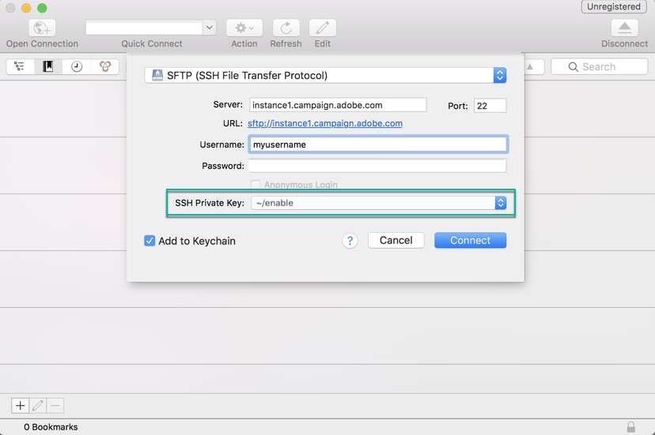

# SFTP 서버에 로그인 {#logging-into-sft-server}

아래 단계에서는 SFTP 클라이언트 애플리케이션을 통해 SFTP 서버를 연결하는 방법을 자세히 설명합니다.

[ 비디오에서 이 기능 살펴보기](https://video.tv.adobe.com/v/27263?quality=12)

서버에 로그인하기 전에 다음을 확인하십시오.

* SFTP 서버는 **Adobe으로 호스팅**.
* 서버에 **사용자 이름**&#x200B;이 설정되었습니다. Campaign 컨트롤 패널의 **키 관리** SFTP 카드의 탭입니다.
* 다음 항목이 있습니다. **개인 및 공개 키 쌍** SFTP 서버에 로그인합니다. 을(를) 참조하십시오 [이 섹션](../../sftp/using/key-management.md) 자세한 내용은 SSH 키를 참조하십시오.
* 사용자 **공개 IP 주소가 허용 목록에 추가되었습니다.** SFTP 서버에서 다음을 수행합니다. 그렇지 않은 경우 다음을 참조하십시오. [이 섹션](../../sftp/using/ip-range-allow-listing.md) 허용 목록에 IP 범위를 추가하는 방법에 대한 자세한 내용을 참조하십시오.
* 다음에 대한 액세스 권한이 있습니다. **SFTP 클라이언트 소프트웨어**. 사용하도록 권장하는 SFTP 클라이언트 애플리케이션을 IT 부서에 문의하거나, 회사 정책에서 이를 허용하는 경우 인터넷에서 검색할 수 있습니다.

SFTP 서버에 연결하려면 다음 단계를 따르십시오.

1. Campaign 컨트롤 패널을 실행한 다음 **[!UICONTROL Key Management]** 의 탭 **[!UICONTROL SFTP]** 카드.

   

1. SFTP 클라이언트 애플리케이션을 시작한 다음 Campaign 컨트롤 패널에서 서버 주소를 복사하여 붙여넣은 다음 &quot;campaign.adobe.com&quot;을 선택하고 사용자 이름을 입력합니다.

   

1. 다음에서 **[!UICONTROL SSH Private Key]** 필드에 컴퓨터에 저장된 개인 키 파일을 선택합니다. 이 파일은 &quot;.pub&quot; 확장자가 없는 공개 키와 동일한 이름을 가진 텍스트 파일에 해당합니다(예: &quot;enable&quot;).

   

   다음 **[!UICONTROL Password]** 필드는 파일의 개인 키로 자동으로 채워집니다.

   

   개인 또는 공개 키의 지문을 SFTP 카드의 키 관리 탭에 나타나는 키의 지문과 비교하여 사용하려는 키가 Campaign 컨트롤 패널에 저장되었는지 확인할 수 있습니다.

   

   >[!NOTE]
   >
   >Mac 컴퓨터를 사용하는 경우 다음 명령을 실행하여 컴퓨터에 저장된 개인 키의 지문을 볼 수 있습니다.
   >
   >`ssh-keygen -lf <path of the privatekey>`

1. 모든 정보가 채워지면 다음을 클릭합니다. **[!UICONTROL Connect]** SFTP 서버에 로그인합니다.

   
