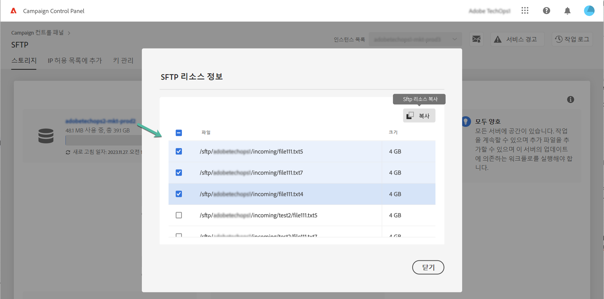

# SFTP 스토리지 관리 {#sftp-storage-management}

>[!CONTEXTUALHELP]
>id="cp_storage"
>title="스토리지 용량"
>abstract="이 탭에서는 SFTP 서버의 스토리지 용량 및 사용률 정보를 확인할 수 있습니다. SFTP 서버의 이름을 클릭하여 SFTP 서버의 공간을 가장 많이 사용하는 상위 10개 파일을 나열할 수도 있습니다. 여기에는 액세스 권한이 있는 SFTP 서버만 표시됩니다. 다른 SFTP 서버 액세스 권한을 요청하려면 관리자에게 문의하십시오."
>additional-url="https://images-tv.adobe.com/mpcv3/8a977e03-d76c-44d3-853c-95d0b799c870_1560205338.1920x1080at3000_h264.mp4" text="데모 비디오 시청"

계약 약관에 따라 SFTP 서버에서 다른 스토리지 용량을 프로비저닝할 수 있습니다.

각 SFTP 서버의 사용 가능한 공간을 정기적으로 모니터링해야 합니다. 이렇게 하지 않으면 서버에 파일을 추가로 저장할 수 없거나, 이 서버의 업데이트를 사용하는 워크플로우를 정상적으로 실행하지 못할 수 있습니다.

[이메일 경고](../../performance-monitoring/using/email-alerting.md)를 구독한 경우, SFTP 서버 중 하나가 용량 80% 이상에 도달하면 이메일로 알림을 받게 됩니다. [SFTP 스토리지 관리](../../sftp/using/sftp-storage-management.md)를 참조하세요.

 이 비디오에서 [Campaign v7/v8](https://experienceleague.adobe.com/docs/campaign-classic-learn/control-panel/sftp-management/monitoring-server-capacity.html?lang=ko) 또는 [Campaign Standard](https://experienceleague.adobe.com/docs/campaign-standard-learn/control-panel/sftp-management/monitoring-server-capacity.html?lang=ko)를 사용하여 해당 기능 살쳐보기

## 스토리지 용량 정보 액세스 {#accessing-storage-capacity-information}

액세스 권한이 있는 모든 인스턴스에서 사용하는 공간 관련 정보는 SFTP 카드의 **[!UICONTROL Storage]** 탭에서 제공됩니다. 페이지를 새로 고칠 때마다 정보가 업데이트됩니다.

각 인스턴스에 대해 스토리지 용량이 초과되는 시점을 파악할 수 있도록 각기 다른 색상의 경고가 표시됩니다.

* **주황**: 인스턴스 용량을 80% 넘게 사용했습니다.
* **빨강**: 인스턴스 용량을 90% 넘게 사용했습니다.

SFTP 서버의 이름을 클릭하여 SFTP 서버의 공간을 가장 많이 사용하는 상위 10개 파일을 식별할 수도 있습니다.

서버의 용량이 거의 소진되면 진행해야 하는 단계를 파악할 수 있도록 추가 팁도 제공됩니다.

## 스토리지 용량 부족 시의 모범 사례 {#best-practices-when-capacity-runs-out}

1. **SFTP 서버에서 오래된 파일이나 필요하지 않은 파일을 정리**&#x200B;합니다. SFTP 서버 폴더에 액세스하는 방법과 관련된 자세한 내용은 [이 섹션](../../sftp/using/logging-into-sftp-server.md)을 참조하십시오.
1. SFTP 서버를 정리하는 **워크플로우**&#x200B;가 정상적으로 실행되는지 확인합니다. Adobe Campaign의 기술 워크플로우와 관련된 자세한 내용은 전용 [Campaign v7/v8](https://experienceleague.adobe.com/docs/campaign-classic/using/automating-with-workflows/advanced-management/about-technical-workflows.html?lang=ko) 및 [Campaign Standard](https://experienceleague.adobe.com/docs/campaign-standard/using/administrating/application-settings/technical-workflows.html?lang=ko) 설명서를 참조하십시오.
1. 계정 팀에 연락하여 **추가 스토리지를 요청**&#x200B;합니다(추가 비용이 발생할 수 있음).
1. 문제가 있다고 생각되면 **고객 지원 센터**&#x200B;에 문의하십시오.
