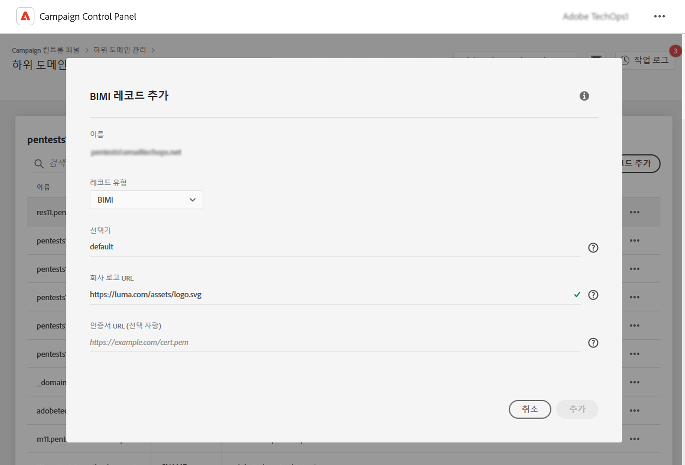

# BIMI 레코드 추가 {#dmarc}

## BIMI 레코드 정보 {#about}

BIMI(Brand Indicators for Message Identification)는 브랜드 인지도와 신뢰도를 높이기 위해 사서함 공급자의 받은 편지함에 있는 발신자의 이메일 옆에 승인된 로고를 표시할 수 있도록 하는 업계 표준입니다. 

BIMI 구현에 대한 자세한 내용은 [Adobe 전달성 모범 사례 안내서](https://experienceleague.adobe.com/docs/deliverability-learn/deliverability-best-practice-guide/additional-resources/technotes/implement-bimi.html?lang=ko)에서 확인할 수 있습니다.

{width="70%" align="center"}

## 제한 및 전제 조건 {#limitations}

* BIMI 레코드를 생성하려면 SPF, DKIM 및 DMARC 레코드가 필요합니다.

* BIMI 레코드는 DNS에 게시해야 합니다. 완전히 위임된 도메인의 경우 컨트롤 패널을 통해 가능합니다. [하위 도메인 구성 방법에 대해 자세히 알아보기](subdomains-branding.md#subdomain-delegation-methods)

* DMARC 레코드 전제 조건:

   * 조직 도메인의 레코드 정책 유형은 “격리” 또는 “거부”로 설정되어야 합니다. DMARC 정책 유형이 “없음”으로 설정되어 있으면 BIMI 레코드를 만들 수 없습니다.
   * DMARC 정책이 적용되는 이메일의 비율은 100%여야 합니다. BIMI는 이 비율이 100% 미만으로 설정된 DMARC 정책을 지원하지 않습니다.

[DMARC 레코드 구성 방법 알아보기](dmarc.md)

## 하위 도메인에 대한 BIMI 레코드 추가 {#add}

하위 도메인에 대한 BIMI 레코드를 추가하려면 다음 단계를 수행하십시오.

1. 하위 도메인 목록에서 원하는 하위 도메인 옆에 있는 줄임표 버튼을 클릭하고 **[!UICONTROL 하위 도메인 세부 사항]**&#x200B;을 선택합니다.

1. **[!UICONTROL TXT 레코드 추가]** 버튼을 클릭한 후 **[!UICONTROL 레코드 유형]** 드롭다운 목록에서 **[!UICONTROL BIMI]**&#x200B;를 선택합니다.

   

1. **[!UICONTROL 선택기]** 필드에서는 레코드에 대한 BIMI 선택기를 지정할 수 있습니다. BIMI 선택기는 BIMI 레코드에 할당할 수 있는 고유 식별자입니다. 이 방법으로 주어진 하위 도메인에 대해 여러 로고를 정의할 수 있습니다. 현재 이 기능은 사서함 제공업체에서 지원하지 않습니다.

1. **[!UICONTROL 회사 로고 URL]**&#x200B;에 로고가 포함된 SVG 파일의 URL을 지정합니다.

1. **[!UICONTROL 인증서 URL]**&#x200B;은 선택 사항이지만 Gmail 및 Apple 등 일부 사서함 제공업체에는 필요합니다. 따라서 BIMI를 실제로 활용하려면 VMC(Verified Mark Certificate)를 받는 것이 좋습니다.

   +++VMC를 받으려면 어떻게 해야 하나요?

   VMC를 받는 주요 단계는 다음과 같습니다.

   1. VMC 발행인이 인정한 지식재산청에 브랜드 로고를 상표로 등록합니다. 법률 팀이 있는 경우, 해당 팀과 함께 로고 상표가 지정되었거나 이미 상표가 지정되었는지 확인하는 것이 좋습니다.

   1. 로고 상표가 지정되었는지 확인한 후 DigiCert 또는 Entrust 인증 기관(CA)에 문의하여 VMC를 요청합니다.

   1. VMC가 승인되면 엔티티 인증서 PEM(Privacy Enhanced Mail) 파일을 받게 됩니다. CA에서 받은 다른 중간 인증서를 이 PEM 파일에 추가합니다. PEM 파일을 (추가 파일과 함께) 공용 웹 서버에 업로드하고 PEM 파일 URL을 기록해 둡니다. BIMI TXT 레코드의 URL을 사용하게 됩니다.

   1. 특정 하위 도메인의 하위 도메인 세부 정보 페이지에 BIMI 레코드가 표시되면 [여기](https://bimigroup.org/bimi-generator/)에서 사용 가능한 BIMI 검사기를 사용하여 BIMI 레코드가 올바르게 작동하는지 확인할 수 있습니다.

   BIMI 구현에 대한 자세한 내용은 [BIMI 표준 설명서](https://bimigroup.org/implementation-guide/)에서 확인할 수 있습니다.
   +++

1. **[!UICONTROL 추가]**&#x200B;를 클릭하여 BIMI 레코드 생성을 확인합니다.

BIMI 레코드 생성이 처리되면(약 5분) 하위 도메인의 세부 정보 화면에 표시됩니다. [하위 도메인의 TXT 레코드를 모니터링하는 방법 알아보기](gs-txt-records.md#monitor)
