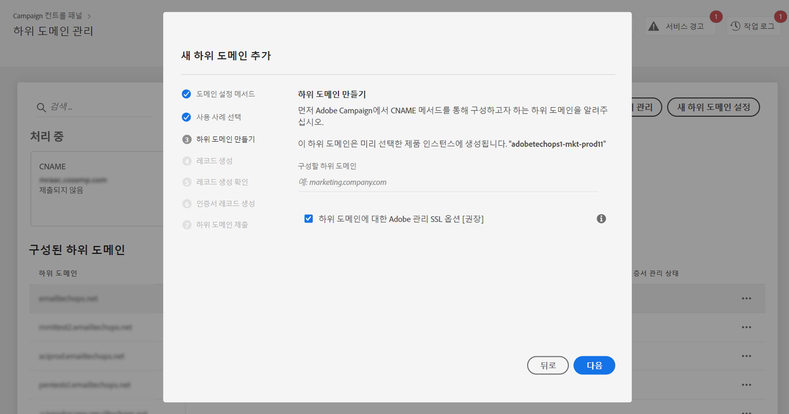
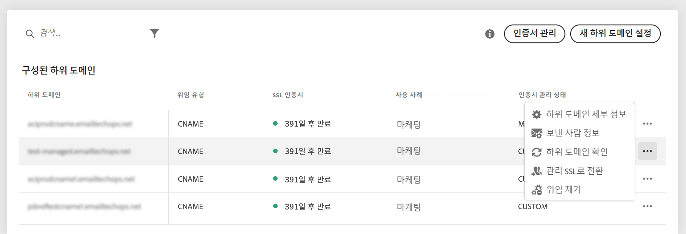
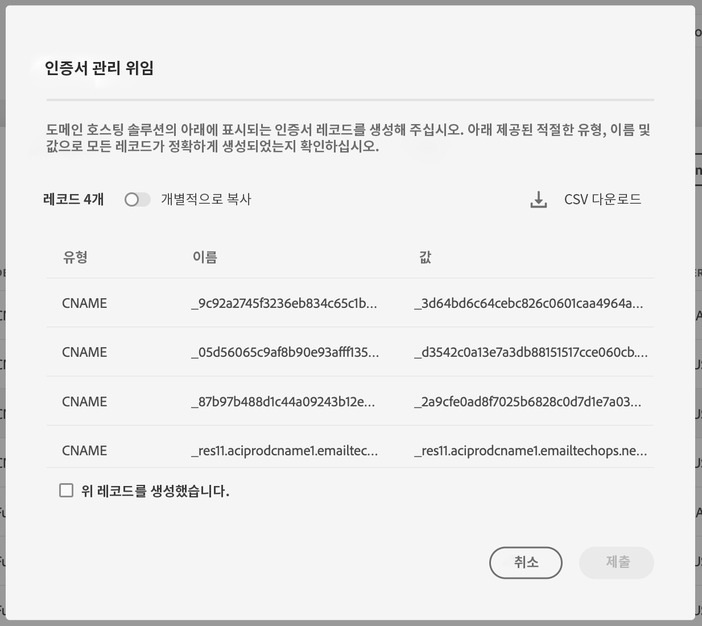

# 하위 도메인의 SSL 인증서를 Adobe에 위임 {#delegate-ssl-certificates}

>[!CONTEXTUALHELP]
>id="cp_managed_ssl"
>title="하위 도메인의 SSL 인증서를 Adobe에 위임"
>abstract="컨트롤 패널을 사용하면 하위 도메인의 SSL 인증서를 Adobe에서 관리하도록 할 수 있습니다. CNAME을 사용하여 하위 도메인을 설정하는 경우, 도메인 호스팅 솔루션에 인증서를 생성하기 위해 인증서 레코드가 자동으로 생성되고 제공됩니다."

하위 도메인의 SSL 인증서 관리를 Adobe으로 위임하는 것을 강력하게 권장합니다. Adobe에서 인증서를 자동으로 만들고 매년 인증서가 만료되기 전에 갱신하기 때문에 편리합니다.

CNAME을 사용해 하위 도메인 위임을 설정하는 경우에는 Adobe에서 인증서를 생성하기 위한 도메인 호스팅 솔루션에 사용할 인증서 레코드를 제공합니다.

SSL 인증서를 Adobe에 위임하는 작업은 새 하위 도메인을 설정할 때나 이미 위임한 하위 도메인에 실행할 수 있습니다.

>[!NOTE]
>
>Adobe 관리 SSL은 무료이며 비용 없이 사용할 수 있습니다. 하위 도메인의 인증서를 Adobe에 위임하더라도 투명성이 보장되며 캠페인과 전달성에 영향을 주지 않습니다. [SSL 인증서 관리에 대해 자세히 알아보기](monitoring-ssl-certificates.md#management)

## 새 하위 도메인의 SSL 인증서 위임 {#new}

새 하위 도메인을 설정할 때 SSL 인증서를 위임하려면 하위 도메인 구성 마법사에서 **[!UICONTROL Opt for Adobe managed SSL for sub-domains]** 옵션을 활성화합니다. 나중에 구성 마법사에서 제공하는 인증서 레코드를 복사해서 호스팅 솔루션에 붙여 넣으면 됩니다. 자세한 단계는 [이 섹션](setting-up-new-subdomain.md)에서 설명합니다.

{width="70%" align="left"}

## 이미 위임한 하위 도메인의 SSL 인증서 위임 {#delegated}

이미 위임한 하위 도메인의 SSL 인증서를 위임하려면 원하는 하위 도메인 옆에 있는 줄임표 버튼을 클릭하고 **[!UICONTROL Switch to Managed SSL]**&#x200B;을 클릭합니다.

{width="70%" align="left"}

Adobe에서 자동으로 생성한 인증서 레코드가 있는 대화 상자가 표시됩니다. 이 레코드를 하나씩 복사하거나 CSV 파일을 다운로드하여 복사한 다음 도메인 호스팅 솔루션으로 이동하여 레코드에 맞는 인증서를 생성합니다.

모든 인증서 레코드가 도메인 호스팅 솔루션에 생성되었는지 확인합니다. 모두 올바르게 구성되었다면 레코드 만들기를 확인한 다음 **[!UICONTROL Submit]**&#x200B;을 클릭합니다.

{width="70%" align="left"}
