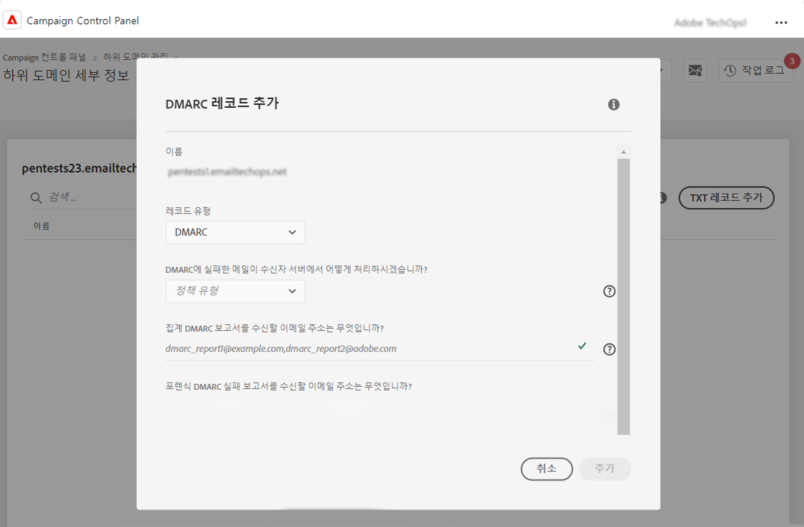
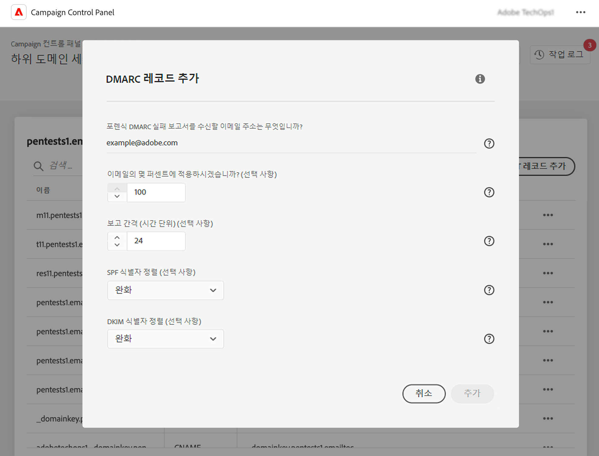

# DMARC 레코드 추가 {#dmarc}

## DMARC 레코드 정보 {#about}

도메인 기반 메시지 인증, 보고 및 적합성(DMARC)은 조직이 피싱 및 스푸핑 공격으로부터 이메일 도메인을 보호할 수 있도록 지원하는 이메일 인증 프로토콜 표준입니다. 이를 통해 사서함 공급자가 SPF 및 DKIM 검사에 실패한 이메일을 처리하는 방법을 결정할 수 있으므로, 발신자의 도메인을 인증하고 악의적인 목적으로 도메인을 승인하지 않고 사용하는 것을 방지할 수 있습니다.

DMARC 구현에 대한 자세한 내용은 [Adobe 전달성 모범 사례 안내서](https://experienceleague.adobe.com/docs/deliverability-learn/deliverability-best-practice-guide/additional-resources/technotes/implement-dmarc.html?lang=ko)에서 확인할 수 있습니다.

## 제한 및 전제 조건 {#limitations}

* SPF 및 DKIM 레코드는 DMARC 레코드를 만들기 위한 전제 조건입니다.
* DMARC 레코드는 전체 하위 도메인 위임을 사용하는 하위 도메인에 대해서만 추가할 수 있습니다. [하위 도메인 구성 방법에 대해 자세히 알아보기](subdomains-branding.md#subdomain-delegation-methods)
* 하위 도메인에 대한 DMARC 및 BIMI 레코드가 모두 있는 경우:
   * DMARC 레코드는 삭제할 수 없습니다. DMARC 레코드를 삭제하려면 먼저 BIMI 레코드를 삭제하십시오.
   * DMARC 레코드를 편집할 수 있지만 DMARC 정책이 &quot;없음&quot;으로 다운그레이드할 수 없으며 백분율 값을 &quot;100&quot;으로 설정해야 합니다.

## 하위 도메인에 대한 DMARC 레코드 추가 {#add}

하위 도메인에 대한 DMARC 레코드를 추가하려면 다음 단계를 수행하십시오.

1. 하위 도메인 목록에서 원하는 하위 도메인 옆에 있는 줄임표 버튼을 클릭하고 **[!UICONTROL Subdomain details]**&#x200B;을 선택합니다.

1. **[!UICONTROL Add TXT record]** 버튼을 클릭한 다음 **[!UICONTROL Record Type]** 드롭다운 목록에서 **[!UICONTROL DMARC]**&#x200B;을 선택합니다.

   

1. 이메일 중 하나가 실패할 경우 수신자 서버가 따라야 하는 **[!UICONTROL Policy Type]**&#x200B;을 선택합니다. 사용 가능한 정책 유형은 다음과 같습니다.

   * **[!UICONTROL None]**,
   * **[!UICONTROL Quarantine]**(스팸 폴더 배치),
   * **[!UICONTROL Reject]**(이메일 차단).

   모범 사례로서, DMARC의 잠재적 영향에 대한 DMARC 이해를 도우면서 DMARC 정책을 p=none에서 p=quarantine, p=reject로 단계적으로 확대하여 DMARC 구현을 천천히 롤아웃하는 것이 좋습니다.

   * **1단계:** 수신하고 사용하는 피드백을 분석합니다(p=none). 이는 수신자에게 인증에 실패한 메시지에 대해 아무 작업도 수행하지 않도록 지시하지만 발신자에게 이메일 보고서를 계속 보냅니다. 또한 합법적인 메시지가 인증에 실패한 경우 SPF/DKIM 문제를 검토하고 수정합니다.

   * **2단계:** SPF와 DKIM이 일치하는지 확인하고 모든 합법적인 이메일에 대해 인증을 통과한 다음 정책을 (p=quarantine)로 이동합니다. 그러면 수신 이메일 서버가 인증에 실패한 이메일을 격리하도록 지시합니다(일반적으로 해당 메시지를 스팸 폴더에 넣는 것을 의미함). 정책이 격리되도록 설정된 경우 적은 수의 이메일로 시작하는 것이 좋습니다.

   * **3단계:** 정책을 (p=reject)로 조정합니다. 참고: 이 정책을 신중하게 사용하고 조직에 적합한지 확인하십시오. p= reject 정책은 수신자에게 인증에 실패한 도메인에 대한 모든 이메일을 완전히 거부(바운스)하도록 지시합니다. 이 정책을 활성화하면 도메인에서 100% 인증된 것으로 확인된 이메일만 받은 편지함에 배치될 수 있습니다.

   >[!NOTE]
   >
   > DMARC 레코드 정책 유형이 “없음”으로 설정되어 있으면 BIMI 레코드를 만들 수 없습니다.

1. DMARC 보고서를 받을 이메일 주소를 입력합니다. 여러 개의 이메일 주소를 쉼표로 구분하여 추가할 수 있습니다. 이메일 중 하나가 실패하면 DMARC 보고서가 선택한 이메일 주소로 자동 전송됩니다.

   * Aggregate-DMARC 보고서는 지정된 기간 동안 실패한 이메일 수와 같은 대략적인 정보를 제공합니다.
   * 포렌식 DMARC 실패 보고서는 실패한 이메일의 출처 IP 주소와 같은 자세한 정보를 제공합니다.

1. DMARC 정책이 “없음”으로 설정된 경우 이메일의 100%에 적용되는 백분율을 입력합니다.

   정책이 “거부” 또는 “격리”로 설정된 경우 적은 수의 이메일로 시작하는 것이 좋습니다. 도메인에서 더 많은 이메일이 수신 서버를 통해 인증을 통과함에 따라 레코드를 더 높은 비율로 천천히 업데이트합니다.

   >[!NOTE]
   >
   >도메인에서 BIMI를 사용하는 경우 DMARC 정책의 백분율 값은 100%여야 합니다. BIMI는 이 값이 100% 미만으로 설정된 DMARC 정책을 지원하지 않습니다.

   

1. DMARC 보고서는 24시간마다 전송됩니다. **[!UICONTROL Reporting Interval]** 필드에서 보고서 전송 빈도를 변경할 수 있습니다. 최소 인증 간격은 1시간이지만 최대 인증 값은 2,190시간(즉, 3개월)입니다.

1. **SPF** 및 **[!UICONTROL DKIM Identifier Alignment]** 필드에서 이메일에 대한 SPF 및 DKIM 인증을 확인하는 동안 수신자 서버가 얼마나 엄격해야 하는지 지정합니다.

   * **[!UICONTROL Relaxed]** 모드: 하위 도메인에서 이메일을 보낸 경우에도 서버가 인증을 수락합니다.
   * **[!UICONTROL Strict]** 모드는 발신자 도메인이 SPF 및 DKIM 도메인과 정확히 일치하는 경우에만 인증을 수락합니다.

   `http://www.luma.com` 도메인으로 작업한다고 가정해 보겠습니다. “완화” 모드에서는 `marketing.luma.com` 하위 도메인에서 오는 이메일이 서버에 의해 승인되지만 “엄격” 모드에서는 거부됩니다.

1. DMARC 레코드 생성을 확인하려면 **[!UICONTROL Add]**&#x200B;을 클릭하십시오.

DMARC 레코드 생성이 처리되면(약 5분) 하위 도메인의 세부 정보 화면에 표시됩니다. [하위 도메인의 TXT 레코드를 모니터링하는 방법 알아보기](gs-txt-records.md#monitor)
