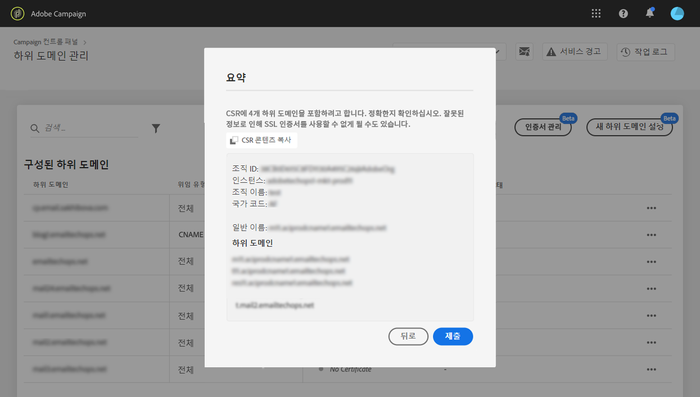
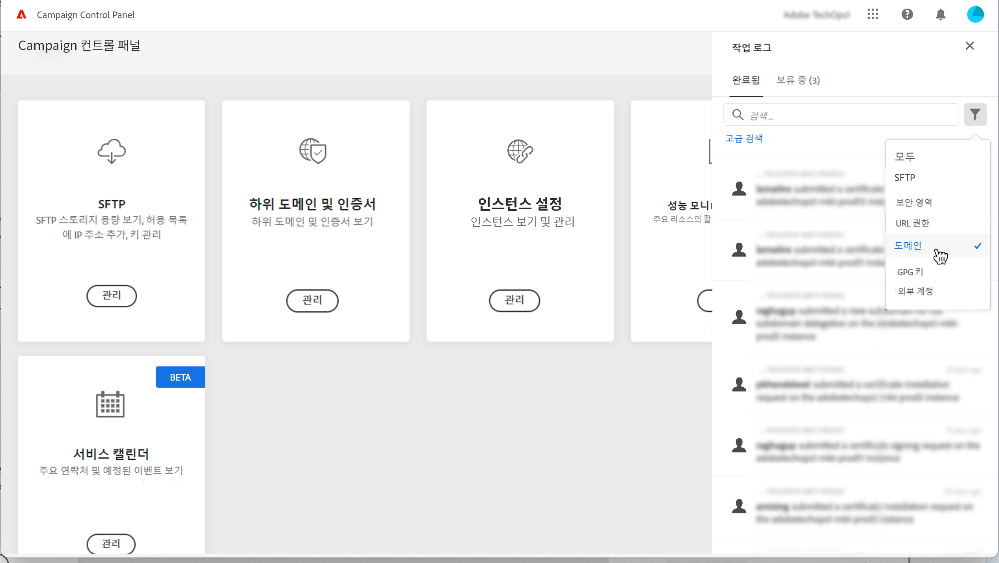
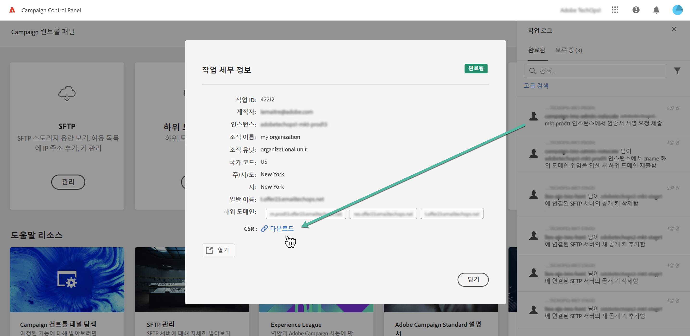

# CSR 생성 {#generating-csr}

>[!CONTEXTUALHELP]
>id="cp_generate_csr"
>title="CSR 생성"
>abstract="인증서를 구매하기 전에 보호하려는 인스턴스 및 하위 도메인에 대해 인증서 서명 요청을 생성해야 합니다."

>[!CONTEXTUALHELP]
>id="cp_select_subdomains"
>title="CSR을 생성할 하위 도메인 선택"
>abstract="인증서 서명 요청에는 모든 하위 도메인을 포함할 수도 있고 특정 하위 도메인만 포함할 수도 있습니다. 선택한 하위 도메인만 구매한 SSL 인증서를 통해 인증됩니다."
>additional-url="https://experienceleague.adobe.com/docs/control-panel/using/subdomains-and-certificates/subdomains-branding.html?lang=ko" text="하위 도메인 브랜딩"

## CSR 생성 {#generate}

CSR(인증서 서명 요청)을 생성하려면 다음 단계를 수행합니다.

1. **[!UICONTROL Subdomains & Certificates]** 카드에서 원하는 인스턴스를 선택하고 **[!UICONTROL Manage Certificate]** 버튼을 클릭합니다.

   

1. **[!UICONTROL 1 - Generate a CSR]**&#x200B;을 선택하고 **[!UICONTROL Next]**&#x200B;을 클릭하여 CSR 생성 프로세스를 안내하는 마법사를 시작합니다.

   

1. CSR을 생성하는 데 필요한 모든 세부 정보가 포함된 양식이 표시됩니다.

   요청된 정보를 완전하고 정확하게 입력해야 합니다. 이렇게 하지 않으면 인증서가 갱신되지 않을 수도 있습니다. 필요한 경우 내부 보안/IT 팀에 문의하여 정보를 확인하고 입력한 후에 **[!UICONTROL Next]**&#x200B;을 클릭합니다.

   * **[!UICONTROL Organization]**: 공식 조직 이름
   * **[!UICONTROL Organization Unit]**: 하위 도메인에 연결된 사업부(예: 마케팅, IT)
   * **[!UICONTROL Instance]**(사전 입력되어 있음): 하위 도메인에 연결된 Campaign 인스턴스의 URL
   * **[!UICONTROL Common name]**: 공통 이름이 기본적으로 선택되어 있으므로 필요한 경우 하위 도메인 중 하나를 선택할 수 있습니다.

   

1. CSR에 포함할 하위 도메인을 선택하고 **[!UICONTROL OK]**&#x200B;을 클릭합니다.

   

1. 선택한 하위 도메인이 목록에 표시됩니다. 각 CSR에 포함할 하위 도메인을 선택하고 **[!UICONTROL Next]**&#x200B;을 클릭합니다.

   

1. CSR에 포함할 하위 도메인의 요약이 표시됩니다. **[!UICONTROL Submit]**&#x200B;을 클릭하여 요청을 확인합니다.

   

   >[!NOTE]
   >
   >다음 **[!UICONTROL Copy CSR content]** 버튼을 사용하면 CSR(조직 ID, 인스턴스, 조직 이름, 일반 이름, 포함된 하위 도메인 등)과 관련된 모든 정보를 복사할 수 있습니다.

1. 선택한 항목에 해당하는 .csr 파일이 자동으로 생성되어 다운로드됩니다. 이제 이 파일을 사용하여 회사가 승인하는 인증 기관에서 SSL 인증서를 구매할 수 있습니다. CSR을 다시 다운로드해야 하는 경우, 다음에 자세히 설명된 단계를 따르십시오. [이 섹션](#download).

CSR이 생성되어 다운로드되면, 이를 사용하여 조직에서 승인한 인증 기관에서 SSL 인증서를 구매할 수 있습니다.

구매한 SSL 인증서는 하위 도메인을 보호하기 위해 인스턴스에 설치할 수 있습니다. [자세히 알아보기](install-ssl-certificate.md)

## CSR 다운로드 {#download}

SSL 인증서를 구매하려면 먼저 인증서 서명 요청을 다운로드해야 합니다. CSR은 생성된 후 자동으로 다운로드됩니다. 작업 로그에서 언제든지 다시 다운로드할 수도 있습니다.

1. 에서 **[!UICONTROL Job Logs]**&#x200B;에서 을(를) 선택합니다. **[!UICONTROL Finished]** 탭을 클릭한 다음 목록을 필터링하여 하위 도메인 관리와 관련된 작업을 표시합니다.

   

1. CSR 생성에 해당하는 작업을 연 다음 **[!UICONTROL Downbload]** 링크를 클릭하여 .csr 파일을 가져옵니다.

   
