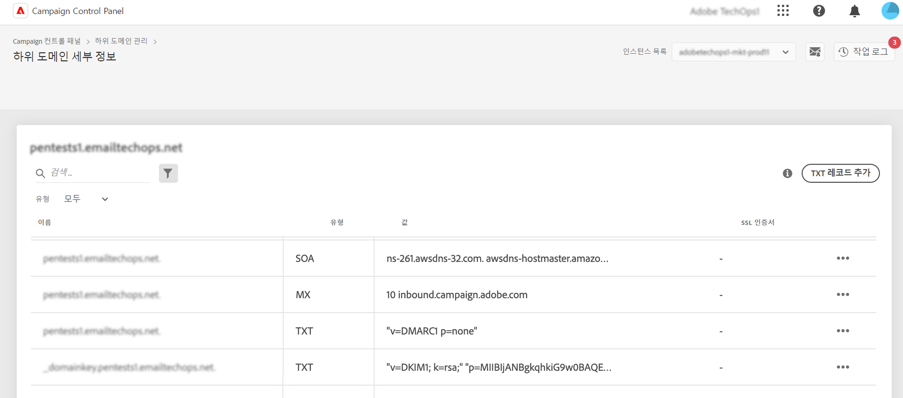

# TXT 레코드 시작 {#managing-txt-records}

>[!CONTEXTUALHELP]
>id="cp_siteverification_add"
>title="TXT 레코드 관리"
>abstract="TXT 레코드는 외부 소스에서 읽을 수 있는 도메인 관련 텍스트 정보를 제공하는 데 사용되는 DNS 레코드 유형입니다. 컨트롤 패널을 사용하면 하위 도메인에 세 가지 유형의 레코드를 추가할 수 있습니다. Google 사이트 확인, DMARC, BIMI 레코드"

## TXT 레코드 소개 {#about}

TXT 레코드는 외부 소스에서 읽을 수 있는 도메인 관련 텍스트 정보를 제공하는 데 사용되는 DNS 레코드 유형입니다. 컨트롤 패널을 사용하면 하위 도메인에 세 가지 유형의 레코드를 추가할 수 있습니다.

* **Google TXT 레코드**&#x200B;를 사용하면 귀하가 도메인을 소유하고 있음을 증명하여 이메일의 받은 편지함 비율을 높이고 스팸 비율을 낮출 수 있습니다. [Google TXT 레코드를 추가하는 방법 알아보기](managing-txt-records.md)
* **DMARC 레코드**&#x200B;는 발신자의 도메인을 인증하고 악의적인 목적으로 도메인을 무단으로 사용하는 것을 방지하는 방법을 제공합니다. [DMARC 레코드를 추가하는 방법 알아보기](dmarc.md)
* **BIMI 레코드**&#x200B;를 사용하면 사서함 공급자의 받은 편지함에 있는 이메일 옆에 승인된 로고를 표시하여 브랜드 인지도와 신뢰도를 높일 수 있습니다. [BIMI 레코드를 추가하는 방법 알아보기](bimi.md)

## 하위 도메인의 레코드 모니터링 {#monitor}

하위 도메인의 세부 정보에 액세스하여 각 하위 도메인에 대해 추가된 모든 TXT 레코드를 모니터링할 수 있습니다.

이 화면에서는 선택한 하위 도메인의 모든 TXT 유형 레코드가 표시되고 구성에 있는 “값” 열에 정보가 표시됩니다. Google TXT, DMARC 또는 BIMI 레코드를 삭제하려면 줄임표 버튼을 클릭한 다음 삭제를 선택합니다. 필요한 경우 DMARC 및 BIMI 레코드를 편집할 수도 있습니다.

