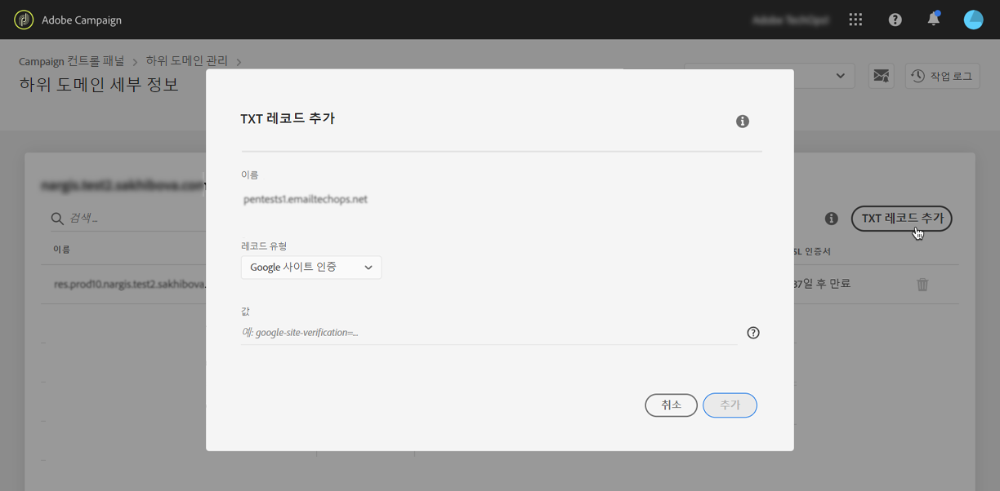
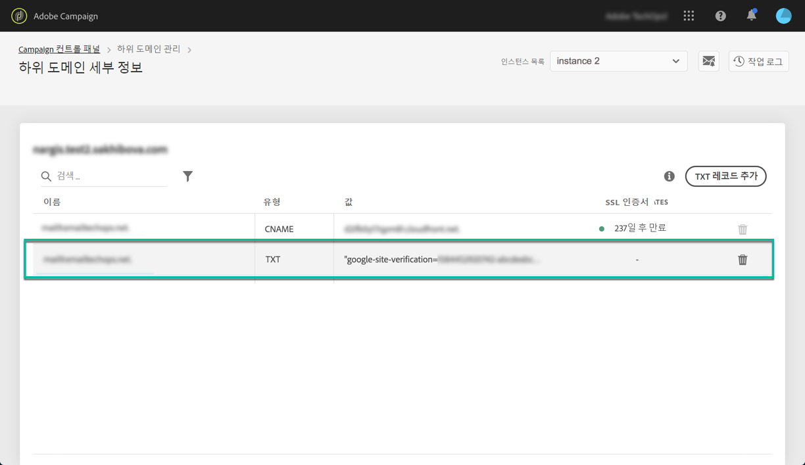

# Google 사이트 확인 레코드 추가 {#adding-a-google-txt-record}

Google 등의 일부 서비스에서는 이메일이 스팸 메일함이 아닌 받은 편지함으로 배달되는 비율을 높이기 위해 도메인 설정에 TXT 레코드를 추가하여 자신이 도메인 소유자임을 확인해야 합니다.

Gmail은 현재 가장 많은 사용자를 보유한 이메일 주소 공급자 중 하나입니다. Adobe Campaign에서는 이메일 배달 가능성을 높여 Gmail 주소로 이메일이 올바르게 배달되도록 하기 위해 하위 도메인에 특수 Google 사이트 확인 TXT 레코드를 확인용으로 추가할 수 있습니다.

Gmail 주소를 이메일로 보내는 데 사용되는 하위 도메인에 Google TXT 레코드를 추가하려면 다음 단계를 수행합니다.

1. 하위 도메인 목록에서 원하는 하위 도메인 옆에 있는 줄임표 버튼을 클릭하고 **[!UICONTROL 하위 도메인 세부 사항]**&#x200B;을 선택합니다.

1. **[!UICONTROL TXT 레코드 추가]** 버튼을 클릭한 후 **[!UICONTROL 레코드 유형]** 드롭다운 목록에서 **[!UICONTROL Google 사이트 확인]**&#x200B;을 선택합니다.

1. G Suite 관리 도구에서 생성된 값을 입력합니다. 자세한 내용은 [G Suite 관리 도움말](https://support.google.com/a/answer/183895)을 참조하십시오.

   

1. **[!UICONTROL 추가]** 버튼을 클릭하여 확인합니다.

   

추가한 TXT 레코드는 Google에서 확인해야 합니다. 이렇게 하려면 G Suite 관리 도구로 이동한 다음 확인 단계를 시작합니다([G Suite 관리 도움말](https://support.google.com/a/answer/183895) 참조).

레코드를 삭제하려면 레코드 목록에서 해당 레코드를 선택하고 제거 버튼을 클릭합니다.

>[!NOTE]
>
>DNS 레코드 목록에서 삭제할 수 있는 레코드는 이전에 추가한 레코드(여기서는 Google TXT 레코드)뿐입니다.

 이 비디오에서 [Campaign v7/v8](https://experienceleague.adobe.com/docs/campaign-classic-learn/control-panel/subdomains-and-certificates/subdomain-delegation.html?lang=ko#subdomains-and-certificates) 또는 [Campaign Standard](https://experienceleague.adobe.com/docs/campaign-standard-learn/control-panel/subdomains-and-certificates/subdomain-delegation.html?lang=ko#subdomains-and-certificates)를 사용하여 해당 기능 살펴보기
