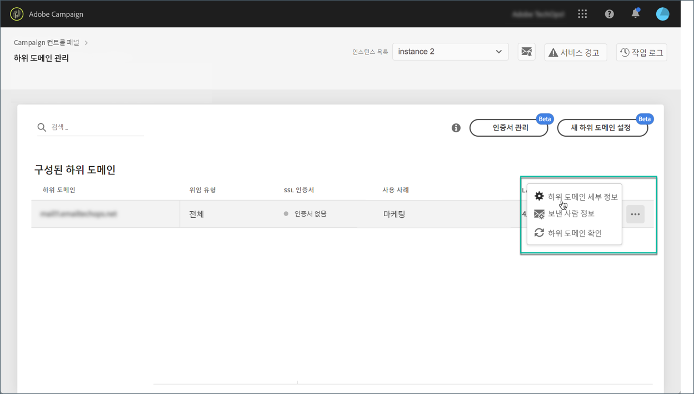

# TXT 레코드 관리 {#managing-txt-records}

>[!CONTEXTUALHELP]
>id="cp_siteverification_add"
>title="TXT 레코드 관리"
>abstract="Google과 같은 일부 서비스에서는 도메인 소유임을 확인하기 위해 도메인 설정에 TXT 레코드를 추가해야 합니다."

## TXT 레코드 정보 {#about-txt-records}

TXT 레코드는 외부 소스에서 읽을 수 있는 도메인에 대한 텍스트 정보를 제공하는 데 사용되는 DNS 레코드 유형입니다.

받은 편지함이 높고 스팸률이 낮도록 하기 위해 Google과 같은 일부 서비스는 도메인을 소유하고 있는지 확인하기 위해 도메인 설정에 TXT 레코드를 추가해야 합니다.

현재 Gmail은 가장 인기 있는 이메일 주소 제공업체 중 하나입니다. Gmail 주소로 이메일을 성공적으로 전달하고 배달할 수 있도록 Adobe Campaign을 사용하면 특수 Google 사이트 확인 TXT 레코드를 하위 도메인에 추가하여 이것이 확인되었는지 확인할 수 있습니다.

추가 리소스:

* [Campaign Standard 자습서 비디오](https://docs.adobe.com/content/help/en/campaign-standard-learn/tutorials/administrating/control-panel/google-txt-record-management.html)
* [Campaign Classic 자습서 비디오](https://docs.adobe.com/content/help/en/campaign-classic-learn/tutorials/administrating/control-panel-acc/google-txt-record-management.html)

## 하위 도메인에 대한 Google TXT 레코드 추가 {#adding-a-google-txt-record}

Gmail 주소를 이메일로 보내는 데 사용되는 하위 도메인에 Google TXT 레코드를 추가하려면 다음 단계를 따르십시오.

1. 카드로 **[!UICONTROL Subdomain and Certificates]** 이동합니다.

1. 인스턴스를 선택한 다음 DNS 레코드를 추가할 하위 도메인의 세부 정보를 엽니다.

   

1. 단추를 **[!UICONTROL Add TXT record]** 클릭한 다음 G Suite 관리 도구에서 생성된 값을 입력합니다. 자세한 내용은 G Suite 관리 [도움말을 참조하십시오](https://support.google.com/a/answer/183895).

   

1. 단추를 클릭하여 **[!UICONTROL Add]** 확인합니다.

   

TXT 레코드가 추가되면 Google에서 확인해야 합니다. 이렇게 하려면 G Suite 관리 도구로 이동한 다음 확인 단계를 시작합니다(G Suite [관리 도움말 참조](https://support.google.com/a/answer/183895)).

레코드를 삭제하려면 레코드 목록에서 레코드를 선택한 다음 제거 단추를 클릭합니다.

>[!NOTE]
>
>DNS 레코드 목록에서 삭제할 수 있는 유일한 레코드는 이전에 추가한 레코드입니다(Google TXT 레코드).

