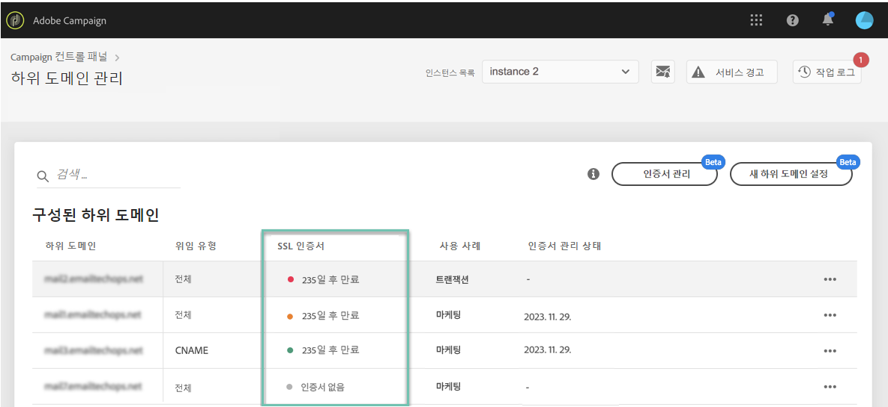

# 하위 도메인의 SSL 인증서 모니터링 {#monitoring-ssl-certificates}

## SSL 인증서 {#about-ssl-certificates}

랜딩 페이지를 호스팅하는 하위 도메인(특히 고객의 중요한 정보를 수집하는 하위 도메인)은 보호하는 것이 좋습니다.

**SSL(Secure Socket Layer) 암호화** Adobe 작업을 위해 구성한 하위 도메인이 안전한지 확인합니다. 고객이 웹 양식을 작성하거나 Adobe Campaign에서 호스팅하는 랜딩 페이지를 방문할 때는 기본적으로 정보가 비보안 프로토콜(HTTP)을 통해 전송됩니다. 보안을 강화하려면 전송되는 정보를 HTTPS 프로토콜로 보호해야 합니다. 예를 들어 하위 도메인 주소 &quot;http://info.mywebsite.com/&quot;은 보안 강화를 위해 이제 &quot;https://info.mywebsite.com/&quot;으로 설정됩니다.

**구성된 하위 도메인 자체에는 SSL 인증서가 설치되지 않습니다.**. SSL 인증서는 연결된 하위 도메인(주로 랜딩 페이지, 리소스 페이지 등을 호스팅하는 하위 도메인)에 설치됩니다.

**SSL 인증서는 일정 기간**(1년, 60일 등) 동안 제공됩니다. 인증서가 만료되면 랜딩 페이지에 액세스하거나 하위 도메인의 리소스를 사용할 때 문제가 발생할 수 있습니다. 이러한 상황을 방지하기 위해 컨트롤 패널에서 하위 도메인의 SSL 인증서를 모니터링하고 인증서 갱신 프로세스를 시작할 수 있습니다.

## SSL 인증서 관리 {#management}

SSL 인증서 모니터링은 하위 도메인이 안전한지 확인하는 키입니다. Campaign 컨트롤 패널을 사용하면 직접 하위 도메인의 SSL 인증서를 설치 및 갱신하거나, Adobe에 위임하여 사용자 측의 작업 없이도 이 프로세스가 자동으로 수행됩니다.

하위 도메인의 SSL 인증서 관리를 Adobe으로 위임하는 것을 강력하게 추천합니다. Adobe에서 인증서를 자동으로 만들고 매년 만료 전에 갱신하기 때문에 편리합니다. 이렇게 하면 인증서를 수동으로 관리할 때 발생할 수 있는 오류 위험을 줄일 수 있습니다. [하위 도메인의 SSL 인증서를 Adobe에 위임하는 방법 알아보기](delegate-ssl.md)

아래에서는 이 작업을 Adobe에 위임하는 것과 대조적으로 수동 인증서 관리와 관련된 포괄적인 영향 목록을 찾을 수 있습니다.

|       | 고객 관리 인증서 | Adobe 관리 인증서 |
|  ---  |  ---  |  ---  |
| 인증서 공급자 | 서드파티 인증 기관 | AWS 인증서 관리자를 통한 Adobe |
| 수동 단계 | CSR 생성, 인증서 구매 및 설치 | 없음 |
| 갱신 프로세스 | 고객의 책임 | Adobe에서 자동으로 관리 |
| 하위 도메인 보안 | 인증서를 설치/갱신하지 않는 한 도메인에는 보안되지 않은 하위 도메인(추적, 미러 및 복구)이 있을 수 있습니다. | 모든 새 도메인(Adobe 관리에 대해 선택된 경우)에는 기본적으로 모든 하위 도메인이 보호됩니다. |
| 인증서 비용 | 인증서 비용은 고객이 부담합니다 | 무료 |

## SSL 인증서 모니터링 {#monitoring-certificates}

>[!CONTEXTUALHELP]
>id="cp_subdomain_details"
>title="하위 도메인 세부 사항"
>abstract="하위 도메인의 SSL 인증서에 대한 정보를 검색합니다."

을(를) 선택하면 하위 도메인 목록에서 하위 도메인 SSL 인증서 상태를 바로 확인할 수 있습니다. **[!UICONTROL 하위 도메인 및 인증서]** 카드.

하위 도메인은 SSL 인증서의 만료 날짜가 임박한 항목부터 차례로 정렬되며, 만료까지 남은 기간(일) 정보가 각기 다른 색상으로 표시됩니다.

* **녹색**: 하위 도메인에 앞으로 60일 이내에 만료되는 인증서가 없습니다.
* **주황**: 하위 도메인 하나 이상에 앞으로 60일 이내에 만료되는 인증서가 있습니다.
* **빨강**: 하위 도메인 하나 이상에 앞으로 30일 이내에 만료되는 인증서가 있습니다.
* **회색**: 하위 도메인용 인증서가 설치되어 있지 않습니다.

하위 도메인에 대한 자세한 내용을 보려면 **[!UICONTROL 하위 도메인 세부 정보]** 단추를 클릭합니다.
모든 관련 하위 도메인 목록이 표시됩니다. 이 목록에는 보통 랜딩 페이지, 리소스 페이지 등의 하위 도메인이 포함됩니다.

다음 **[!UICONTROL 보낸 사람 정보]** 탭은 구성된 받은 편지함 관련 정보(보낸 사람, 회신, 오류 이메일)를 제공합니다.

하위 도메인의 SSL 인증서 중 하나가 곧 만료되는 경우 컨트롤 패널에서 바로 갱신할 수 있습니다. 인증서 갱신과 관련된 자세한 내용은 [하위 도메인의 SSL 인증서 갱신](../../subdomains-certificates/using/renewing-subdomain-certificate.md) 섹션을 참조하십시오.

**관련 항목:**

* [하위 도메인의 SSL 인증서 갱신](../../subdomains-certificates/using/renewing-subdomain-certificate.md)
* [하위 도메인 브랜딩](../../subdomains-certificates/using/subdomains-branding.md)
