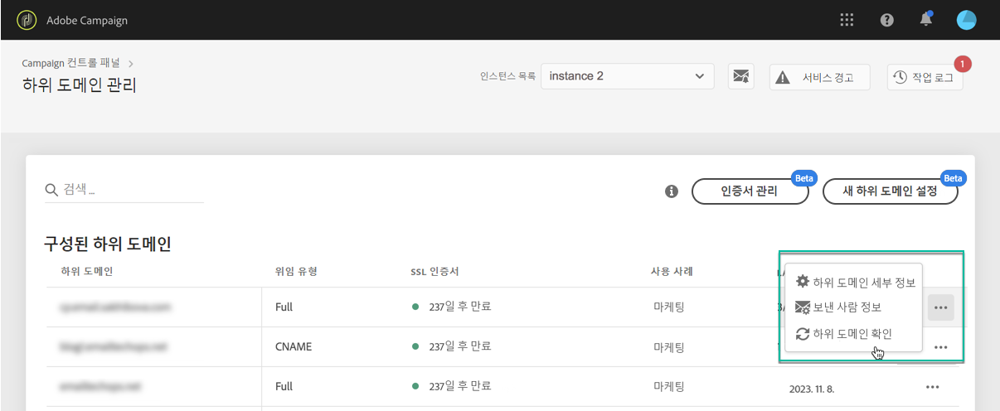

# 하위 도메인 모니터링 {#monitoring-subdomains}

>[!CONTEXTUALHELP]
>id="cp_subdomain_undelegate"
>title="위임된 하위 도메인 제거 "
>abstract="이 화면에서는 Campaign 컨트롤 패널에서 위임된 하위 도메인을 제거할 수 있습니다. 하위 도메인 제거는 취소할 수 없으며 제출되면 취소할 수 없습니다.  선택한 인스턴스에 대한 주 도메인을 제거하려고 하면 해당 도메인을 바꿀 도메인을 선택하라는 메시지가 표시됩니다."

Adobe Campaign에서 작동하도록 하위 도메인을 모니터링하는 것이 중요합니다.

각 프로덕션 인스턴스의 하위 도메인 목록은 **[!UICONTROL Subdomains & Certificates]** 카드.

다음 **[!UICONTROL Last verification]** 열은 마지막으로 하위 도메인을 확인한 시점을 나타냅니다. 언제든지 을(를) 클릭하여 확인을 시작할 수 있습니다 **...** / **[!UICONTROL Verify subdomain]** 버튼을 클릭합니다.

>[!IMPORTANT]
>
>Adobe은 인증서 날짜가 없는 하위 도메인을 사용하는 것이 아니라 이러한 하위 도메인에 배달 가능성 문제가 있을 수 있다는 의미입니다.

확인을 시작할 때 하위 도메인이 올바르게 구성되었는지( 인스턴스 테넌트 확인, 이메일 전송 테스트 등) 확인하는 여러 작업이 수행됩니다.

하위 도메인의 확인이 실패하면 Adobe 고객 지원 센터에 문의하여 추가 조사를 받으십시오.

**관련 항목:**

* [하위 도메인의 SSL 인증서 갱신](../../subdomains-certificates/using/renewing-subdomain-certificate.md)
* [하위 도메인 브랜딩](../../subdomains-certificates/using/subdomains-branding.md)
