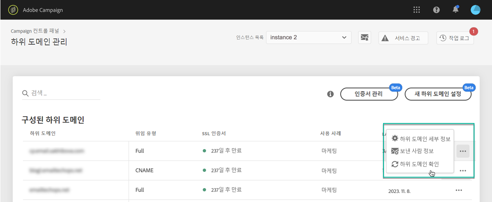

# 하위 도메인 모니터링 {#monitoring-subdomains}

하위 도메인을 모두 Adobe Campaign 작업에 적절하게 구성했는지 확인하려면 모니터링이 중요합니다.

**[!UICONTROL 하위 도메인 및 인증서]** 카드를 선택하면 각 프로덕션 인스턴스의 하위 도메인 목록에 바로 액세스할 수 있습니다.

**[!UICONTROL 최근 인증]** 열에는 하위 도메인을 마지막으로 인증한 시점이 표시됩니다. 언제든지 **...** / **[!UICONTROL 하위 도메인 인증]** 버튼을 클릭하여 인증을 실행할 수 있습니다.

>[!IMPORTANT]
>
>인증서 날짜가 없는 하위 도메인은 전달성에 문제가 있을 수 있으므로 사용하지 않는 것을 권장합니다.

인증을 시작할 때 하위 도메인이 올바르게 구성되었는지 확인하기 위해 몇 가지 작업이 수행됩니다(인스턴스 테넌트 확인, 이메일 전송 테스트 등). 하위 도메인의 확인에 실패하는 경우 추가 조사를 위해 Adobe 고객 지원 센터에 문의하십시오.

**관련 항목:**

* [하위 도메인의 SSL 인증서 갱신](../../subdomains-certificates/using/renewing-subdomain-certificate.md)
* [하위 도메인 브랜딩](../../subdomains-certificates/using/subdomains-branding.md)
