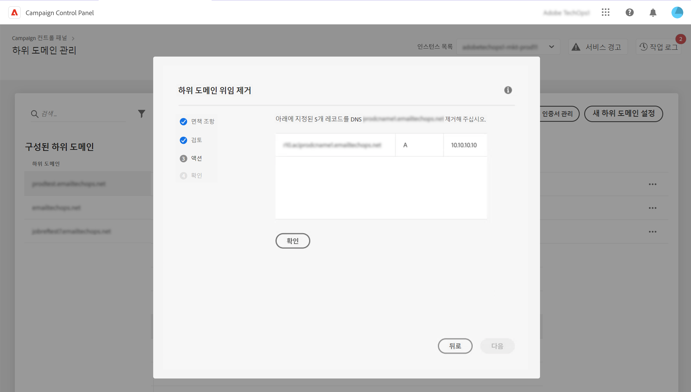

# Adobe에 대한 하위 도메인 위임 제거 {#remove-delegated--subdomains}

>[!CONTEXTUALHELP]
>id="cp_subdomain_undelegate"
>title="하위 도메인 위임 제거"
>abstract="이 화면에서는 Adobe에 대한 하위 도메인 위임을 제거할 수 있습니다. 이 프로세스는 실행을 취소할 수 없으며 실행이 완료될 때까지 되돌릴 수 없습니다.  선택한 인스턴스에 대한 주 도메인의 위임을 제거하면 주 도메인을 대체할 도메인을 선택하라는 메시지가 표시됩니다."

컨트롤 패널을 사용하면 Adobe에 완전히 위임했거나 CNAME을 사용하여 위임한 하위 도메인의 위임을 제거할 수 있습니다.

## 중요 정보 {#important}

계속하기 전에 제거 프로세스가 트리거되면 발생하는 영향을 신중하게 고려하십시오.

* 프로세스가 트리거되면 하위 도메인 위임 제거를 취소할 수 없으며 프로세스 실행이 완료될 때까지 되돌릴 수 없습니다.
* 다른 하위 도메인에 대한 유사한 프로세스가 진행 중인 경우 다른 하위 도메인 위임을 제거할 수 없습니다.
* 하위 도메인에서 제거된 위임은 제거 후 3일이 지나야 다시 위임할 수 있습니다.

## 하위 도메인 위임 제거 {#steps}

Adobe에 대한 하위 도메인 위임을 제거하려면 다음 단계를 수행합니다.

1. 위임을 제거할 도메인 옆에 있는 줄임표 버튼을 클릭하고 **[!UICONTROL Remove delegation]**&#x200B;을(를) 선택합니다.

   

1. 약관을 검토하고 Adobe에 대한 도메인 위임을 제거했음을 확인합니다.

1. 관련 IP 선호도 및 브랜드 구성을 포함하여 하위 도메인이 연결된 인스턴스에 대한 정보를 검토합니다.

   선택한 인스턴스에 대한 주 도메인의 위임을 제거하는 경우 **[!UICONTROL Replacement Domain]** 목록을 사용하여 이를 대체할 도메인을 선택해야 합니다.

    **[!UICONTROL Next]**&#x200B;을(를) 클릭하여 제거 작업을 진행합니다.

   

1. CNAME 유형 위임을 제거하거나 기본 도메인을 CNAME을 사용하여 위임한 도메인으로 바꾸는 경우 추가로 DNS 레코드를 관리하는 **[!UICONTROL Action]** 단계가 표시됩니다. [이 섹션에서 자세히 알아보기](#dns)

1. 표시되는 요약을 검토합니다. 제거를 확정하려면 위임을 제거할 도메인의 URL을 입력하고 **[!UICONTROL Submit]**&#x200B;을(를) 클릭합니다.

   

위임 제거가 시작되면 완료될 때까지 보류 중인 작업이 작업 로그에 표시됩니다.

## DNS 레코드 관리 {#dns}

컨트롤 패널에서 CNAME을 사용하여 도메인 위임을 구성하려면 DNS 서버에 특정 레코드를 추가해야 합니다. [CNAME을 사용하여 하위 도메인을 설정하는 방법 알아보기](setting-up-new-subdomain.md#use-cnames)

CNAME 유형 위임을 제거할 때는 문제를 방지하기 위해 서버에서 **이 DNS 레코드를 제거**&#x200B;해야 합니다. 또한 기본 하위 도메인의 위임을 제거하고 CNAME을 사용하여 위임한 도메인으로 바꾸려면 하위 도메인에 대해 설정된 IP 선호도에 따라 서버에 **DNS 레코드를 추가**&#x200B;해야 할 수도 있습니다. 

아래 표는 제거할 위임의 유형과 대체 도메인을 설정하는 데 사용할 위임 유형에 따라 수행할 작업의 목록입니다.

| 제거된 위임 | 대체 도메인 위임 | 필요한 작업 |
|  ---  |  ---  |  ---  |
| CNAME | 교체 도메인 없음 | DNS 레코드 삭제 |
| CNAME | CNAME | DNS 레코드 삭제 DNS 레코드 추가&#x200B;*(IP 선호도에 따라 선택)* |
| CNAME | 전체 | DNS 레코드 삭제 |
| 전체 | 교체 도메인 없음 | 필요한 작업 없음 |
| 전체 | CNAME | DNS 레코드 추가&#x200B;*(IP 선호도에 따라 선택)* |
| 전체 | 전체 | 필요한 작업 없음 |

{style="table-layout:auto"}

위임을 제거하는 데 이 작업 중 하나가 필요한 경우에는 위임을 제거하겠다고 확인하기 전에 추가로 **[!DNL Action]** 단계가 표시됩니다. 이 화면에는 상황에 따라 제거하거나 추가할 DNS 레코드의 목록이 있습니다.

### DNS 레코드 삭제

1. DNS 서버로 이동하여 컨트롤 패널의 목록에 있는 레코드를 제거합니다.
1. 컨트롤 패널로 돌아가서 **[!UICONTROL Next]**&#x200B;을(를) 클릭하여 위임 제거를 계속 진행합니다.

### DNS 레코드 추가

1. DNS 서버로 이동하여 컨트롤 패널의 목록에 있는 레코드를 추가합니다.
1. DNS 추가 효과가 적용될 때까지 기다립니다.
1. 컨트롤 패널로 돌아가서 **[!UICONTROL Verify]**&#x200B;을(를) 클릭합니다.
1. 레코드 추가를 성공적으로 확인했으면 **[!UICONTROL Next]**&#x200B;을(를) 클릭하여 위임 제거를 계속 진행합니다.

## 오류 코드 {#FAQ}

이 섹션에는 하위 도메인 위임을 제거할 때 발생할 수 있는 오류 메시지가 나열됩니다.

| 오류 코드 | 메시지 | 설명 |
|  ---  |  ---  |  ---  |
| 8002 | 진행 중인 유사한 중복 요청이 있으므로 요청된 위임 도메인 제거 작업을 진행할 수 없습니다. 3일 후에 시도해 주십시오 | 선택한 인스턴스에 대한 하위 도메인 위임 제거 작업이 이미 진행 중입니다. 새 제거 작업을 시작하려면 3일이 지나야 합니다. |
| 8003 | 이 인스턴스에 대해서는 요청된 위임 도메인 제거가 지원되지 않습니다. | 선택한 하위 도메인은 기술 문제로 인해 위임 제거가 지원되지 않습니다. 고객 지원 센터에 문의하십시오. |
| 8004 | 이 인스턴스에는 도메인이 하나만 있으므로 요청된 위임 도메인 제거는 허용되지 않습니다. | 선택한 인스턴스에 대해 하나의 하위 도메인만 위임되었습니다. 위임 제거가 허용되지 않습니다. |
| 8005 | 이 구성에 대해서는 요청된 위임 도메인 제거가 지원되지 않습니다. | 선택한 하위 도메인은 기술 문제로 인해 위임 제거가 지원되지 않습니다. 고객 지원 센터에 문의하십시오. |
| 8006 | 알 수 없는 이유로 인해 요청된 위임 도메인 제거가 허용되지 않습니다. 고객 지원 센터에 문의해 주십시오. | 알 수 없는 문제로 인해 선택한 인스턴스에 대한 위임 제거가 지원되지 않습니다. 고객 지원 센터에 문의하십시오. |
