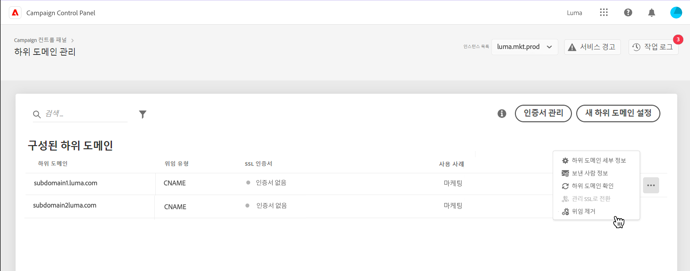
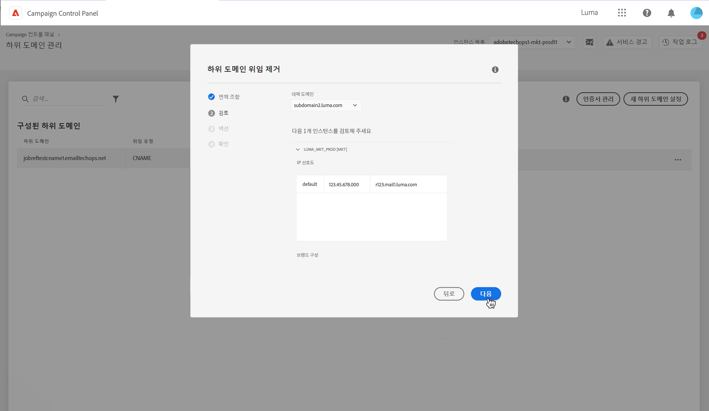
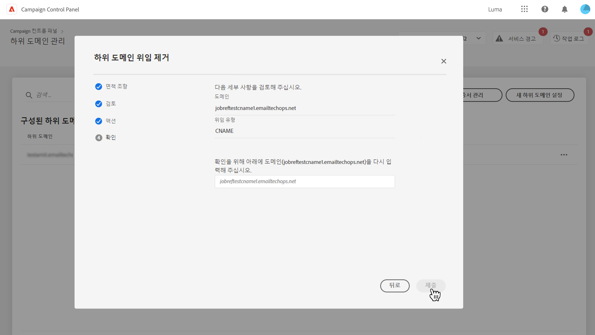
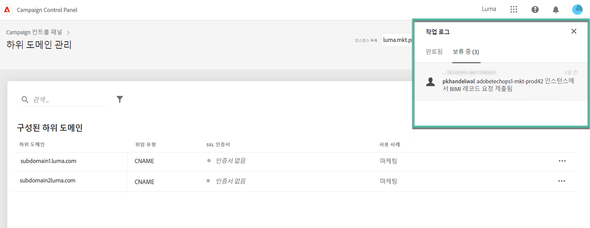

# Adobe에 대한 하위 도메인 위임 제거 {#remove-delegated--subdomains}

>[!CONTEXTUALHELP]
>id="cp_subdomain_undelegate"
>title="하위 도메인 위임 제거"
>abstract="이 화면에서는 Adobe에 대한 하위 도메인 위임을 제거할 수 있습니다. 이 프로세스는 실행을 취소할 수 없으며 실행이 완료될 때까지 되돌릴 수 없습니다.  선택한 인스턴스에 대한 주 도메인의 위임을 제거하면 주 도메인을 대체할 도메인을 선택하라는 메시지가 표시됩니다."

Campaign 컨트롤 패널을 사용하면 Adobe에 대한 하위 도메인 위임을 제거할 수 있습니다.

>[!NOTE]
>
>현재 CNAME을 사용하여 설정한 하위 도메인은 위임을 제거할 수 없습니다.

## 중요 정보 {#important}

계속하기 전에 제거 프로세스가 트리거되면 발생하는 영향을 신중하게 고려하십시오.

* 프로세스가 트리거되면 하위 도메인 위임 제거를 취소할 수 없으며 프로세스 실행이 완료될 때까지 되돌릴 수 없습니다.
* 다른 하위 도메인에 대한 유사한 프로세스가 진행 중인 경우 다른 하위 도메인 위임을 제거할 수 없습니다.
* 하위 도메인에서 제거된 위임은 제거 후 3일이 지나야 다시 위임할 수 있습니다.

## 하위 도메인 위임 제거 {#steps}

Adobe에 대한 하위 도메인 위임을 제거하려면 다음 단계를 수행합니다.

1. 위임을 제거할 도메인 옆에 있는 줄임표 버튼을 클릭하고 **[!UICONTROL Remove delegated subdomain]**&#x200B;을(를) 선택합니다.

   

1. 약관을 검토하고 Adobe에 대한 도메인 위임을 제거했음을 확인합니다.

1. 관련 IP 선호도 및 브랜드 구성을 포함하여 하위 도메인이 연결된 인스턴스에 대한 정보를 검토합니다.

   선택한 인스턴스에 대한 주 도메인의 위임을 제거하는 경우 **[!UICONTROL Replacement Domain]** 목록을 사용하여 이를 대체할 도메인을 선택해야 합니다.

    **[!UICONTROL Next]**&#x200B;을(를) 클릭하여 제거 작업을 진행합니다.

   

1. 표시되는 요약을 검토합니다. 제거를 확정하려면 위임을 제거할 도메인의 URL을 입력하고 **[!UICONTROL Submit]**&#x200B;을(를) 클릭합니다.

   

위임 제거가 시작되면 완료될 때까지 보류 중인 작업이 작업 로그에 표시됩니다.

## 오류 코드 {#FAQ}

이 섹션에는 하위 도메인 위임을 제거할 때 발생할 수 있는 오류 메시지가 나열됩니다.

| 오류 코드 | 메시지 | 설명 |
|  ---  |  ---  |  ---  |
| 8002 | 진행 중인 유사한 중복 요청이 있으므로 요청된 위임 도메인 제거 작업을 진행할 수 없습니다. 3일 후에 시도해 주십시오 | 선택한 인스턴스에 대한 하위 도메인 위임 제거 작업이 이미 진행 중입니다. 새 제거 작업을 시작하려면 3일이 지나야 합니다. |
| 8003 | 이 인스턴스에 대해서는 요청된 위임 도메인 제거가 지원되지 않습니다. | 선택한 하위 도메인은 기술 문제로 인해 위임 제거가 지원되지 않습니다. 고객 지원 센터에 문의하십시오. |
| 8004 | 이 인스턴스에는 도메인이 하나만 있으므로 요청된 위임 도메인 제거는 허용되지 않습니다. | 선택한 인스턴스에 대해 하나의 하위 도메인만 위임되었습니다. 위임 제거가 허용되지 않습니다. |
| 8005 | 이 구성에 대해서는 요청된 위임 도메인 제거가 지원되지 않습니다. | 선택한 하위 도메인은 기술 문제로 인해 위임 제거가 지원되지 않습니다. 고객 지원 센터에 문의하십시오. |
| 8006 | 알 수 없는 이유로 인해 요청된 위임 도메인 제거가 허용되지 않습니다. 고객 지원 센터에 문의해 주십시오. | 알 수 없는 문제로 인해 선택한 인스턴스에 대한 위임 제거가 지원되지 않습니다. 고객 지원 센터에 문의하십시오. |
