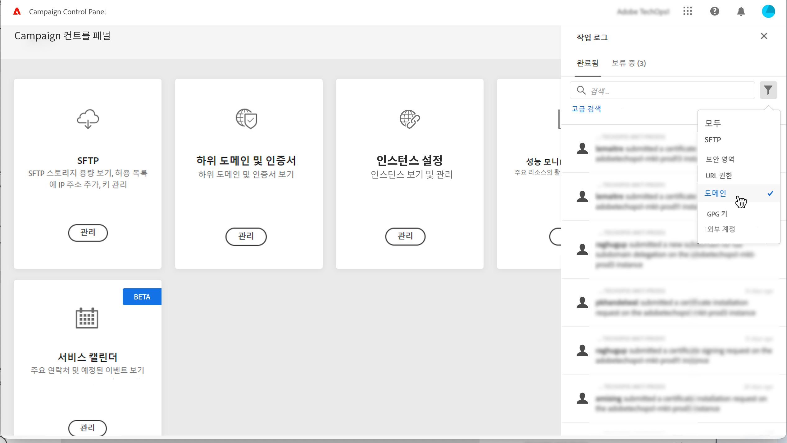
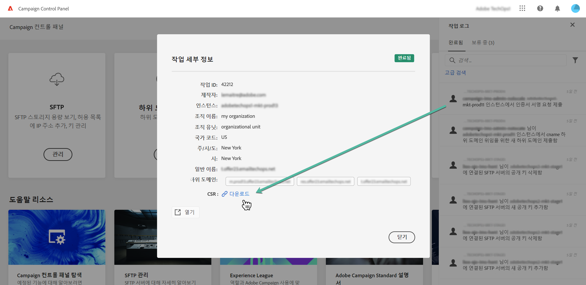

# SSL 인증서 갱신 {#renewing-subdomains-ssl-certificates}

>[!CONTEXTUALHELP]
>id="cp_add_ssl_certificate"
>title="SSL 인증서 갱신"
>abstract="SSL 인증서를 추가하려면 CSR을 생성하고 하위 도메인용 SSL 인증서를 구매한 다음 인증서 번들을 설치해야 합니다. 이 작업은 인증서를 Adobe에 위임하지 않고 수동으로 관리하도록 선택한 경우에만 필요합니다. "

>[!NOTE]
>
>하위 도메인의 SSL 인증서 갱신은 이 프로세스를 Adobe에 위임하지 않고 직접 인증서를 관리하도록 선택한 경우에만 필요합니다. 하위 도메인의 SSL 인증서 관리를 Adobe으로 위임하는 것이 좋습니다. Adobe은 인증서가 자동으로 생성되고 만료되기 전에 매년 갱신하기 때문입니다. [SSL 인증서 관리에 대해 자세히 알아보기](monitoring-ssl-certificates.md#management)

SSL 인증서 갱신 프로세스에는 다음의 세 단계를 수행합니다.

1. **CSR(인증서 서명 요청) 생성**

   인증서를 구매하기 전에 보호하려는 인스턴스 및 하위 도메인에 대해 인증서 서명 요청을 생성해야 합니다.  일반 이름, 조직 이름, 주소 등 CSR을 생성하는 데 필요한 정보를 제공해야 합니다. [자세히 알아보기](#generate)

1. **SSL 인증서 구매**

   CSR이 생성되면 이를 사용하여 회사가 승인하는 인증 기관에서 SSL 인증서를 구매할 수 있습니다.

1. **SSL 인증서 설치**

   구매한 SSL 인증서를 원하는 하위 도메인에 설치하여 보안을 설정합니다. [자세히 알아보기](#install)

 이 비디오에서 [Campaign v7/v8](https://experienceleague.adobe.com/docs/campaign-classic-learn/control-panel/subdomains-and-certificates/adding-ssl-certificates.html?lang=ko) 또는 [Campaign Standard](https://experienceleague.adobe.com/docs/campaign-standard-learn/control-panel/subdomains-and-certificates/adding-ssl-certificates.html?lang=ko)를 사용하여 해당 기능 살펴보기

**관련 항목:**

* [게재 기능 모범 사례 안내서 - Adobe Campaign에 대한 SSL 인증서 요청 프로세스](https://experienceleague.adobe.com/docs/deliverability-learn/deliverability-best-practice-guide/additional-resources/campaign/ac-ssl-certificate-request.html?lang=ko)
* [하위 도메인 브랜딩](../../subdomains-certificates/using/subdomains-branding.md)
* [하위 도메인 모니터링](../../subdomains-certificates/using/monitoring-subdomains.md)

## CSR 생성 {#generate}

>[!CONTEXTUALHELP]
>id="cp_generate_csr"
>title="CSR 생성"
>abstract="인증서를 구매하기 전에 보호하려는 인스턴스 및 하위 도메인에 대해 인증서 서명 요청을 생성해야 합니다."

>[!CONTEXTUALHELP]
>id="cp_select_subdomains"
>title="CSR을 생성할 하위 도메인 선택"
>abstract="인증서 서명 요청에는 모든 하위 도메인을 포함할 수도 있고 특정 하위 도메인만 포함할 수도 있습니다. 선택한 하위 도메인만 구매한 SSL 인증서를 통해 인증됩니다."

CSR(인증서 서명 요청)을 생성하려면 다음 단계를 수행합니다.

1. **[!UICONTROL Subdomains & Certificates]** 카드에서 원하는 인스턴스를 선택하고 **[!UICONTROL Manage Certificate]** 버튼을 클릭합니다.

   

1. **[!UICONTROL 1 - Generate a CSR]**&#x200B;을 선택하고 **[!UICONTROL Next]**&#x200B;을 클릭하여 CSR 생성 프로세스를 안내하는 마법사를 시작합니다.

   

1. CSR을 생성하는 데 필요한 모든 세부 정보가 포함된 양식이 표시됩니다.

   요청된 정보를 완전하고 정확하게 입력해야 합니다. 이렇게 하지 않으면 인증서가 갱신되지 않을 수도 있습니다. 필요한 경우 내부 보안/IT 팀에 문의하여 정보를 확인하고 입력한 후에 **[!UICONTROL Next]**&#x200B;을 클릭합니다.

   * **[!UICONTROL Organization]**: 공식 조직 이름
   * **[!UICONTROL Organization Unit]**: 하위 도메인에 연결된 사업부(예: 마케팅, IT)
   * **[!UICONTROL Instance]**(사전 입력되어 있음): 하위 도메인에 연결된 Campaign 인스턴스의 URL
   * **[!UICONTROL Common name]**: 기본적으로 일반 이름이 선택되어 있으며 필요한 경우 하위 도메인 중 하나를 선택할 수 있습니다.

   

1. CSR에 포함할 하위 도메인을 선택하고 **[!UICONTROL OK]**&#x200B;을 클릭합니다.

   

1. 선택한 하위 도메인이 목록에 표시됩니다. 각 CSR에 포함할 하위 도메인을 선택하고 **[!UICONTROL Next]**&#x200B;을 클릭합니다.

   

1. CSR에 포함할 하위 도메인의 요약이 표시됩니다. **[!UICONTROL Submit]**&#x200B;을 클릭하여 요청을 확인합니다.

   

   >[!NOTE]
   >
   >다음 **[!UICONTROL Copy CSR content]** 버튼을 사용하면 CSR과 관련된 모든 정보(조직 ID, 인스턴스, 조직 이름, 일반 이름, 포함된 하위 도메인 등)를 복사할 수 있습니다.

1. 선택한 항목에 해당하는 .csr 파일이 자동으로 생성되어 다운로드됩니다. 이제 이 파일을 사용하여 회사가 승인하는 인증 기관에서 SSL 인증서를 구매할 수 있습니다. CSR을 다시 다운로드해야 하는 경우에서 자세히 설명한 단계를 수행합니다 [이 섹션](#download).

CSR이 생성되고 다운로드되면 이를 사용하여 조직에서 승인한 인증 기관에서 SSL 인증서를 구매할 수 있습니다.

구매한 SSL 인증서는 인스턴스에 설치하여 하위 도메인의 보안을 유지할 수 있습니다. [자세히 알아보기](#install)

## CSR 다운로드 {#download}

SSL 인증서를 구매하려면 먼저 인증서 서명 요청을 다운로드해야 합니다. CSR은 생성된 후 자동으로 다운로드됩니다. 작업 로그에서 언제든지 다시 다운로드할 수도 있습니다.

1. 다음에서 **[!UICONTROL Job Logs]**&#x200B;를 선택하고 **[!UICONTROL Finished]** 탭을 클릭한 다음 목록을 필터링하여 하위 도메인 관리와 관련된 작업을 표시합니다.

   

1. CSR 생성에 해당하는 작업을 연 다음 **[!UICONTROL Downbload]** .csr 파일을 가져오려면 링크를 클릭하십시오.

   

## SSL 인증서 설치 {#install}

>[!CONTEXTUALHELP]
>id="cp_install_ssl_certificate"
>title="SSL 인증서 설치"
>abstract="조직에서 승인한 인증 기관에서 구매한 SSL 인증서를 설치합니다."

구매한 SSL 인증서는 인스턴스에 설치할 수 있습니다. 계속 진행하기 전에 아래 사전 요구 사항을 숙지하십시오.

* 컨트롤 패널에서 CSR(인증서 서명 요청)을 생성한 상태여야 합니다. CSR을 생성하지 않은 경우에는 컨트롤 패널에서 인증서를 설치할 수 없습니다.
* CSR(인증서 서명 요청)은 Adobe에서 작동하도록 구성된 하위 도메인과 일치해야 합니다. 예를 들어 구성된 하위 도메인보다 더 많은 하위 도메인을 포함할 수 없습니다.
* 인증서의 날짜가 현재 날짜여야 합니다. 날짜가 오늘 이후인 인증서는 설치할 수 없습니다. 또한 인증서가 만료되지 않은 상태이며, 시작 날짜와 종료 날짜가 유효해야 합니다.
* Comodo, DigiCert, GoDaddy 등의 신뢰할 수 있는 CA(인증 기관)에서 발급한 인증서를 사용해야 합니다.
* 인증서 크기는 2048비트여야 하며 알고리즘은 RSA여야 합니다.
* 인증서는 X.509 PEM 형식이어야 합니다.
* SAN 인증서가 지원됩니다.
* 와일드카드 인증서는 지원되지 않습니다.
* ZIP 파일 또는 인증서를 암호로 보호해서는 안 됩니다.
* ZIP 파일에는 다음 항목만 가급적 개별 파일 형태로 포함해야 합니다.
   * 최종 엔티티 인증서
   * 적절한 순서로 정렬된 중간 인증서 체인
   * 루트 인증서(선택 사항)

인증서를 설치하려면 다음 단계를 수행합니다.

1. **[!UICONTROL Subdomains & Certificates]** 카드에서 원하는 인스턴스를 선택하고 **[!UICONTROL Manage Certificate]** 버튼을 클릭합니다.

   

1. **[!UICONTROL 3 - Install Certificate Bundle]**&#x200B;를 선택하고 **[!UICONTROL Next]**&#x200B;을 클릭하여 인증서 설치 프로세스를 안내하는 마법사를 시작합니다.

   

1. 설치할 인증서가 포함된 .zip 파일을 선택하고 **[!UICONTROL Submit]**&#x200B;을 클릭합니다.

   

>[!NOTE]
>
>CSR에 포함된 모든 도메인/하위 도메인에 인증서가 설치됩니다. 인증서에 포함된 추가 도메인/하위 도메인은 확인 대상에서 제외됩니다.

SSL 인증서가 설치되면 인증서의 만료 날짜 및 상태 아이콘이 그에 따라 업데이트됩니다.
