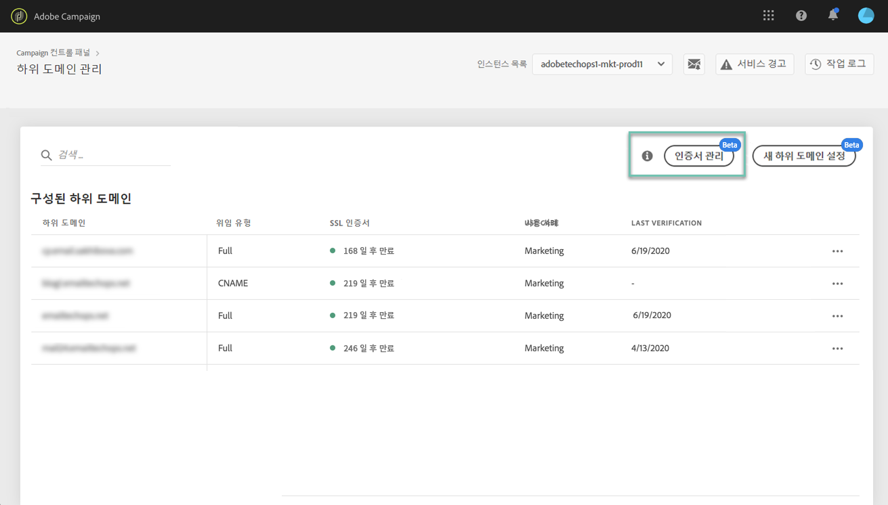
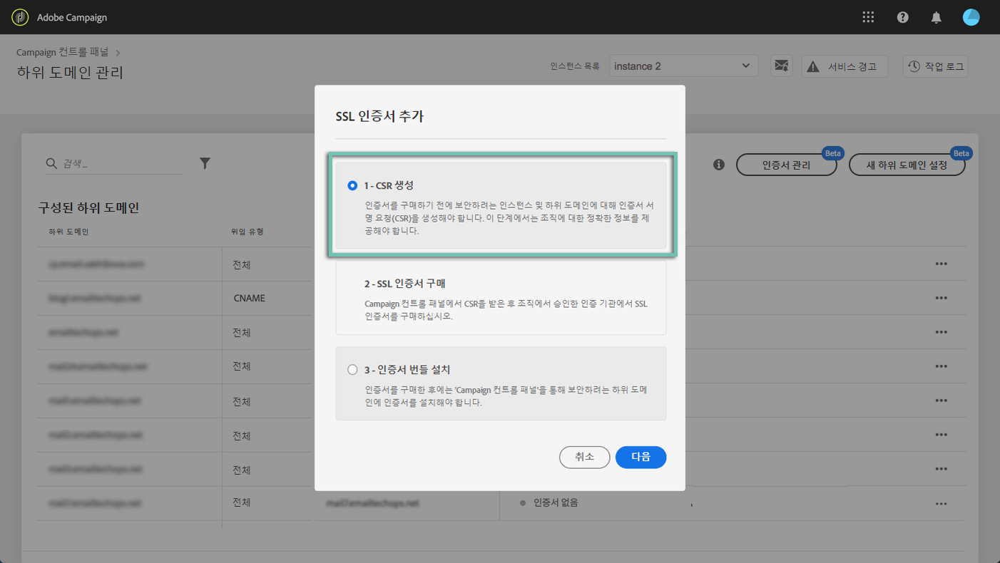
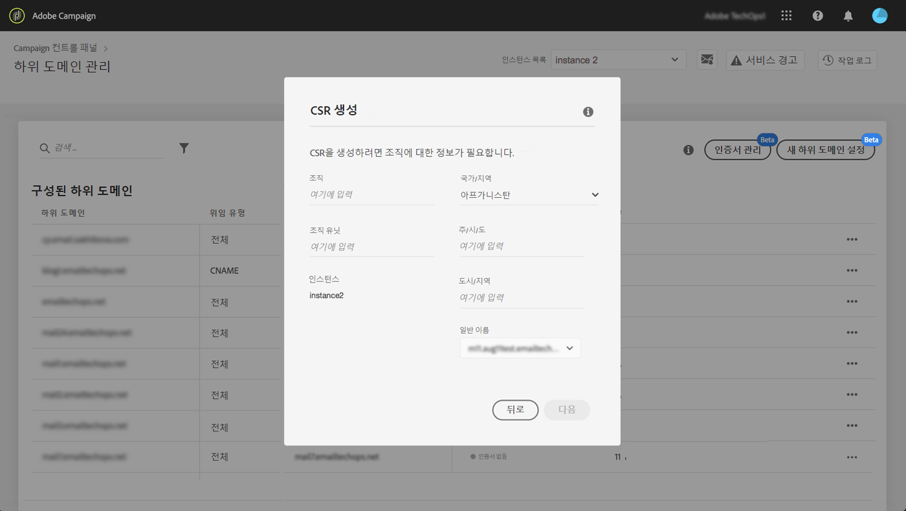
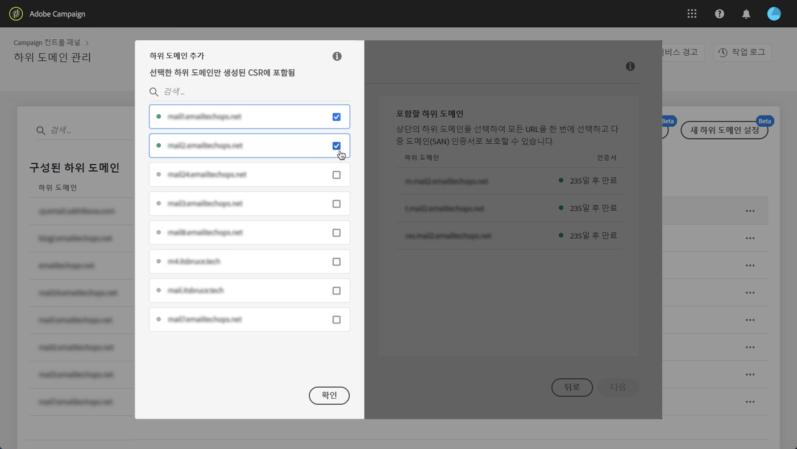
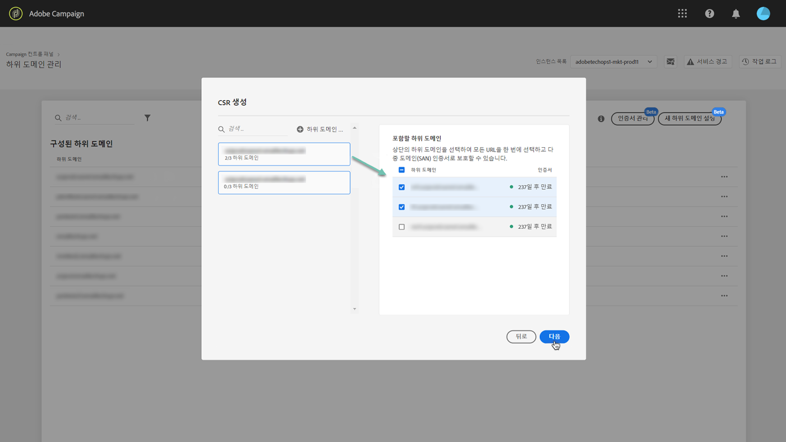
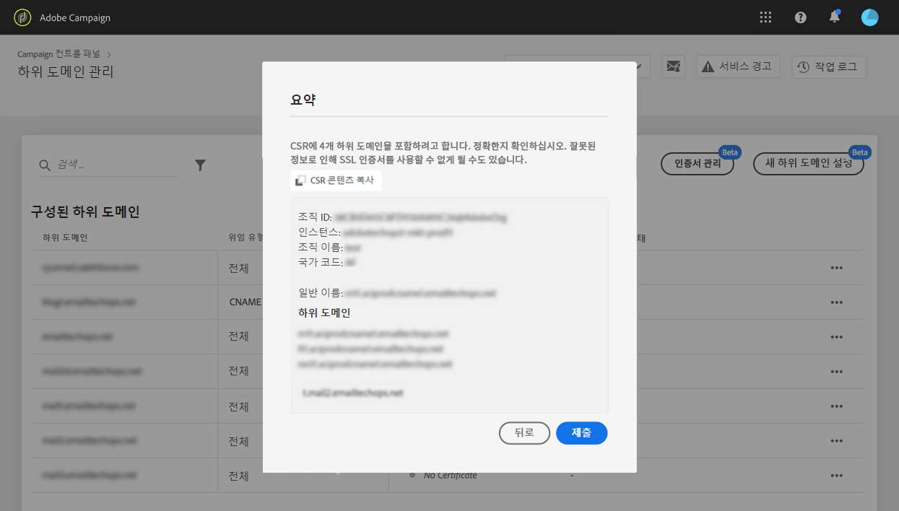
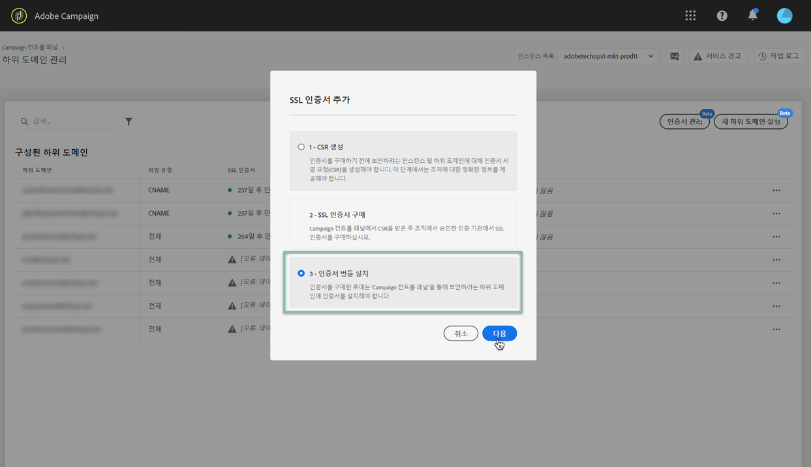
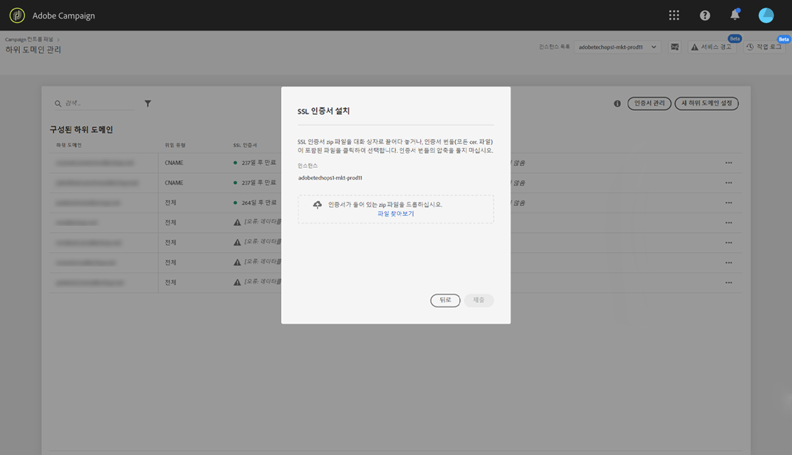

# 하위 도메인의 SSL 인증서 갱신 {#renewing-subdomains-ssl-certificates}

## 인증서 갱신 프로세스 정보 {#about-certificate-renewal-process}

SSL 인증서 갱신 프로세스에는 제어판에서 직접 수행되는 3단계가 포함됩니다.

1. **인증서 서명 요청(CSR)**&#x200B;의 생성 Adobe 고객 지원 센터에서 사용자를 위한 CSR을 생성합니다. CSR을 생성하는 데 필요한 일부 정보(일반 이름, 조직명 및 주소 등)를 제공해야 합니다.
1. **SSL 인증서**&#x200B;구매 CSR이 생성되면 CSR을 다운로드하여 회사가 승인한 인증 기관에서 SSL 인증서를 구입하는 데 사용할 수 있습니다.
1. **SSL 인증서**&#x200B;설치SSL 인증서를 구입하면 원하는 하위 도메인에 설치할 수 있습니다.

### 인증서 서명 요청 생성(CSR) {#generating-csr}

CSR(인증서 서명 요청)을 생성하려면 다음 단계를 수행합니다.

1. 카드에서 원하는 인스턴스를 선택한 다음 **[!UICONTROL Subdomains & Certificates]****[!UICONTROL Manage Certificate]** 단추를 클릭합니다.

   

1. 을 **[!UICONTROL Generate a CSR]****[!UICONTROL Next]** 선택한 다음 을 클릭하여 CSR 생성 프로세스를 안내하는 마법사를 시작합니다.

   

1. CSR을 생성하는 데 필요한 모든 세부 사항이 포함된 양식이 표시됩니다.

   요청된 정보를 완전하고 정확하게 입력해야 합니다(필요한 경우 내부 팀, 보안 및 IT 팀에 문의). 그런 다음 을 **[!UICONTROL Next]**클릭합니다.

   * **[!UICONTROL Organization]**:
   * **[!UICONTROL Organization Unit]**:
   * **[!UICONTROL Instance]**:하위 도메인에 연결된 캠페인 인스턴스의 URL입니다.
   

1. CSR에 포함할 하위 도메인을 선택한 다음 을 **[!UICONTROL OK]**클릭합니다.

   

1. 선택한 하위 도메인이 목록에 표시됩니다. 각각에 대해 포함할 하위 도메인을 선택한 다음 을 클릭합니다 **[!UICONTROL Next]**.

   

1. CSR에 포함할 하위 도메인의 요약이 표시됩니다. 을 **[!UICONTROL Submit]**클릭하여 요청을 확인합니다.

   

1. 선택한 항목에 해당하는 .csr 파일이 자동으로 생성되고 다운로드됩니다. 이제 회사에서 승인한 인증 기관에서 SSL 인증서를 구매할 수 있습니다.

## SSL 인증서 설치 {#installing-ssl-certificate}

SSL 인증서를 구입하면 다음 단계에 따라 인스턴스에 설치합니다.

1. 카드에서 원하는 인스턴스를 선택한 다음 **[!UICONTROL Subdomains & Certificates]****[!UICONTROL Manage Certificate]** 단추를 클릭합니다.

   

1. 인증서 설치 과정을 안내하는 마법사를 **[!UICONTROL Install SSL Certificate]**시작하려면 아이콘을 클릭한**[!UICONTROL Next]** 다음 클릭합니다.

   

1. 설치할 인증서가 포함된 .zip 파일을 선택한 다음 을 **[!UICONTROL Submit]**클릭합니다.

   
