# 새 하위 도메인 설정 {#setting-up-subdomain}

>[!CONTEXTUALHELP]
>id="cp_subdomain_management"
>title="새 하위 도메인 설정 및 인증서 관리"
>abstract="Adobe Campaign을 사용하여 이메일 전송을 시작하거나 랜딩 페이지를 게시하려면 새 하위 도메인을 설정하고 하위 도메인의 SSL 인증서를 관리해야 합니다."
>additional-url="https://experienceleague.adobe.com/docs/control-panel/using/subdomains-and-certificates/monitoring-ssl-certificates.html?lang=ko" text="SSL 인증서 모니터링"

## 반드시 알아야 할 사항 {#must-read}

이 페이지에서는 전체 하위 도메인 위임 또는 CNAME을 사용하여 새 하위 도메인을 설정하는 방법에 대한 정보를 제공합니다. 이 두 가지 방법에 대한 전체적인 개념이 다음의 섹션에 제공됩니다.[하위 도메인 브랜딩](../../subdomains-certificates/using/subdomains-branding.md).

**관련 항목:**

* [하위 도메인 모니터링](../../subdomains-certificates/using/monitoring-subdomains.md)

### 인스턴스 선택

 **프로덕션** 인스턴스의 경우에만 하위 도메인을 위임할 수 있습니다.

마법사에서 선택하는 인스턴스에 이전에 설정한 하위 도메인이 없는 경우, 처음 구성된 하위 도메인이 해당 인스턴스에 대해 **주 하위 도메인**&#x200B;이 되고 나중에 변경할 수 없습니다. 따라서 이 주 하위 도메인을 사용하는 다른 하위 도메인에 대해 **역방향 DNS 레코드**&#x200B;이 만들어집니다. 다른 하위 도메인용 **회신 주소 및 바운스 주소**&#x200B;는 주 하위 도메인에서 생성됩니다.

### 이름 서버 구성

이름 서버를 구성할 때는 **루트 하위 도메인을 Adobe에 위임하면 안 됩니다**. 루트 하위 도메인을 위임하면 해당 도메인을 Adobe에서만 사용할 수 있으며, 조직 직원에게 내부 이메일을 전송하는 등의 기타 용도에는 사용할 수 없습니다.

또한 이 새 하위 도메인용으로 **별도의 영역 파일을 만들면 안 됩니다**.

## 전체 하위 도메인 위임 {#full-subdomain-delegation}

>[!CONTEXTUALHELP]
>id="cp_add_new_subdomain"
>title="새 하위 도메인 추가"
>abstract="Adobe는 전체 하위 도메인을 위임할 것을 권장합니다. 하지만 CNAME 또는 사용자 지정 메소드로 하위 도메인을 설정할 수도 있습니다."
>additional-url="https://experienceleague.adobe.com/docs/control-panel/using/subdomains-and-certificates/setting-up-new-subdomain.html?lang=ko" text="새 하위 도메인 설정"
>additional-url="https://helpx.adobe.com/kr/enterprise/using/support-for-experience-cloud.html" text="고객 지원 센터 문의"

>[!CONTEXTUALHELP]
>id="cp_add_subdomain_create_delegate"
>title="하위 도메인 만들기 및 위임"
>abstract="Adobe Campaign에 사용할 하위 도메인을 호스팅 솔루션에서 만든 후 Adobe에 위임합니다."
>additional-url="https://experienceleague.adobe.com/docs/control-panel/using/subdomains-and-certificates/setting-up-new-subdomain.html?lang=ko" text="새 하위 도메인 설정"

>[!CONTEXTUALHELP]
>id="cp_add_subdomain_submit"
>title="하위 도메인 제출"
>abstract="이전 단계에서 구성한 하위 도메인을 확인하고 제출합니다."
>additional-url="https://experienceleague.adobe.com/docs/control-panel/using/subdomains-and-certificates/setting-up-new-subdomain.html?lang=ko" text="새 하위 도메인 설정"

하위 도메인을 Adobe Campaign에 완전히 위임하려면 아래 단계를 따르십시오.

 이 비디오에서 [Campaign v7/v8](https://experienceleague.adobe.com/docs/campaign-classic-learn/control-panel/subdomains-and-certificates/subdomain-delegation.html?lang=ko#subdomains-and-certificates) 또는 [Campaign Standard](https://experienceleague.adobe.com/docs/campaign-standard-learn/control-panel/subdomains-and-certificates/subdomain-delegation.html?lang=ko#subdomains-and-certificates)를 사용하여 해당 기능 살펴보기

1. **[!UICONTROL Subdomains & Certificates]**&#x200B;카드에서 원하는 프로덕션 인스턴스를 선택하고 **[!UICONTROL Setup new subdomain]**&#x200B;을(를) 클릭합니다.

   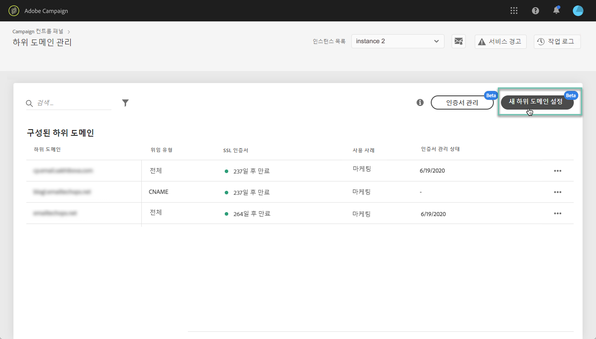

1. **[!UICONTROL Next]**&#x200B;을(를) 클릭하여 전체 위임 방법을 확인합니다.

   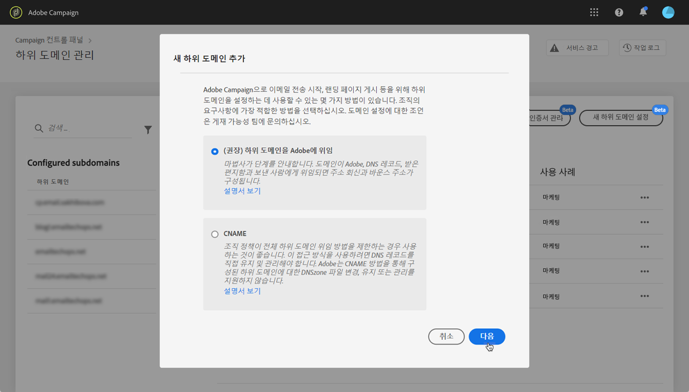

1. 조직에서 사용하는 호스팅 솔루션에서 원하는 하위 도메인 및 이름 서버를 만듭니다. 이렇게 하려면 마법사에 표시된 Adobe Nameserver 정보를 복사하여 붙여넣습니다. 호스팅 솔루션에서 하위 도메인을 만드는 방법에 대한 자세한 내용은 [튜토리얼 비디오](https://video.tv.adobe.com/v/30175)를 참조하십시오.

   >[!NOTE]
   >
   > Adobe Campaign Standard의 경우, 위임한 하위 도메인을 사용하여 **마케팅** 및 **트랜잭션** 메시지를 모두 보낼 수 있습니다.

   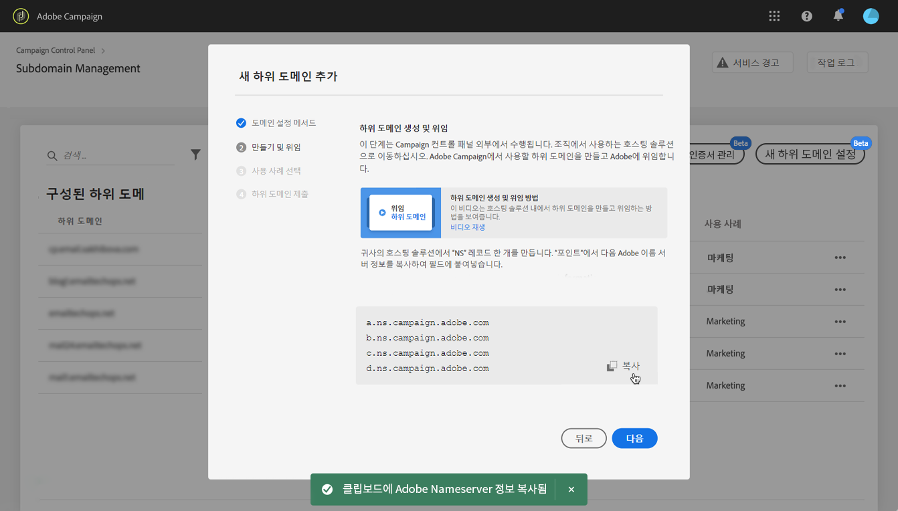

1. 해당 Adobe 이름 서버 정보를 사용하여 하위 도메인을 만든 후 **[!UICONTROL Next]**&#x200B;을(를) 클릭합니다.

1. Campaign v7/v8 인스턴스를 선택한 경우 하위 도메인에 대해 원하는 사용 사례를 선택합니다. **마케팅 커뮤니케이션** 또는 **트랜잭션 및 운영 커뮤니케이션**. 하위 도메인의 사용 사례에 대한 전체 개념은 [이 섹션](../../subdomains-certificates/using/subdomains-branding.md#about-subdomains-use-cases)에서 살펴볼 수 있습니다.

   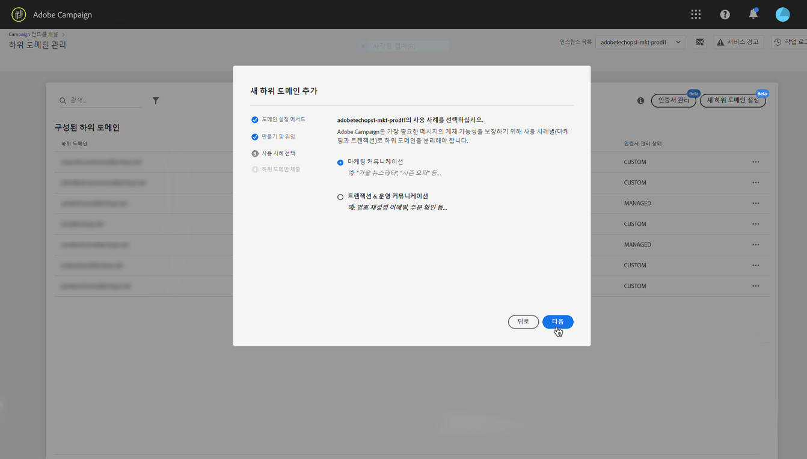

1. 만든 하위 도메인을 호스팅 솔루션에 입력하고 **[!UICONTROL Submit]**&#x200B;을(를) 클릭합니다.

   위임할 하위 도메인의 **전체 이름** 을 입력해야 합니다. 예를 들어 &quot;usoffers.email.weretail.com&quot; 하위 도메인을 위임하려면 &quot;usoffers.email.weretail.com&quot;을 입력합니다.

   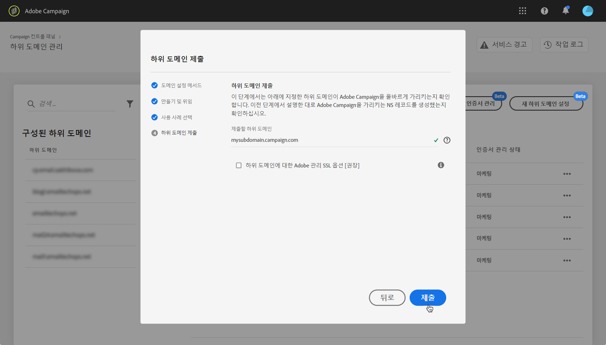

하위 도메인을 제출하면 컨트롤 패널에서 다양한 검사 및 구성 단계를 수행합니다. 자세한 내용은 [하위 도메인 확인 및 구성](#subdomain-checks-and-configuration)을 참조하십시오.

## CNAME을 사용한 하위 도메인 구성 {#use-cnames}

>[!CONTEXTUALHELP]
>id="cp_add_cname_subdomain_create_delegate"
>title="하위 도메인 구성"
>abstract="이 화면에서는 CNAME을 사용하여 구성할 하위 도메인을 지정합니다."
>additional-url="https://experienceleague.adobe.com/docs/control-panel/using/subdomains-and-certificates/setting-up-new-subdomain.html?lang=ko" text="새 하위 도메인 설정"

>[!CONTEXTUALHELP]
>id="cp_add_cname_records"
>title="기록 생성"
>abstract="이 화면에 표시된 DNS 기록 목록을 생성하려면 호스팅 솔루션으로 이동합니다."
>additional-url="https://experienceleague.adobe.com/docs/control-panel/using/subdomains-and-certificates/setting-up-new-subdomain.html?lang=ko" text="새 하위 도메인 설정"

>[!CONTEXTUALHELP]
>id="cp_add_cname_subdomain_submit"
>title="하위 도메인 제출"
>abstract="이전 단계에서 구성한 하위 도메인을 확인하고 제출합니다."
>additional-url="https://experienceleague.adobe.com/docs/control-panel/using/subdomains-and-certificates/setting-up-new-subdomain.html?lang=ko" text="새 하위 도메인 설정"

CNAME을 사용하여 하위 도메인을 구성하려면 아래 단계를 따르십시오.

 이 비디오에서 [Campaign v7/v8](https://experienceleague.adobe.com/docs/campaign-classic-learn/control-panel/subdomains-and-certificates/delegating-subdomains-using-cname.html?lang=ko#subdomains-and-certificates) 또는 [Campaign Standard](https://experienceleague.adobe.com/docs/campaign-standard-learn/control-panel/subdomains-and-certificates/delegating-subdomains-using-cname.html?lang=ko)를 사용하여 해당 기능 살펴보기

1. **[!UICONTROL Subdomains & Certificates]** 카드에서 원하는 프로덕션 인스턴스를 선택하고 **[!UICONTROL Setup new subdomain]**&#x200B;을(를) 클릭합니다.

   

1. **[!UICONTROL CNAME]** 방법을 선택한 다음 **[!UICONTROL Next]**&#x200B;을(를) 클릭합니다.

   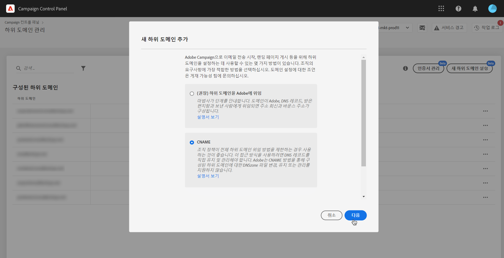

1. Campaign v7/v8 인스턴스를 선택한 경우 하위 도메인에 대해 원하는 사용 사례를 선택합니다. **마케팅 커뮤니케이션** 또는 **트랜잭션 및 운영 커뮤니케이션**. 하위 도메인의 사용 사례에 대한 전체 개념은 [이 섹션](../../subdomains-certificates/using/subdomains-branding.md#about-subdomains-use-cases)에서 살펴볼 수 있습니다.

   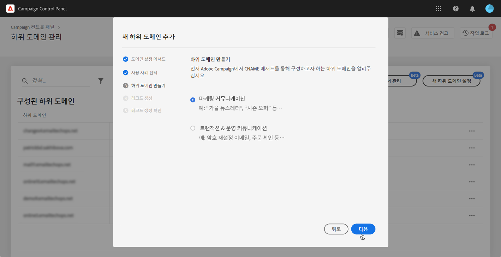

1. 만든 하위 도메인을 호스팅 솔루션에 입력하고 **[!UICONTROL Next]**&#x200B;을(를) 클릭합니다.

   설정할 하위 도메인의 **전체 이름**&#x200B;을 입력해야 합니다. 예를 들어 &quot;usoffers.email.weretail.com&quot; 하위 도메인을 구성하려면 &quot;usoffers.email.weretail.com&quot;을 입력합니다.

   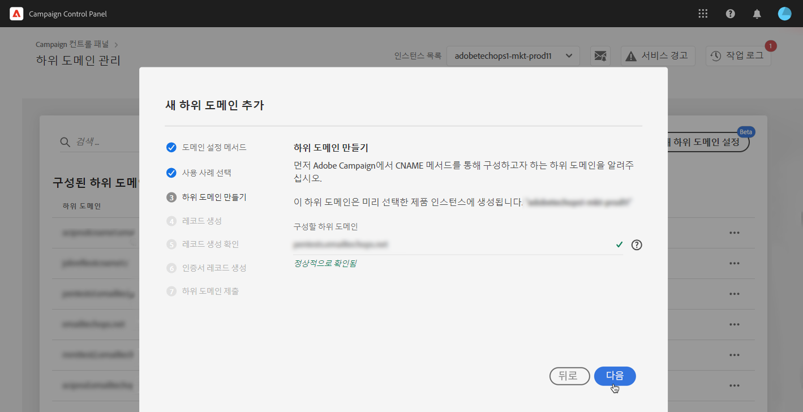

1. DNS 서버에 배치할 레코드 목록이 표시됩니다. 이러한 레코드를 하나씩 복사하거나 CSV 파일을 다운로드하여 복사한 다음 도메인 호스팅 솔루션으로 이동하여 일치하는 DNS 레코드를 생성합니다.

   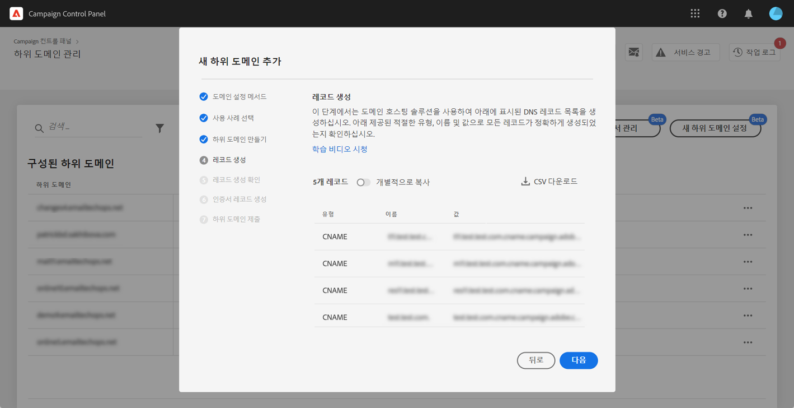

1. 이전 단계의 모든 DNS 레코드가 도메인 호스팅 솔루션에 생성되었는지 확인합니다. 모든 것이 올바르게 구성된 경우, 첫 번째 문을 선택한 다음 **[!UICONTROL Submit]**&#x200B;을(를) 클릭하여 확인합니다.

   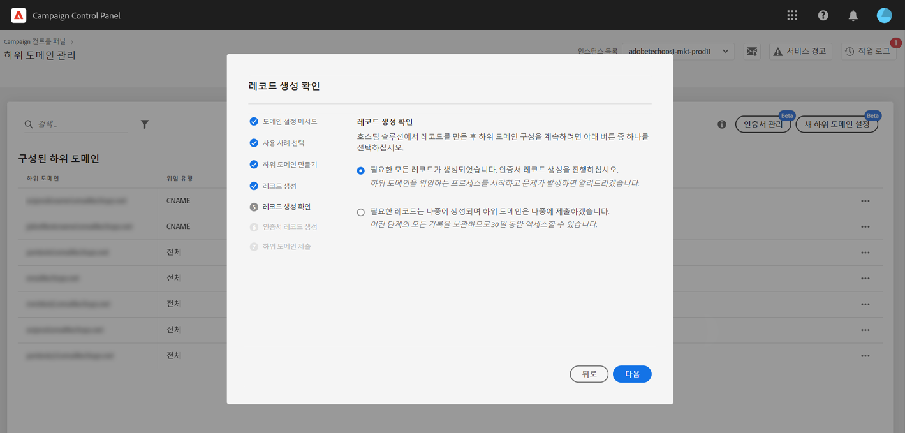

   >[!NOTE]
   >
   >나중에 레코드를 만들고 하위 도메인 구성을 제출하려면 두 번째 문을 선택하고 **[!UICONTROL Submit later]**&#x200B;을(를) 클릭합니다. 그런 다음 하위 도메인 관리 화면 **[!UICONTROL Processing]** 영역에서 바로 하위 도메인 구성을 다시 시작할 수 있습니다.
   >
   >서버에 배치할 DNS 레코드는 컨트롤 패널에 30일 동안 보관됩니다. 해당 기간이 지나면 하위 도메인을 처음부터 구성해야 합니다.

하위 도메인을 제출하면 컨트롤 패널에서 다양한 검사 및 구성 단계를 수행합니다. 자세한 내용은 [하위 도메인 확인 및 구성](#subdomain-checks-and-configuration)을 참조하십시오.

## 하위 도메인 확인 및 구성 {#subdomain-checks-and-configuration}

1. 하위 도메인을 제출하면 컨트롤 패널에서 이 하위 도메인이 Adobe NS 레코드를 올바르게 가리키는지와 이 하위 도메인에 해당하는 SOA(권한 시작) 레코드가 없는지를 확인합니다.

   >[!NOTE]
   >
   >하위 도메인 구성이 실행되는 동안 성능 문제를 방지하기 위해 다른 Campaign 컨트롤 패널 요청은 큐에 저장되며 하위 도메인 구성이 완료된 후에만 수행됩니다.

1. 이 두 가지 사항이 성공적으로 확인되면 컨트롤 패널에서 DNS 레코드, 추가 URL, 받은 편지함 등으로 하위 도메인 설정을 시작합니다.

   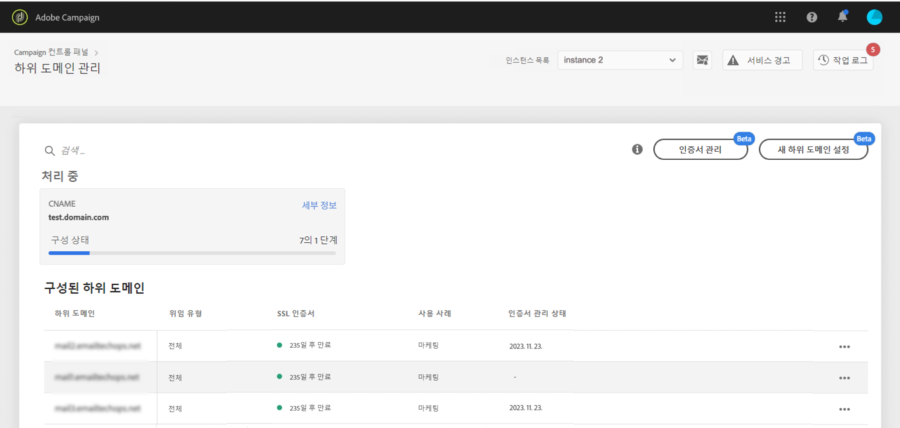

   하위 도메인 구성&#x200B;**[!UICONTROL Details]** 버튼을 클릭하면 구성 진행에 관해 자세히 확인할 수 있습니다.

   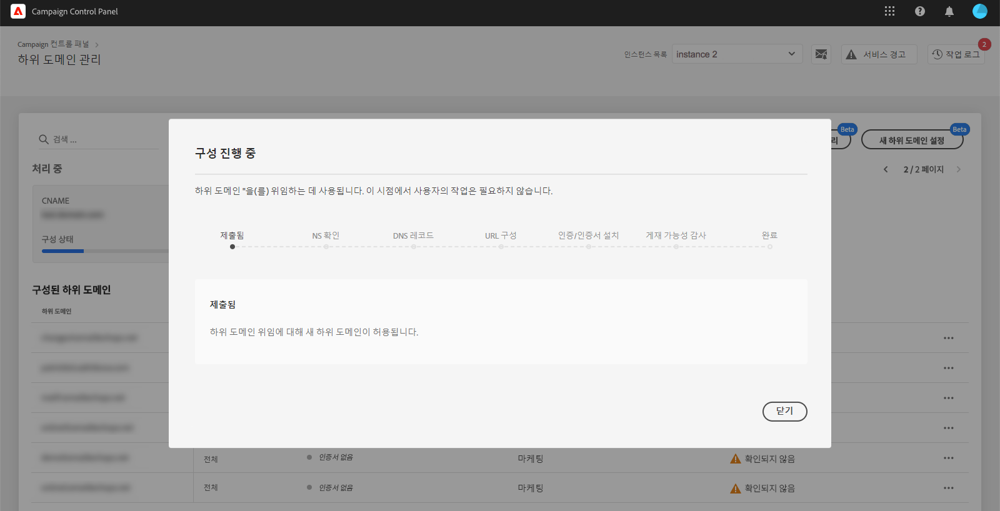

1. 그러면 **게재 팀은** 새로운 하위 도메인을 감사하기 위해 알림을 받습니다. 감사 프로세스는 하위 도메인이 위임된 후 영업일 기준으로 최대 10일이 소요됩니다.

   >[!IMPORTANT]
   >
   >이 프로세스의 게재 확인에는 피드백 루프, 스팸 위반 루프 테스트 등이 포함됩니다. 그러므로 감사가 완료되기 전에는 하위 도메인을 사용하지 않는 것이 좋습니다. 감사 완료 전에 하위 도메인을 사용하면 하위 도메인 평판이 낮아질 수 있기 때문입니다.
   >
   >그러나 게재 기능 감사가 계속 처리 중인 경우에도 하위 도메인에서 SSL 인증서와 관련된 작업을 수행할 수 있습니다.

1. 프로세스가 종료되면 하위 도메인이 Adobe Campaign 인스턴스에서 사용 가능하도록 구성되며, 아래 요소가 작성됩니다.

   * SOA, MX, CNAME, DKIM, SPF, TXT **DNS 레코드가 포함된 하위 도메인**
   * 미러, 리소스, 추적 페이지 및 도메인 키 호스팅을 위한 **추가 하위 도메인**
   * **받은 편지함**(보낸 사람, 오류, 회신)

   기본적으로 컨트롤 패널의 &quot;회신&quot; 받은 편지함은 이메일을 지우도록 구성되므로 이메일 검토가 불가능합니다. 마케팅 캠페인용 &quot;회신&quot; 받은 편지함을 모니터링하려는 경우에는 이 주소를 사용하지 마십시오.

**[!UICONTROL Subdomain details]** 및 **[!UICONTROL Sender info]** 버튼을 클릭하면 하위 도메인 세부 사항을 확인할 수 있습니다.

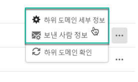

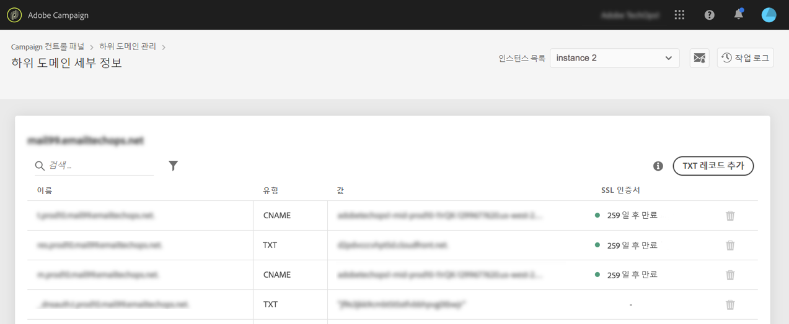

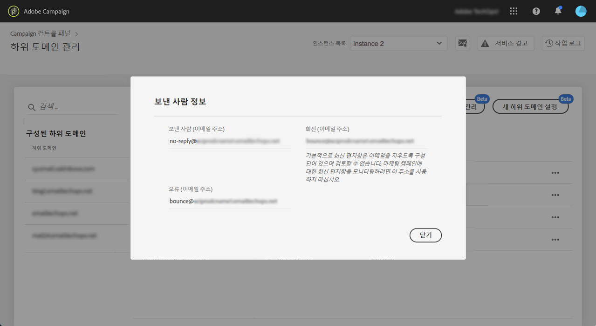

## 문제 해결 {#troubleshooting}

* 하위 도메인이 구성되었지만 올바르게 확인되지 않는 경우도 있습니다. 하위 도메인은 오류에 대한 정보를 제공하는 작업 로그와 함께 **[!UICONTROL Configured]** 목록에 유지됩니다. 이 문제를 해결하기가 어렵다면 고객 지원 센터에 문의하십시오.
* 구성 후 하위 도메인이 &quot;확인되지 않음&quot;으로 표시되는 경우 새 하위 도메인 확인을 시작합니다(**...** /) **[!UICONTROL Verify subdomain]**. 여전히 동일한 상태를 표시하는 경우, 표준 프로세스를 사용하여 확인할 수 없는 수신자 스키마에 대해 일부 사용자 지정이 수행되기 때문일 수 있습니다. 해당 하위 도메인이 있는 캠페인을 보내십시오.
* 게재 가능성 감사 단계에서 하위 도메인 구성이 너무 오래(영업일 기준 10일 이상) 걸리면 고객 지원 센터에 문의하십시오.
